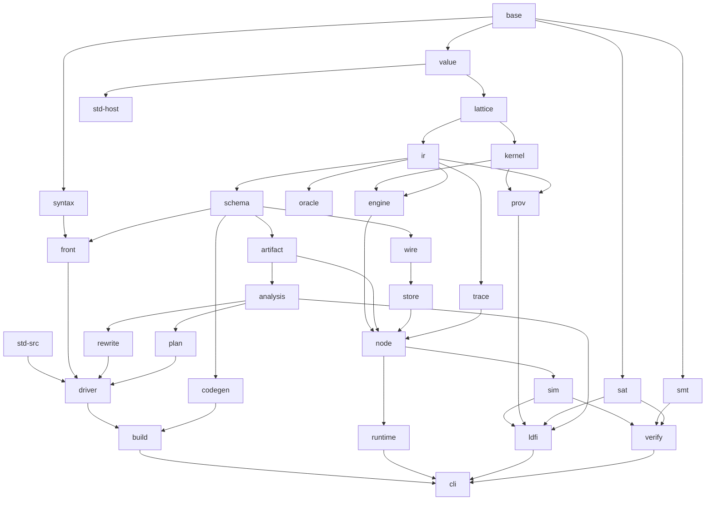

# Blossom Implementation Architecture

Status: **revision 2**, 2026-09-27. It replaces the first draft and answers the three design reviews
(`critique-perf.md`, `critique-semantics.md`, `critique-production.md`); Appendix C lists every must-fix item and
where it is handled. Once accepted, this document is normative for the implementation. The surface language is now
fixed by `docs/design/LANGUAGE.md`, and §13 describes the frontend that implements it.

Toolchain: Rust **edition 2024**, stable **rustc 1.96.0**. The version is pinned in `rust-toolchain.toml` and is
also the MSRV. Nightly is used only in the separate CI jobs that need it (fuzzing, Miri; §11.10). No crate needs
nightly to build or to pass its tests.

Normative inputs, in order of precedence:

1. `docs/DECISIONS.md`;
2. `docs/research/FEATURES.md` §1, the CR-xx resolutions;
3. `docs/design/LANGUAGE.md`, the surface language and its lowering to the IR;
4. the rest of FEATURES.md (§2–§13) and the research reports R01–R15.

Nothing in this document overrides a CR-xx. Where this document refines a FEATURES item, the refinement is called
out in the text and listed in §0.2. Where it needs LANGUAGE.md to change, the change is listed in §0.3; the
architecture is correct without those changes, which only add diagnostics or clarify wording.

Conventions:

- `ARCH-nn` is an architecture decision (§0.1). PLAN.md cites these ids.
- `crate::path` means a module inside a workspace crate.
- Rust signatures fix names, owning crates, ownership, error types and the split of responsibilities. After M0
  (§14.2) the public items of the frozen crates are exactly these signatures, and changing one follows the
  procedure in §1.6. Derives, private fields and lifetimes that the signature does not show are the implementer's
  choice.
- "P0/P1/P2" are FEATURES.md priorities. Wherever a P2 item is placed, the text marks it **[P2, later]**.
- **Stub policy (§12.1).** A path that is not implemented yet returns `Unimplemented { feature: "ENG-063", .. }`.
  It never returns a plausible default and never panics. The planner and `Engine::new` refuse, before the first
  tick, any plan that needs an unbuilt feature (§3.10), so a missing feature is found at build or load time, not
  hours into production.

---

## 0. Decisions at a glance

### 0.1 Architecture decisions

| Id | Decision | Why (short) |
|---|---|---|
| ARCH-01 | **35 crates in six layers, plus `xtask`**, forming a strict dependency DAG (§1). The layer table lives in `xtask/layers.toml`; `xtask check-layers` checks every normal, build and dev edge against it, and generates the table in §1.2. | Keeps the kernel IR-free, the oracle independent of the engine, and the node free of I/O. Those separations make the rest of the design testable, and a machine-readable table cannot drift from the code. |
| ARCH-02 | **The Dedalus^L IR is the one semantic core.** A surface construct that has a fast native implementation (choice, `index!`, `seq!`, `fold!`, persistence, soft state, seals, finality, …) is recorded as a *Construct* whose **expansion rules are its meaning** (§2.6). The oracle evaluates the expansion. The planner may replace the expansion with a native operator. Differential tests (§11.2–§11.3) keep the two identical. | SEM-083 and ENG-067 require every operator to be *defined* by a Dedalus expansion and every fast path to be observationally identical to it. Tagging constructs when they are built removes the fragile work of pattern-matching the expansion afterwards. |
| ARCH-03 | **A sans-IO node state machine** (`blossom-node`) is shared by the production runtime and the simulator. It is written against an `Evaluator` trait (engine or oracle), a `Vfs` (real or simulated filesystem) and explicit time, entropy and fsync-completion events. The simulator runs the real WAL and checkpoint code over `SimFs`, which models POSIX crash behaviour (§5.6, §6.3). | FoundationDB/TigerBeetle-style fidelity. The code that simulation tests is the code that ships, including the durability code, which is where crash bugs live. |
| ARCH-04 | **The kernel crate knows nothing about the IR.** Kernels are generic over shape traits (row width and lane, key layout, deaths, lattice ops, provenance sink, digest sink). The interpreter instantiates them with dynamic shapes and generated code with static shapes (§4.10). Generated code may name only `blossom_engine::abi` (§4.7), which `xtask check-codegen-abi` enforces. | ENG-005: one kernel library for both backends, with the interpreter kept within 1.5–3× of generated code, and an engine that can be refactored without breaking generated code. |
| ARCH-05 | **Values are fixed-width words in per-relation lanes.** A relation whose columns all fit in 32 bits uses 4-byte lanes, every other relation 8-byte lanes (ENG-020). Scalars use *order-preserving* encodings, so word order equals canonical order. The representation of every non-scalar column is chosen per column (ARCH-22). Canonical order is computed only where it is observable (SEM-088). | Joins, deduplication and hashing reduce to word operations (R09 §14.1); 32-bit lanes halve scan and index bandwidth for nearly every BENCH-200 relation. |
| ARCH-06 | **Relation storage** is append-only chunks with stable addresses and epoch-stamped rows, split into typed segments (frame, standing, weighted, carried, transient; §4.2). Rule evaluation reads **current-state indexes** that hold only live rows: a primary dedup index and hash indexes with per-key posting lists, plus sorted permuted runs chosen by minimum chain cover. History (as-of reads, Tier B, LDFI) is served from birth and death stamps, with history indexes built only while a history reader exists. Keyed relations update their payload in place (§4.2). | Δ is a row range and is never copied (ENG-021). Hot keys do not accumulate dead index entries. Tick-local data is truncated wholesale. Snapshots cost O(#relations) and tax the running engine nothing (ENG-030). |
| ARCH-07 | **Four maintenance regimes, chosen per rule** (§3.4): *Standing* (semi-naive continuation over inputs that only grow), *Transient* (evaluated per tick from tick-local or time-varying inputs), *Counted* (DBSP signed-weight delta queries over persistent inputs) and *Recompute* (the correct fallback). Lookups are versioned occurrences like atoms. A persistent relation with a deletion path keeps the deductive support of its Standing and Counted writers apart from its frame (§3.4.4). Recursive retraction by FBF or recursive counting is P1. | ODD-06 (c) with its R13 amendment, made concrete and made exact: every regime is observationally identical to naive per-tick Dedalus, so the choice between them is purely a matter of cost. |
| ARCH-08 | **Provenance goes through a `ProvenanceSink` trait** whose `ENABLED` constant compiles capture out entirely when provenance is off. Tier C is a sliced columnar firing log whose record types live in `blossom-kernel::prov`. Tier B is hidden annotation columns plus interval history (§4.9). LDFI runs use the *literal* plan profile, so every recurring firing is logged per tick (§3.10). | ENG-110–116 and ODD-08 (b). Tier A costs nothing, and LDFI lineage is complete by construction. |
| ARCH-09 | **The wire codec is ours**: schema-driven, field-numbered and tag/length encoded, with explicit decoder limits (§5.4). The WAL and checkpoints reuse it. serde is used for configuration, traces and compiler artifacts, not for tuples. | *Refines ODD-14.* The interpreter's tuples are dynamic, schema evolution needs field-level access and preservation of unknown variants (LANG-261, DIST-087), and positional serde formats cannot evolve. |
| ARCH-10 | **Our own WAL** in segment files, one segment per incarnation, with per-record LSN, batch number and CRC; **pipelined group commit** in which tick t+1 computes while tick t's fsync is in flight and tick t's outbox is released only when every WAL record of a tick ≤ t is synced (Invariant R, §5.1); a failed fsync poisons the WAL for the rest of the incarnation. The writer is split by owner: `WalWriter` on the committer thread, `CheckpointWriter` on the checkpoint thread (§5.6). fsync is `File::sync_data`, which issues `F_FULLFSYNC` on Apple targets. | ODD-13 (a), SEM-072, DIST-020–022, and correct behaviour after power failures, torn writes, fsync errors and upgrades. |
| ARCH-11 | **Transport**: tokio TCP with rustls mTLS (the `ring` provider) is the default, quinn QUIC is optional **[P1]**, and an in-process transport is used for embedding and tests. Both ends verify the peer's SPIFFE identity. The frame-level admission steps are one pure function shared with the simulator (§5.3, §5.8). | ODD-14, ODD-30, DIST-060–062. |
| ARCH-12 | **The simulator is discrete-event.** A single root seed feeds *independent* decision streams, one per purpose. The simulator runs the same `Node` over `SimFs`, schedules fsync completions and failures as decisions, records the TEST-010 trace format, replays exactly and shrinks failures with ddmin (§6). A program error found under simulation, LDFI or BMC is a verdict, never a crash fault (§6.6). | TEST-001–015. Independent streams make shrinking converge; treating errors as verdicts keeps verifiers from certifying runs in which the program had no meaning. |
| ARCH-13 | **SAT** sits behind the `SatSolver` trait in its own crate, `blossom-sat`. The default is **CaDiCaL through `rustsat-cadical`**, which vendors the C++ source and builds it with `cc`. The fallback is pure-Rust **`batsat`**, and an exhaustive solver exists for tests (§8.6). | The LDFI hot loop is incremental SAT under assumptions with thousands of blocking clauses, and CaDiCaL is the strongest incremental solver available. A separate crate lets LDFI, input generation (TEST-082) and verification share it. |
| ARCH-14 | **SMT** is SMT-LIB2 over a child process (`z3 -in`; cvc5 through the same trait). **ASP** is `clingo` as a child process. Solver binaries are found through `$BLOSSOM_Z3`/`$BLOSSOM_CVC5`/`$BLOSSOM_CLINGO`, then `PATH`. | DECISIONS.md: solver-agnostic, and no C++ build of Z3. |
| ARCH-15 | **Codegen** is a pure function from a validated physical plan and a schema catalog to Rust tokens (`blossom-codegen`). `build.rs` integration lives in `blossom-build`, which runs the compiler and then codegen. The generated code calls the same kernels as the interpreter, through the execution ABI (§10). | ODD-07 (c), and a crate DAG without cycles: codegen needs neither the driver nor the planner. |
| ARCH-16 | **The naive oracle is a crate that does not depend on the engine, the kernel, the planner or the analyses** (`blossom-oracle`: base, value, lattice, ir). It computes its own stratification with a deliberately naive algorithm and calls host functions through the Value-level `ExternRegistry`. Every CI run differential-tests the interpreter, the generated code and the oracle tick by tick (§11). | ENG-067 is only meaningful if the oracle shares no code with what it checks, including the stratifier. |
| ARCH-17 | **Errors are `thiserror` enums per crate**, boxed where they are large, with stable user-facing codes (`BLSnnnn` compile-time, `BLSRnnn` runtime) registered in `blossom-base::codes`. Missing functionality is a hard `Unimplemented` error. Lints forbid `unwrap`/`expect`/`panic!`/`todo!`/`unreachable!` in library code, and fuzzing guards "no panic on user input" (§12). The CLI has one exit-code table (§12.5). | This is the user's rule. |
| ARCH-18 | **Hashes.** xxh3-64 for value fingerprints (ENG-032). SipHash-1-3 as the keyed PRF (SEM-084). BLAKE3-256 for program, schema and plan digests and checkpoint files. State digests are 128-bit *incremental set hashes* (§4.11), maintained only when a `DigestSink` asks for them. Hash tables are keyed from the per-incarnation boot nonce, never from the deployment seed. | Each hash is chosen for its job and versioned. The seed stays secret, and hash order is never observable. |
| ARCH-19 | **Determinism discipline.** `std::collections::{HashMap, HashSet}`, `hashbrown::{HashMap, HashSet, DefaultHashBuilder}`, `RandomState` types, ambient `Instant::now`/`SystemTime::now` and thread RNGs are banned by `clippy::disallowed_*` everywhere except the clock, entropy and `blossom-base::det` modules. `DetMap`/`DetSet` are the only map types. CI runs one simulation seed in two processes and on two platforms and compares every `TickEnd` digest (§11.10). | SEM-081, SEM-083 and SEM-088 hold by construction and are checked, not only reviewed. |
| ARCH-20 | **Tick errors.** A runtime hard error (BLSR001…) aborts the tick *without committing it*. In the semantic model that is a crash of the node. How the runtime reacts is policy: in production the node restarts from durable state in *probation* and isolates the poisonous input, behind a circuit breaker; in tests the node halts; under the simulator, LDFI and BMC the error is a *verdict* (§5.12, §6.6). | The crash mapping needs no undo log and keeps every guarantee; probation keeps one bad message from halting a server; verdicts keep verifiers honest. |
| ARCH-21 | **Tail-latency discipline.** No operation inside a tick costs more than O(tick work + fuel), where fuel is a budget proportional to the tick's work. Hash-table growth, run merges, compaction, interner reclamation and clearing of tick-local tables are all incremental (§4.12). Targets are stated at p50, p99, p999 and maximum. | Protocols live at p99: a 100 ms stall exceeds a Raft election window. |
| ARCH-22 | **Per-column value representation.** Each column is `Direct` (a scalar word), `Interned` (hash-consed, reference-counted, for columns that take part in equality), `Bulk` (an arena handle with a cached fingerprint, for payload-only strings, bytes and records) or a lattice slot. Values created during a tick live in a tick arena and are promoted when they enter long-lived state (§4.1). | Hash-consing buys O(1) equality only for values that are compared; payload-only columns pay nothing for it, and the interner is bounded by live state. |
| ARCH-23 | **Tick-local fusion.** Generated tick-local relations (handler headers, blocks, view alternatives, upsert scratch) are inlined into their consumers, or materialized as index-free buffers fanned out with `Op::Tee`, and deduplicated only when some consumer is multiplicity-sensitive (§3.7). | One `put` in `e01_kvs.bls` costs at most two hash operations plus its choice, as in DFIR. |
| ARCH-24 | **Interface freeze and parallel tracks.** M0 is a compiling skeleton of the whole workspace in which every public item named here exists in its owning crate (Appendix B) and every body returns `Unimplemented`. After M0, the public items of `blossom-base`, `blossom-value`, `blossom-ir`, `blossom-schema`, `blossom-artifact` and `blossom-trace` change only through §1.6. Each trait ships with a conformance suite (§11.1). | Independent agents can then build crates in parallel against interfaces that do not move, and prove conformance without the rest of the system. |
| ARCH-25 | **Durable identity.** Every node data directory carries an identity record and a lock. A missing or foreign directory is a refusal to start, never a silent `bootstrap fresh`. Ticks and `now` are monotone across incarnations through a reserved high-water mark (§5.6). | A Raft node that forgets its term and vote breaks safety; a reused tick number breaks message identity. |
| ARCH-26 | **Threads.** Each node's engine runs on a dedicated OS thread. Network I/O and TLS run on a tokio multi-thread runtime and exchange batches with the engine thread over SPSC rings (`rtrb`). The committer and the checkpoint writer have their own threads (§5.2). | A long fixpoint must not starve transport I/O, and a work-stealing scheduler must not migrate the engine between cores and lose its caches. |
| ARCH-27 | **LDFI crash views and plan profile.** `FailureSpec` carries a crash view: `Frozen` (CR-20, the default) or `MollyContinue` (the `.ded` profile, which reproduces Molly's verdicts). LDFI runs use the *literal* plan profile (Transient/Recompute regimes, natives off) so lineage is complete (§8). Molly parity is defined on verdicts, run counts and Appendix-B-minimal falsifier sets (§8.7). | Resolves a conflict inside FEATURES (TEST-021 against BENCH-130) and makes the parity target well defined and reachable. |
| ARCH-28 | **A strict status ratchet** in every corpus manifest: a case is `pass`, `unimplemented` (with the exact feature ids it must fail with) or `known-failure`, each with the milestone that must flip it (§11.4). | CI stays green at every milestone while nothing is skipped silently and every gap is named by its feature id. |

### 0.2 Refinements of FEATURES.md made here

Each item needs one line in `docs/DECISIONS.md`; they are gathered here so that one commit can record them.

- **ODD-14 (serialization).** A custom field-numbered codec replaces "serde-based" (ARCH-09). Every property ODD-14
  requires still holds.
- **ENG-003/ENG-004.** Persistence and persist-pullup are realized as storage segments (§4.2). Standing outputs are
  kept instead of re-derived (§3.4). Inductive rules stage only their output's *changes* (§3.5). A persistent
  relation that has a deletion path holds its Standing and Counted writers' output as a separate *deductive
  support* next to its frame, with the normative equations of §3.4.4, so a deletion never removes a tuple that is
  still derived (CR-05, CR-26).
- **ENG-060.** Lifetime classification is made **per rule** (the maintenance regime), not only per relation. A
  relation can have a standing part and a transient part at the same time.
- **ENG-074.** The time-varying scalars are `$now`, `$tick`, `$incarnation`, every `$rand*` and `choose_rand`
  (FEATURES lists only `$rand`, `$tick` and `choose_rand`). A rule that mentions one anywhere is Transient (§3.4.2).
- **ENG-085.** Vectorized, prefetching batch probes move from P1 to **P0** and apply from the batch size up, not
  only above 4096 bindings (§4.4). Without memory-level parallelism, large-state ticks cannot meet §4.13.
- **ENG-089.** Online re-planning chooses among *alternatives compiled ahead of time*. The engine never calls the
  planner at runtime (R09 §14.4).
- **ENG-020.** Restored as written: columns are packed to 32-bit lanes where every column of a relation allows it
  (the first draft had silently dropped this).
- **DIST-007.** Resend suppression is an IR rewrite in `blossom-rewrite`, gated by ANA-061 and checked by VER-016,
  so the oracle and the engine evaluate the same rewritten program (§3.5). It is never an engine-internal
  optimization.
- **DIST-042.** Dynamic membership operates over a **declared node pool**: every node that may ever join is listed
  in the deployment spec (active or standby). `node_dir` and `R$members` stay static; the membership library's
  epoch relations select subsets of the pool. Adding a node outside the pool is a new deployment version (§5.9).
- **LANG-051/LANG-183.** The rows an `extern table fn` returns are recorded in the trace as inputs, so a table
  function may read the world (files) and replay stays exact (§6.4). `extern fn`s remain pure, and purity is checked
  by double evaluation under simulation (§11.7).
- **LANG-138 (weighted heads).** The weighted transition of §2.4 is normative. A rule with a `ZAdd` head is always
  planned Transient, so a level-triggered writer adds its weight at every tick in which its body holds, exactly as
  Dedalus re-derives it.
- **SEM-001/SEM-071.** The tick counter and `now` are monotone across incarnations: ticks are reserved ahead in
  durable metadata, and a node boots at the reserved bound with `now ≥ last now + 1 ns` (§5.6).
- **SEM-009/ODD-04 (c).** A per-node heartbeat (`NodeConfig::heartbeat`) is provided, and the exhaustive scheduler
  and the confluence tester explore heartbeat ticks for nodes whose empty tick has effects (§6.2). An idle stretch
  equals a run of empty ticks only for nodes whose empty tick has no effect.
- **DIST-033.** The deployment seed is a secret kept outside the deployment spec, and hash tables are keyed from
  the boot nonce, not from the seed (§5.8).
- **TEST-021 and CR-20 against BENCH-130–137.** FEATURES is internally inconsistent: CR-20 stops a crashed node's
  firings, while the Molly verdicts BENCH-130 requires come from code in which a crashed node keeps computing and
  only stops sending. `FailureSpec::crash_view` selects `Frozen` (CR-20, the default for `.bls` programs) or
  `MollyContinue` (the `.ded` compatibility profile). The two differ only in what spec rules see of crashed nodes
  (§8.1).
- **BENCH-130–137 (Molly parity).** Parity means identical counterexample/no-counterexample verdicts, run counts
  at most the published ones, and, where a corpus item states falsifier sets, equality of the Appendix-B-minimal
  falsifier sets over removed clock facts. Raw Molly counterexample output is not a parity target (§8.7).
- **BENCH-200.** The P0 gate is single-threaded: at most 1.0× compiled Soufflé `-j1` on at least two thirds of the
  suite and at most 1.5× on all of it. BENCH-200's own target (at least compiled Soufflé `-j4`, at most 2× its memory)
  is the M8 gate, because it requires ENG-102 (intra-tick parallelism), which FEATURES itself makes P1. This is a
  priority inversion inside FEATURES, recorded in PLAN.md.
- **DDlog baseline (BENCH-200).** DDlog is archived and cannot be installed with the current toolchain. It is
  compared through published numbers, normalized by the ratio to Soufflé measured on the same machine (§4.14).
  The live incremental baselines are `differential-dataflow` (DDlog's own engine) and `dbsp` (Feldera).
- **BENCH-202 and Hydro.** The DFIR comparison is P0 and runs on the same machine and transport (§4.14).
- **Fault classes beyond the normative model.** In simulation, *duplication* of network frames is available as an
  opt-in fault class, used only to test exactly-once wrappers (DIST-015/016). Duplication is outside the TPLP
  delivery semantics, so no verdict or certificate may assume it.

### 0.3 Amendments requested of LANGUAGE.md

None blocks implementation; each adds a diagnostic or clarifies wording, and the architecture already behaves as
described.

| # | LANGUAGE.md § | Amendment | Why |
|---|---|---|---|
| L1 | §20 | Give the runtime codes a table, and add **BLSR011** "an exactly-once dot reused with a different payload" | SEM-036: reusing a dot is a hard `Conflict` (§4.6) and needs a code |
| L2 | §20 | Add **BLS0908** (E) "not implemented in this build: FEATURE-ID (what), needed by LABEL" | Unimplemented features are reported at build and load time (§3.10) |
| L3 | §20, §11.10 | Add **BLS1009** (W) "a level-triggered statement writes a `zset`/`bag` table: its weight is added at every tick the header holds" | The literal semantics of §2.4 is almost never what the author meant |
| L4 | §20, §15.3 | Add **BLS1010** (W) "a level-triggered `send` in a deployed program whose node has neither a timer nor a heartbeat that would make it resend while idle"; qualify LANGUAGE §15.3: an idle stretch equals a run of empty ticks only when the empty tick has no effect | SEM-009, ODD-04 (c) (§6.2) |
| L5 | §16.2 | State that the rows an `extern table fn` returns are recorded as inputs for replay | LANG-051/183 refinement (§0.2) |
| L6 | §6.10, §18.1 | State that `node_dir` covers the declared node pool, and dynamic membership selects epochs within it | DIST-042 refinement (§0.2) |
| L7 | §18.2, §20 | Extend BLS1003 to channels whose key excludes the sender while more than one node may send into them | A receive-side SEM-050 conflict between two peers aborts the receiver's tick (§7.2) |

---

## 1. Workspace and crate layout

### 1.1 Repository tree

```
bloom-remake/
├─ Cargo.toml                  workspace: members, [workspace.package], [workspace.dependencies], [workspace.lints],
│                              [profile.*] (overflow-checks = true everywhere; build-override opt-level = 2)
├─ rust-toolchain.toml         channel = "1.96.0", components = ["rustfmt", "clippy"]
├─ clippy.toml                 disallowed-types / disallowed-methods (ARCH-19), allow-unwrap-in-tests = true
├─ deny.toml                   cargo-deny: license allowlist, advisories, duplicate-version policy
├─ .config/nextest.toml        per-test timeouts, test groups (§11.10)
├─ crates/                     every blossom-* library and binary crate (table §1.2)
├─ systems/                    flagship systems written in Blossom (§1.5)
├─ std/                        the Blossom standard library sources (*.bls), embedded by blossom-std-src
├─ tests/
│  ├─ corpus/                  golden conformance corpus (BENCH-000; layout §11.4)
│  ├─ codegen-corpus/          generated crate: every corpus program compiled by build.rs (§10.4)
│  └─ fixtures/                golden storage, wire and trace fixtures per released version (TEST-106, §11.7),
│                              certificates, the test TLS PKI generator inputs
├─ fuzz/                       cargo-fuzz targets (§11.8)
├─ datasets/                   (git-ignored) benchmark inputs fetched by `xtask fetch-datasets`, checksummed
├─ xtask/                      check-layers (layers.toml), check-codegen-abi, check-sans-io, corpus, crashcheck,
│                              coverage, fetch-datasets, gen-ast, gen-codegen-corpus, bench-report, release
│                              (cargo-auditable builds, SBOM, reproducibility check, signed artifacts)
└─ docs/
```

### 1.2 Crates

Layers: **L0** foundation, **L1** language and compilation, **L2** evaluation, **L3** node and I/O, **L4**
assurance, **L5** products. A crate may depend only on crates in its own layer or in a lower layer, and only along
the edges listed here. The table below is the seed of `xtask/layers.toml`; after M0 the table is generated from that
file (§1.6). There are 35 crates plus `xtask`.

| Crate | L | Purpose | Internal deps | External crates allowed |
|---|---|---|---|---|
| `blossom-base` | 0 | Index newtypes (`define_idx!`, `IndexVec`); identifier interning (`Symbol`); `Span`, `FileId`, `SourceDb`; `Diagnostic`; `FeatureId`; the shared error base (`Unimplemented`, `InternalError`, `unimplemented_feature!`, `bug!`); the code registry (`codes`); `DetMap`/`DetSet` and the keyed deterministic hasher (`det`); graph algorithms (Tarjan SCC, topological sort, Hopcroft–Karp) | — | thiserror, serde, smallvec, hashbrown, indexmap |
| `blossom-value` | 0 | The `Type` language and `TypeTable`; the canonical `Value` model and canonical order; `Word`, lanes and scalar encodings; `ValueStore` and `WordSink`; fingerprints (xxh3); PRF (SipHash-1-3) and seed streams; BLAKE3 digests; `ExternFn`, `ExternTableFn`, `ExternRegistry`; `RefValueStore`, a simple reference value store | base | serde, smallvec, hashbrown, xxhash-rust, siphasher, blake3 |
| `blossom-lattice` | 0 | `Lattice`/`Group`/`Ring` traits; every built-in lattice (LANG-124, 130–134, 281–284); the operation catalogue with monotonicity classes (R04 §2.4); `Atomize` and minimal deltas (ENG-045); dynamic lattice ops over words (`LatticeOps`); law checkers (TEST-083, feature `laws`); generators (feature `arbitrary`) | base, value | smallvec, hashbrown, roaring (tombstones, P1), proptest (optional) |
| `blossom-std-src` | 1 | The standard library's `.bls` sources, embedded at build time as `STD_SOURCES: &[(&str, &str)]` | — | — |
| `blossom-syntax` | 1 | Lexer, lossless CST, error-recovering parser, typed AST views, formatter, editions; the Molly `.ded` lexer and parser (`ded`) (§13) | base | rowan |
| `blossom-ir` | 1 | The Dedalus^L core IR (§2), the physical plan IR (`ir::plan`, §3), `Stratification`, observation records (`ir::obs`), `IrBuilder`, `ValidatedProgram` and the validator, the IR pretty printer (LANGUAGE §4 notation), canonical digests, fixture programs (feature `fixtures`) | base, value, lattice | serde, postcard |
| `blossom-schema` | 1 | Field numbers, schema hashes, `schema.lock` reading and writing, the compatibility rules table (R15 §6.3), `SchemaCatalog`, `AclTable` | base, value, ir | serde, toml |
| `blossom-artifact` | 1 | Compiler outputs as data: `CompileOutput`, `RoleArtifact`, `SpecArtifact`, certificate records, the artifact header (magic, kind, format version) for every postcard artifact | base, value, ir, schema | serde, postcard |
| `blossom-front` | 1 | Module loading, name resolution and literal classification, instances and monomorphization, role placement, type inference, the event/standing classifier, HIR, **lowering to IR** through `IrBuilder`, spec lowering, the schema lock; the Molly frontend (`front::ded`) (§13) | base, value, lattice, syntax, ir, schema | — |
| `blossom-analysis` | 1 | Every ANA analysis that produces facts, certificates or diagnostics (§7): stratification, locality, polarity/CALM, Blazes labels, finality classes, FDs, determinism, stream properties, key conflicts, ACLs, version compatibility, schedule branching | base, value, lattice, ir, schema, artifact | serde |
| `blossom-rewrite` | 1 | IR→IR rewrites gated by analysis preconditions: Edelweiss ARM/DR+/DR−/joinbuf (ANA-061–064), DIST-007 resend suppression, coordination synthesis (ANA-046/047), decoupling and partitioning (ANA-081/082), distributed provenance (DIST-045); magic sets **[P2, later]** | base, value, ir, analysis | — |
| `blossom-plan` | 1 | Planner: growth classes and regimes, tick-local fusion, semi-naive versions, join planning (JST + SIP + Free Join), index selection (chain cover), native construct selection, plan profiles and the capability check, RAM rewrites, plan alternatives, plan dumps | base, value, lattice, ir, schema, artifact, analysis | — |
| `blossom-oracle` | 1 | The naive per-tick Dedalus^L evaluator over `Value`, with its own naive stratifier, and the choice-validity checker TEST-013. **Deliberately independent of the kernel, the engine, the planner and the analyses.** | base, value, lattice, ir | — |
| `blossom-driver` | 1 | The compilation pipeline (`CompileSession`), artifact caching by digest, diagnostic rendering, certificate output | base, value, std-src, syntax, front, ir, schema, artifact, analysis, rewrite, plan | codespan-reporting, serde_json |
| `blossom-kernel` | 2 | Row stores, indexes, cursors and join kernels, the interner (implements `ValueStore`), tick arena, lattice heap, group tables, Z-set kernels, argmin and order-statistic indexes, incremental digests, the Tier C record types and `FiringLog` (`kernel::prov`). **No dependency on the IR.** | base, value, lattice | hashbrown, smallvec, imbl (feature `fork-heavy`), rayon (feature `parallel`, P1) |
| `blossom-engine` | 2 | The single-node evaluator: `Engine`, the `PlanExecutor` trait, the execution ABI (`engine::abi`), the interpreter (feature `interp`, default), tick evaluation (SEM-002 steps 1–3), regimes, native sites, provenance capture, snapshots and forks | base, value, lattice, ir, kernel | tracing |
| `blossom-prov` | 2 | Provenance graphs from Tier C logs and Tier B annotations; `why`/`whynot` (TEST-050/051/145); Nemo graph algebra (TEST-052); semiring and semimodule annotations (ENG-114, ENG-147); DOT and JSON rendering | base, value, ir, kernel | serde |
| `blossom-codegen` | 2 | Validated physical plan + schema catalog → Rust tokens: executors, typed host bindings, specialized wire codecs | base, value, ir, schema | quote, proc-macro2, syn, prettyplease |
| `blossom-std-host` | 2 | The Rust implementations behind the standard library's `extern fn`s and `extern table fn`s, as an `ExternRegistry` | base, value | sha2 |
| `blossom-wire` | 3 | Frame format, the field-numbered tuple codec (decoding straight into a `WordSink`), `WireLimits`, hello and version negotiation, cross-version translation (DIST-087), the codec ABI for generated codecs (`wire::abi`) | base, value, ir, schema | bytes |
| `blossom-store` | 3 | `Vfs` with `RealFs` and `SimFs`; `open_node_store`, `WalWriter`, `CheckpointWriter`, `MetaStore`, store identity and lock; recovery and migrations ordering; the memory backend for LDFI/BMC; store tooling | base, value, schema, wire | crc32c, rustix (feature `prealloc`, Linux, P1) |
| `blossom-trace` | 3 | The observation vocabulary (`SchedDecision`, `MsgId`, `TickTrigger`, `DropReason`, `RejectReason`, `FaultSchedule`, `NodeDesc`) and the trace format (TEST-010): header, events, levels, reader and writer, JSON export | base, value, ir | serde, postcard, serde_json |
| `blossom-node` | 3 | **Sans-IO node state machine** (ARCH-03): the `Evaluator` trait, inbox batching, the pure ingress admission pipeline, timers table, seeds and incarnations, Invariant R, outbox release, subscriptions, sessions, probation and poison isolation, `CompiledProgram`/`CompiledRole`, `Transport`, `Clock`, `Entropy`, `MetricsSink`, `HostServices` | base, value, ir, schema, artifact, engine, wire, store, trace | tracing, hdrhistogram |
| `blossom-runtime` | 3 | Production driver: engine threads, tokio I/O, TCP/TLS and QUIC transports, committer and checkpoint threads, directory, ops listener (metrics, health), admin plane, config loading, the host embedding API | node and everything under it | tokio, rustls (`ring`), tokio-rustls, rustls-pki-types, rustls-webpki, x509-parser, quinn (feature `quic`), rtrb, metrics, metrics-exporter-prometheus, tracing, tracing-subscriber, serde, toml |
| `blossom-sim` | 3 | Deterministic simulator (§6): world, schedulers, fault injectors, exploration, shrinking, replay, space-time diagrams, history checkers, the spec engine driver | base, value, ir, artifact, engine, node, store, wire, trace | rayon |
| `blossom-smt` | 4 | SMT-LIB2 terms and printer, `SmtSolver` trait, child-process driver (z3, cvc5), s-expression response parser, `AspSolver` and the clingo process driver | base | — |
| `blossom-sat` | 4 | `SatSolver` trait; CaDiCaL, batsat, exhaustive and DIMACS backends; cardinality encodings (totalizer, generalized totalizer) | base | rustsat, rustsat-cadical (feature `sat-cadical`, default), batsat (feature `sat-batsat`) |
| `blossom-ldfi` | 4 | Molly-2 (§8): failure specs, crash views, hazard DAG, encodings, minimal enumeration, the forward/backward driver, symmetry, sweep, reports | base, value, ir, artifact, analysis, prov, sim, trace, sat | rayon, num-bigint |
| `blossom-verify` | 4 | Explicit-state BMC (VER-002), ASP bounded encoding (VER-003), FOL transition system, EPR check, inductive invariants (VER-006–011), law proofs (VER-014, TEST-087), confluence certificates and ultimate models (VER-015), trusted-module checks (VER-020); exporters **[P2, later]** | base, value, ir, artifact, analysis, prov, sim, trace, smt, sat | — |
| `blossom-testkit` | 4 | Corpus runner with the status ratchet (BENCH-000), differential runner (oracle ⇄ interpreter ⇄ codegen), the oracle `Evaluator` adapter, conformance suites, Molly parity runner, lattice law driver, allocation-counting harness, input generation (TEST-082) | nearly all (dev and test use only) | proptest, insta, libtest-mimic, rcgen |
| `blossom-build` | 5 | The `build.rs` API (`Builder`) and the regeneration cache: runs `CompileSession`, then `blossom-codegen` | base, driver, artifact, codegen | — |
| `blossom-cli` | 5 | The `blossom` binary (§12.5) | all non-test crates | clap, tracing-subscriber |
| `blossom` | 5 | Facade for embedding. Feature `runtime` (default): `Runtime`, `NodeHandle`, typed rows. Feature `compiler`: `Compiler` | runtime: node, runtime, std-host; compiler: driver | — |
| `blossom-bench` | 5 | Benchmarks and baselines (§4.14) | kernel, engine, driver, node, sim | criterion, iai-callgrind, ascent, datafrog, crepe, differential-dataflow, timely, dbsp, dfir_rs |
| `blossom-lsp` | 5 | Language server **[P2, later]** (TEST-092) | driver, syntax, analysis | lsp-server, lsp-types, salsa |

Adding an external crate that is not in the table requires a line in `docs/design/DEPENDENCIES.md` with the reason.
`cargo-deny` enforces the license allowlist: MIT, Apache-2.0, BSD-2/3, ISC, Zlib, Unicode-3.0, and MPL-2.0 for
`imbl` and `webpki-roots` only. The rustls crypto provider is `ring` (license `Apache-2.0 AND ISC`); rustls and
tokio-rustls are built with `default-features = false` so `aws-lc-rs` is never pulled in. CaDiCaL is MIT.

### 1.3 Dependency DAG



Rules checked by `xtask check-layers`, over normal, build **and** dev dependencies:

- the edge set of `layers.toml` and nothing else;
- `kernel → ir` is forbidden;
- `oracle → {kernel, engine, plan, analysis}` is forbidden;
- `engine → {plan, node, prov, tokio}` is forbidden;
- `node → {tokio, std::fs, std::net, std::thread, std::time::Instant}` is forbidden (`xtask check-sans-io` greps for
  the paths, since they are not crates);
- `node`, `sim` and `runtime` → `{syntax, front, analysis, rewrite, plan, driver}` is forbidden;
- no `systems/*` crate has a normal (non-build) dependency path to `blossom-driver`; its `build.rs` reaches the
  compiler only through `blossom-build`;
- no dev-dependency cycle: a crate's tests use generators from the crates below it (feature `arbitrary`), never
  from `blossom-testkit`, and `blossom-testkit` is a dev-dependency only of integration-test crates and
  `tests/codegen-corpus`. This rules out two copies of one crate in a test binary.

### 1.4 The compilation and execution pipeline

```
 .bls / .ded files  +  blossom-std-src (std::…)
   │  blossom-syntax: lex → lossless CST (rowan) → typed AST views        (.ded: syntax::ded)
   ▼
 blossom-front: modules → resolve/classify → instantiate → place roles → typeck → classify events → HIR → lower
   ▼
 ir::ValidatedProgram (Dedalus^L, guarded choreography, digest) ─────────► blossom-oracle (naive reference)
   │  blossom-analysis: stratify, polarity, certificates, lints …
   │  blossom-rewrite: gated rewrites (each re-validated, VER-016)
   ▼
 ValidatedProgram′ + Stratification + Certificates
   │  blossom-plan: projection → growth classes → regimes → fusion → versions → joins → indexes → natives
   │                → profiles and capability check
   ▼
 blossom-artifact::CompileOutput { program, per-role IR + PhysicalProgram + AclTable, spec plans, SchemaCatalog,
                                   certificates, feature use }
   ├──► blossom-engine::interp (the interpreter)
   └──► blossom-codegen → generated `impl PlanExecutor` (via blossom-build in build.rs)
            ▼
 blossom-node::Node (sans-IO; Evaluator = Engine | OracleEvaluator) ◄── driven by ──► blossom-runtime
                                  └────────────► blossom-sim (virtual time, SimFs, faults) ─► ldfi / verify
```

`blossom-driver::CompileSession` owns this pipeline, so the CLI, `blossom-build`, the testkit and the language
server all compile the same way. Its only output is `CompileOutput`, which contains no node, engine or runtime
types. Artifacts are keyed by digest: the program digest (canonical IR, §2.10), the plan digest (physical program
plus planner version) and the ABI version. An unchanged program is never replanned or regenerated.

### 1.5 Systems and the standard library

- `std/**.bls` holds the LIB modules, for example `std::bcast::reliable`, `std::fd::heartbeat`, `std::kvs::lattice`,
  `std::membership`, `std::upgrade` and `std::crdt::*`. `blossom-std-src` embeds them. They must build under
  `--strict` (ODD-10 (c)). Their host functions live in `blossom-std-host`.
- `systems/<name>/` is one crate per flagship system, with package name `blossom-sys-<name>`:

  | Crate | FLAG ids | Contents |
  |---|---|---|
  | `raft` | 001–016 | full Raft, linearizable KV on Raft, rolling upgrades |
  | `paxos` | 020–027 | Multi-Paxos, Kirsch–Amir election, flexible quorums |
  | `commit` | 040–042 | 2PC over Raft participants, 3PC, 2PC-CTP, scalable 2PC |
  | `kvs` | 060–062 | Anna-style KVS, consistency levels, deletes with reclamation |
  | `boomfs` | 080–086 | BOOM-FS: metadata as relations, heartbeats, re-replication, data path outside the engine, HA via Raft, partitioned metadata, client library |
  | `boommr` | 100–112 | BOOM-MR and HOP: FCFS, LATE, the data plane, pipelined shuffle, online aggregation, snapshots, speculation |
  | `boom2` | 120–124, 132 | the lineage dataflow engine (ODD-19 (d) M1): FS2, the stage planner (narrow vs wide dependencies), shuffle by seals, recovery from lineage, deterministic speculation with an attempt-keyed idempotent commit, CALM-minimized fault tolerance |
  | `lakehouse` | 125–128 | the replicated object store and the Lattice Lakehouse log (ODD-19 M2) |
  | `tide` | 129–141 | streaming on the lakehouse (ODD-19 M3) |
  | `isrlog` | 150 | a replicated log with ISR (Kafka 0.8) |

  Each crate contains `bls/*.bls` (the programs), `build.rs` (calls `blossom_build::Builder`), `src/` (host glue:
  output handlers, blob I/O, services), `tests/` (simulation, LDFI, BMC and property tests) and `deploy/*.toml`.
  Every system also runs in the interpreter, and CI diffs interpreter against generated code on each system's
  simulation suite.
- **The lineage engine (`boom2`).** The stage planner, the recovery rules and the speculation rules are Blossom
  modules. `derived_from(partition, input_partition, stage, attempt)` is **program-level lineage**: ordinary
  relations written by the stage rules at partition granularity. It does not depend on engine provenance, so it
  works with provenance off (ODD-08 (b)). Recovery recomputes a lost partition by walking `derived_from`
  recursively, and wide dependencies are checkpointed where the cost model says so (FLAG-123). FLAG-132's causal log
  is the TEST-010 *Minimal* trace (§6.4) restricted to the nondeterministic sources at ANA-022 points of order, and
  its optional aligned barrier snapshot is a seal-driven native (the `Seal` construct with a checkpoint action).

### 1.6 Interface freeze, API versions and seams for parallel work

- **M0 is a compiling skeleton.** Every crate in §1.2 exists. Every public type and trait named in this document
  compiles in its owning crate (Appendix B), and every function body is `unimplemented_feature!("…", "…")` naming
  the FEATURES id it will implement. `cargo test` passes on M0 because the only tests are the layer check, the
  code registry test and each crate's "every public item exists" doc test.
- **Frozen crates.** After M0, changing a public item of `blossom-base`, `blossom-value`, `blossom-ir` (including
  `ir::plan` and `ir::obs`), `blossom-schema`, `blossom-artifact` or `blossom-trace` requires, in one commit: an
  amendment to this document, a line in DECISIONS.md, and a bump of that crate's `pub const API_VERSION: u32`.
- **The execution ABI.** `blossom_engine::abi::VERSION` covers the engine ABI and the kernel shape traits;
  `blossom_wire::abi::VERSION` covers generated codecs. Generated code embeds both and is checked at load (§10.2).
- **Seams with their own conformance suites** (§11.1): `WalWriter`/`CheckpointWriter`/`Vfs`, `Transport`,
  `SatSolver`, `SmtSolver`/`AspSolver`, `PlanExecutor`, `Evaluator`, `Scheduler`, `ExternFn`.
- **Fixtures without a frontend.** `blossom-ir::fixtures` (feature `fixtures`) builds about 30 small programs
  directly with `IrBuilder` (transitive closure, a counter, a keyed table with deletes, a deleted-but-still-derived
  tuple, choose, sticky choose, a lattice cell read by lookup, a channel ping-pong, an upsert conflict, a zset with a
  level-triggered writer, a soft table, a seal, …). The planner, engine, oracle and node tracks start from them at
  M0+ε instead of waiting for the frontend.
- **Error-code ownership.** LANGUAGE §20 allocates every code; `blossom-base::codes` records each code's owning crate,
  and a test rejects a code constructed outside its owner (§12.1), so parallel work cannot collide on codes.
- **Tracks.** §14.2 replaces a sequential milestone list with parallel tracks and integration milestones.

---

## 2. The Dedalus^L core IR (`blossom-ir::core`)

The IR is the *meaning* of a program (LANGUAGE §4, ENG-001, CR-01, CR-50). It is:

- **Flat.** Instances are renamed (`chat.data.msg`) and generics are monomorphized.
- **Choreographic.** One `Program` holds every role. Each rule carries a `$role` guard (LANGUAGE §6.10).
  Projecting to one role is guard elimination (§2.10).
- **Unordered.** Rules and literals are sets. `IndexVec` ordering carries no meaning, and nothing observable
  depends on it; the digest is invariant under renumbering (§2.10).
- **Explicit about time.** Every rule is deductive, inductive or async. Relation classes and persistence are
  explicit.
- **Immutable once built.** Only `IrBuilder::finish` and `validate` construct a `ValidatedProgram`, and the planner,
  the oracle, the engine and the verifiers accept nothing else. Analyses produce side tables; a rewrite produces a
  new program and validates it again.

### 2.1 Identifiers and common types (`blossom-base`, `blossom-value`)

```rust
// blossom-base::idx — every id is a dense u32 newtype over an IndexVec.
define_idx!(FileId, Symbol, TypeId, LatticeTypeId, GroupTypeId, ConstId, ParamId, FnId, UdaId, ServiceId,
            RoleId, RelId, RuleId, VarId, SiteId, ConstructId, StratumId, ColIdx, InvariantId, OccId);

pub struct Span { pub file: FileId, pub lo: u32, pub hi: u32 }
/// A path of instance segments plus a final name, e.g. `chat.data.msg`, `M::receive$when`.
/// Generated names contain `$`, which no surface identifier can contain.
pub struct QualName(pub Arc<[Symbol]>);
/// Stable, source-order-independent rule identity (LANGUAGE §4.3), e.g. "raft::grant_vote/send:vote".
pub struct RuleLabel { pub text: Arc<str>, pub hash: u64 /* SipHash-1-3 of text, key 0 */ }
/// A FEATURES.md id, used by `Unimplemented` errors, capability tables and certificates.
#[derive(Copy, Clone, PartialEq, Eq, Hash, Debug)] pub struct FeatureId(pub &'static str);

// blossom-value::time
pub struct Tick(pub u64);                 // per-node logical time; 0 = boot of a fresh node (CR-13); durable (§5.6)
pub struct NodeId(pub u32);               // dense; assigned in canonical directory order (§5.9)
pub struct Instant(pub i64);              // ns since the deployment epoch
pub struct Duration(pub i64);             // ns
pub struct Incarnation { pub restarts: u64, pub boot_nonce: u64 }   // SEM-084, DIST-033
```

### 2.2 Types (`blossom-value::types`)

```rust
pub struct TypeTable { types: IndexVec<TypeId, TypeDef>, dedup: DetMap<TypeDef, TypeId> }   // structural types are unique
pub enum TypeDef {
    Bool, Int(IntTy), F64, Str, Bytes, Unit, Duration, Instant,
    Mod { bits: u16 },                           // LANG-026 modular ids
    Blob, Session, Principal,                    // Blob: content-addressed handle (LANG-028, §4.1)
    Node(Option<RoleId>),                        // Node / Node<R>
    Tuple(Vec<TypeId>),
    Struct(StructDef),                           // fields in declaration order (= canonical order)
    Enum(EnumDef),                               // variants with stable numbers; one #[unknown] if it crosses a boundary
    Vec(TypeId), Set(TypeId), Map(TypeId, TypeId), Option(TypeId),
    Lattice(LatticeTypeId), Group(GroupTypeId),
    Extern(ExternTypeDef),                       // opaque host type (LANG-027): rust path + codec id
}
pub enum IntTy { U8, U16, U32, U64, U128, I8, I16, I32, I64, I128 }
pub struct StructDef { pub name: QualName, pub fields: Vec<FieldDef>, pub reserved: Vec<FieldNo> }
pub struct EnumDef   { pub name: QualName, pub variants: Vec<VariantDef>, pub unknown: Option<u32>, pub reserved: Vec<FieldNo> }
pub struct FieldDef  { pub name: Symbol, pub ty: TypeId, pub field_no: Option<FieldNo>, pub default: Option<Value>,
                       pub since: Option<u32>, pub deprecated: Option<u32>, pub renamed_from: Option<Symbol> }
pub struct VariantDef{ pub name: Symbol, pub number: u32, pub payload: Vec<FieldDef>, pub since: Option<u32> }
pub struct FieldNo(pub u32);
```

`TypeTable` is structural and hash-consed, so `TypeId`s depend on insertion order; the program digest therefore
relabels them canonically (§2.10). Every id type is defined in `blossom-base`, so `blossom-value` can name `RoleId`
in `TypeDef::Node` without depending on the IR.

### 2.3 Lattices, groups and functions

```rust
// blossom-ir::core::lattice (built on blossom-lattice's catalogue)
pub struct LatticeDef {
    pub id: LatticeTypeId,
    pub name: QualName,
    pub ctor: LatticeCtor,
    pub ops: Vec<LatOpDecl>,               // the operation catalogue for this type (R04 §2.4, normative)
    pub height: HeightClass,                // Acc | PStable | Unknown   (ENG-142)
    pub laws: LawStatus,                    // Builtin | Proved | Tested | Refuted   (ODD-09 (c), TEST-087)
    pub distributive: bool,                 // exact threshold supports allowed (TEST-140)
    pub dense_domain: Option<u16>,          // element domain size ≤ 256 (enums, Node<R> of a static role): bitmask repr (§4.5)
}
pub enum LatticeCtor {
    Bool, Max(TypeId), Min(TypeId),                                  // adjoined ⊥ = ∓∞ (LANG-281)
    Set(TypeId), Map(TypeId, LatticeTypeId), Bag(TypeId), PSet(TypeId),
    Pair(LatticeTypeId, LatticeTypeId), Product(Vec<(Symbol, LatticeTypeId)>),
    Lex { chain: LatticeTypeId, inner: LatticeTypeId },
    WithBot(LatticeTypeId), WithTop(LatticeTypeId), Conflict(TypeId), Point(TypeId), Unit,
    VecUnion(LatticeTypeId), UnionFind(TypeId),                      // LANG-130 (VClock is an alias of Map(Node, Max(u64)))
    Dom { version: LatticeTypeId, value: TypeId },                   // LDom / MV-register (LANG-132)
    Causal(DotStoreKind), Tombstone { base: LatticeTypeId, tomb: TombKind },   // LANG-133/134
    DomPairUnsafe(LatticeTypeId, TypeId),                            // LANG-136: `unsafe` only
    Extern(ExternLatticeRef),                                        // LANG-135 (3): a Rust type implementing Merge
}
pub struct LatOpDecl {
    pub name: Symbol,
    pub params: Vec<(TypeId, MonoClass)>,   // class per argument, relative to the natural order (LANG-125 amended)
    pub ret: TypeId,
    pub kind: LatOpKind,                    // Threshold | Morphism | Bimorphism | Monotone | Antitone | NonMonotone | Stable { after: Symbol }
    pub join_prime: bool,                   // thresholds only: t(a ⊔ b) ⇒ t(a) ∨ t(b); ANA-141 needs it (BENCH-302)
    pub derivative: Option<FnId>,           // f′(x, dx) for semi-naive over Mon non-morphisms (ENG-141, P1)
    pub incompatible_thresholds: bool,      // generic `threshold(t1..tn)` precondition (LANG-126)
}
pub enum MonoClass { Morphism, Bimorphism, Monotone, Antitone, NonMonotone, Threshold, Constant }

pub struct GroupDef { pub id: GroupTypeId, pub ctor: GroupCtor /* Z | Zn(n) | ZSet(TypeId) | Tuple | Map | User */, pub ring: bool }

pub struct FnDecl {
    pub id: FnId, pub name: QualName,
    pub params: Vec<(Symbol, TypeId)>, pub ret: TypeId,
    pub body: FnBody,
    pub props: FnProps,
}
pub enum FnBody {
    Ir(Expr),                                  // pure, total, non-recursive (LANGUAGE §16.1)
    Extern { path: Arc<str>, memo: bool },     // `extern fn`: pure by declaration, memoized per input per tick (LANG-181);
                                               // purity checked by double evaluation under simulation (§11.7)
    TableFn { path: Arc<str>, outputs: Vec<(Symbol, TypeId)> },    // `extern table fn` (LANG-183): may read the world;
                                               // its rows are recorded as trace inputs (§0.2, §6.4)
    Builtin(BuiltinFn),                        // Appendix B library
}
pub struct FnProps {
    pub classes: Vec<MonoClass>,              // per parameter; NonMonotone ⇒ call needs a bang
    pub injective: Claim, pub commutative: Claim, pub associative: Claim, pub idempotent: Claim,
    pub stable_after: Option<Symbol>,         // `stable fn … after t`
}
pub enum Claim { Absent, Claimed(ProofStatus) }
pub enum ProofStatus { Unchecked, Proved, Tested, Refuted }   // TEST-087 statuses; only Proved enables ANA-015 upgrades

pub struct UdaDecl { pub id: UdaId, pub state: TypeId, pub init: FnId, pub step: FnId, pub combine: Option<FnId>,
                     pub finish: FnId, pub props: FnProps }                       // LANGUAGE §10.8
pub struct ServiceDecl { pub id: ServiceId, pub name: QualName, pub call: RelId /* channel to $host */, pub result: RelId }
```

### 2.4 Program, roles and relations

```rust
pub struct Program {
    pub meta: ProgramMeta,
    pub types: TypeTable,
    pub lattices: IndexVec<LatticeTypeId, LatticeDef>,
    pub groups: IndexVec<GroupTypeId, GroupDef>,
    pub consts: IndexVec<ConstId, Value>,          // folded constants and literals (canonical values)
    pub params: IndexVec<ParamId, ParamDecl>,      // deploy-time parameters, bound at deployment, traced
    pub fns: IndexVec<FnId, FnDecl>,
    pub udas: IndexVec<UdaId, UdaDecl>,
    pub services: IndexVec<ServiceId, ServiceDecl>,
    pub roles: IndexVec<RoleId, RoleDecl>,
    pub rels: IndexVec<RelId, RelDecl>,
    pub rules: IndexVec<RuleId, Rule>,
    pub facts: Vec<Fact>,                          // rows of `static` relations (CR-16)
    pub constructs: IndexVec<ConstructId, Construct>,
    pub sites: IndexVec<SiteId, Site>,
    pub invariants: IndexVec<InvariantId, InvariantDecl>,   // LANG-200; lowered to `violation` rules, kept for reporting
    pub migrations: Vec<MigrationDecl>,            // LANG-262: separate rule sets over `old.*`
    pub translations: Vec<TranslationDecl>,        // LANG-263: tuple-local codec-layer rules
}
pub struct ProgramMeta {
    pub name: Symbol, pub version: u32, pub edition: u16,
    pub compiler: Arc<str>,                        // compiler version string (trace header, TEST-010)
    pub prf_version: u16, pub encoding_version: u16,
    pub program_id: [u8; 16],                      // stable id of the program lineage (schema.lock)
}
pub struct RoleDecl { pub id: RoleId, pub name: QualName, pub kind: RoleKind }
pub enum RoleKind { Process, Cluster, External }

pub struct RelDecl {
    pub id: RelId,
    pub name: QualName,
    pub class: RelClass,
    pub schema: Schema,
    pub persistence: Persistence,
    pub durable: bool,                             // WAL-logged; committed before sends (SEM-072)
    pub interface: Option<InterfaceDir>,           // Input | Output (LANG-003)
    pub placement: Placement,                      // Shared | Role(RoleId)
    pub origin: Origin,                            // User(Span) | Generated { construct } — generated ⇒ provenance-transparent
    pub attrs: RelAttrs,
    pub span: Span,
}
pub enum RelClass {
    /// Defined by rules: `table`, `scratch`, `view`, `cell`, an instance's interface, and every generated relation.
    Idb,
    /// Holds at every tick; rows come from `facts` and deployment config; no rule may write it.
    Static,
    /// Runtime-fed and tick-local.
    Event(EventSource),
    /// Asynchronous relation. Column 0 is the destination (CR-14). The receiving side is tick-local.
    Channel(ChannelDecl),
    /// Weighted collection (LANG-138): `zset table` (ℤ) or `bag table` (ℕ). Heads use `HeadMode::ZAdd`.
    Weighted(WeightKind),
    /// `#[readonly] table`: host-maintained and persistent; the host writes it between ticks; rules only read it (LANG-051).
    HostTable,
}
pub enum EventSource {
    Input,                                         // a program root's `input`; an instance's input is Idb + interface
    InputSeal { input: RelId },                    // host seal of an input key (LANGUAGE §14.4, input seals)
    Timer(TimerDecl), Boot, Recovered, Stdin, SessionOpen, SessionClosed,
    ServiceResult(ServiceId),
    ClusterVersion,                                // LANG-264: LMax<u32>, sampled per tick, recorded
}
pub struct TimerDecl { pub clock: TimerClock /* Physical | Logical */, pub every: Option<Duration>, pub ticks: Option<u64>,
                       pub times: Option<u64>, pub once_after: Option<Duration>, pub once: bool }
pub struct ChannelDecl {
    pub form: ChannelForm,                         // Direction { src: RoleId, dst: RoleId } | Column | NodeToNode
    pub loopback: bool,                            // LANG-046
    pub host_endpoint: bool,                       // `stdout` and service-call channels (`@$host`)
    pub fault: FaultModel,                         // Lossy (default) | LossyDelayed | Reliable | ReliableOrdered (LANG-155)
    pub partition: Option<PartitionSpec>,          // LANG-154: key expression + optional `over` relation
    pub sealed_by: Option<SealDecl>,               // LANG-207: key columns + producer relation
    pub wrapper: Option<WrapperKind>,              // LANG-158: Dots (W2) | Cumulative (W3) | Tree (W4, P2)
    pub acl: AclSpec,                              // Inferred | Explicit(…) (LANG-242)
    pub egress_to_external: bool,                  // replies to Sessions only
    pub replicated: bool,                          // Blazes `Rep` (ANA-041), `#[replicated]`
}

/// SEM-100: every relation has key columns and one value lattice (a product of its lattice columns).
/// A set relation is the 𝔹 case: every column is a key and there are no lattice columns.
pub struct Schema {
    pub cols: Vec<Column>,                        // positional; channels: col 0 is always the destination (CR-14)
    pub key: Vec<ColIdx>,                         // default: every non-lattice column; empty = singleton
    pub payload: Vec<ColIdx>,                     // non-key, non-lattice: governed by the key FD (SEM-050, runtime check)
    pub lattice: Vec<(ColIdx, LatticeTypeId)>,    // merged per key (CR-51)
}
pub struct Column { pub name: Symbol, pub ty: TypeId, pub field_no: Option<FieldNo>, pub default: Option<ConstId>,
                    pub since: Option<u32>, pub deprecated: Option<u32>, pub hidden_dest: bool /* direction-form col 0 */ }

pub enum Persistence {
    /// Tick-local: empty at the start of every tick unless re-derived (SEM-008).
    None,
    /// `table`: `r(x̄)@next :- r(x̄), notin r$del(x̄).` The rule is in `rules`, is tagged `ConstructKind::Persist`,
    /// and is what the oracle evaluates. `del == None`: deletions are rejected (sealed and range tables).
    Frame { rule: RuleId, del: Option<RelId> },
    /// Persistent lattice: the implicit identity rule `r(k̄; X)@next :- r(k̄; X).` (SEM-104).
    Identity { rule: RuleId },
    /// A relation-level `resolve` policy replaces the frame rule (LANGUAGE §10.7); the construct owns the rules.
    Resolved { construct: ConstructId },
    /// Soft tables persist through their generated `$s` relation (LANGUAGE §7.9); the construct owns the rules.
    Soft { construct: ConstructId },
}
pub struct RelAttrs {
    pub nondet: Option<Arc<str>>,                 // LANG-204 reason
    pub deterministic: bool,                      // `#[deterministic]` assertion (checked, BLS0603)
    pub final_output: bool,                       // LANG-212
    pub atomic: bool,                             // LANG-206
    pub handler: Option<Arc<str>>,                // LANG-186 host handler path
    pub materialize: Option<MaterializeHint>,     // LANG-053: hint only, never changes meaning
    pub finite: Option<FiniteSpec>,               // ANA-122 declared finite component
    pub range_col: Option<ColIdx>,                // LANG-050
    pub partition: Option<PartitionSpec>,         // table `partition by` (BLSR008 ownership)
    pub sealed_by: Option<SealDecl>,              // local seals on tables and inputs
}
pub struct Fact { pub rel: RelId, pub row: Vec<ConstId>, pub span: Span }
```

**Sender and principal** (LANG-241, SEM-091) are **not** schema columns. They are optional terms on a channel atom
(§2.5). The planner adds hidden storage columns only when some rule reads them (§3.1). A channel whose sender is
never read therefore merges identical facts from different senders, exactly as SEM-091 requires. The receive
record kept for LDFI is always per (sender, send tick), whatever the storage projection (§8.2).

**Weighted relations (normative transition, LANG-138, SEM-104).** For a `Weighted` relation Z, a body valuation ν
of a rule with head `Z(x̄) += w` contributes w(ν) once per distinct valuation per tick (CR-03), and

```
Z(t)          = Z_carried(t) + Σ_{rules with deductive heads}  Σ_{ν ⊨ body at t} w(ν)
Z_carried(t+1) = Z(t)        + Σ_{rules with inductive heads}  Σ_{ν ⊨ body at t} w(ν)
Z_carried(0)  = ∅
```

where a row whose weight is 0 is absent and weights are checked `i64` (overflow is BLSR004). A `bag` relation never
receives a negative contribution: ANA-030 proves it or the program is rejected (BLS0313), so a negative bag weight at
runtime is an internal error. A level-triggered writer therefore adds its
weight at every tick in which its body holds; the oracle evaluates exactly these equations, and the planner always
plans `ZAdd` rules Transient (§3.4.2). LANGUAGE amendment L3 (§0.3) adds a warning for level-triggered writers.
Derivation counts that the Counted regime keeps internally are a different thing and live in a different store
(§4.6).

### 2.5 Rules, literals, terms and expressions

```rust
pub struct Rule {
    pub id: RuleId,
    pub label: RuleLabel,
    pub kind: RuleKind,
    pub head: Head,
    pub body: Body,
    pub role: Option<RoleId>,                     // the `$role(R)` guard; None only in role-free programs
    pub construct: Option<ConstructId>,           // the construct whose expansion this rule belongs to
    pub span: Span,
}
pub enum RuleKind {
    Deductive,                                    // same node, same tick; may recurse
    Inductive,                                    // `@next`: t+1, evaluated once on the completed fixpoint
    Async,                                        // `@async`: delivered to args[0] at a later tick
}
pub struct Head {
    pub rel: RelId,
    pub args: Vec<HeadArg>,                       // exactly one per schema column; for a channel, args[0] is the destination
    pub mode: HeadMode,
}
pub enum HeadArg { Term(Term), Agg(AggCall) }
pub enum HeadMode {
    Insert,                                       // set insert; lattice columns merge (CR-51)
    ZAdd { weight: Term },                        // Weighted relations: `r(x̄) += w`
    Violation { invariant: InvariantId },         // `violation(name, key)`: feeds nothing (LANGUAGE §17.1)
}
pub struct AggCall {
    pub func: AggFunc,
    pub args: Vec<Term>,                          // aggregated tuple; distinct valuations (set semantics, LANG-100)
    pub order: Option<OrderSpec>,                 // canonical-order tiebreak keys (LANG-118)
}
pub enum AggFunc {
    Count, Sum, Min, Max, Avg, BoolAnd, BoolOr,
    CollectVec, CollectSet, CollectMap,           // canonical order (LANG-118); duplicate map key = BLSR005
    Percentile { num: u32, den: u32 },            // nearest rank, canonical tiebreak
    OlaSum, OlaCount, OlaAvg,                     // LANG-113; implicitly #[nondet("progressive")]
    Uda(UdaId),                                   // LANG-105; evaluated as fold_ordered unless proved C+A
}
/// A rule body: an unordered conjunction. The planner orders literals.
pub struct Body { pub vars: IndexVec<VarId, VarDecl>, pub lits: Vec<Literal> }
pub struct VarDecl { pub name: Symbol, pub ty: TypeId, pub non_bottom: bool /* SEM-101 N4 refinement */ }
pub enum Literal {
    Pos(Atom),                                    // generator; lattice columns range over non-⊥ cells only
    Neg(Atom),                                    // notin; range-restricted (ANA-001)
    Bind { pat: Pattern, expr: Expr },            // `X := e`; a refutable pattern (`Some(X) := e`) filters
    Guard(Expr),                                  // boolean filter
    Lookup { var: VarId, rel: RelId, key: Vec<Term> },   // V = r[k̄]: the cell value, ⊥ if absent (LANG-280)
    Gen { pat: Pattern, src: GenSource },         // `p in e`, ranges, table functions (LANG-088, 092, 183)
}
pub struct Atom {
    pub rel: RelId,
    pub args: Vec<Term>,                          // exactly one per schema column; a received channel atom's args[0] is $self
    pub sender: Option<Term>,                     // `from s`: channel and loopback atoms only
    pub principal: Option<Term>,                  // `principal p`: channel and loopback atoms only
    pub weight: Option<Term>,                     // Weighted relations only: binds the non-zero weight (LANGUAGE §11.10)
    pub spec: Option<SpecAt>,                     // spec programs only: location and time (LANG-070)
    pub span: Span,
}
pub struct SpecAt { pub loc: Term, pub time: SpecTime }
pub enum SpecTime { Eval, At(Term), Ever, Sent }  // evaluation point | `at tick k` | `ever` | `sent` (network relation)
pub enum Term { Var(VarId), Const(ConstId), Wild }
pub enum GenSource {
    Value(Expr),                                  // Vec/Set/Map value in canonical order; Map yields (k, v)
    Lattice(Expr),                                // set-like lattice: a morphism (LANG-123)
    TableFn { f: FnId, inputs: Vec<Term> },
    Range { lo: Expr, hi: Expr, kind: RangeKind /* HalfOpen | Closed | OpenOpen | OpenClosed */, ring_bits: Option<u16> },
}
pub enum Pattern { Var(VarId), Wild, Const(ConstId), Tuple(Vec<Pattern>),
                   Variant { ty: TypeId, number: u32, fields: Vec<Pattern> }, Struct { ty: TypeId, fields: Vec<(u32, Pattern)> } }

pub enum Expr {
    Term(Term),
    Param(ParamId),
    Scalar(BuiltinScalar),                        // $now $tick $self $incarnation $host
    Unary { op: UnOp, arg: Box<Expr> },
    Binary { op: BinOp, lhs: Box<Expr>, rhs: Box<Expr> },   // arithmetic is checked (BLSR004); CanonLt/CanonLe
    Call { f: FnRef, args: Vec<Expr> },
    Construct { ty: TypeId, variant: Option<u32>, fields: Vec<Expr> },   // tuple / struct / enum / Some
    Field { base: Box<Expr>, index: u32 },
    If { cond: Box<Expr>, then: Box<Expr>, els: Box<Expr> },
    Match { scrut: Box<Expr>, arms: Vec<(Pattern, Option<Expr>, Expr)> },
    Collection { kind: CollKind, elems: Vec<Expr> },        // Vec, Set, Map literals
    Lattice { op: LatOpRef, args: Vec<Expr> },              // join, lift, threshold, morphism, reveal (NM) …
    Let { pat: Pattern, value: Box<Expr>, body: Box<Expr> },   // fn bodies only
    Closure { params: Vec<VarId>, body: Box<Expr> },         // only as an argument to built-in combinators, fn bodies only
}
pub enum FnRef { Fn(FnId), Builtin(BuiltinFn) }
/// Built-ins used by lowerings. Each is a pure function of its arguments and the tick's recorded inputs.
pub enum BuiltinFn {
    Prio { site: SiteId },                        // $prio(site, X̄, Ȳ) = (PRF_σc(site, fp(X̄), fp(Ȳ)), Ȳ) (SEM-084/085)
    RandPrio { site: SiteId },                    // $rprio: PRF_σnode(site, incarnation, tick, fp(X̄), fp(Ȳ)) (choose_rand!)
    Rand, RandFloat, RandRange,                   // PRF_σnode("rand", incarnation, tick, fp(k̄)) (LANG-175)
    Route { role: RoleId },                       // rendezvous hashing over canonically ordered members (LANG-154)
    Majority { domain: MajorityDomain },          // |s ∩ R| > |R| / 2 (LANGUAGE §11.6); FOL: quorum sort (VER-008)
    ClusterVersionAtLeast(u32),                   // threshold over the ClusterVersion event (SEM-092)
    ZWeight { rel: RelId }, ZDelta { rel: RelId }, Unwrap { rel: RelId }, Entries,   // LANGUAGE §11.10 (ENG-070)
    PrincipalOf, RoleOf, Size { role: RoleId },
    Len, Contains, Keys, Values, ToString, Hash64, Fingerprint, Error, /* … Appendix B … */
}
impl Expr { pub fn time_varying(&self) -> bool; }   // $now, $tick, $incarnation, Rand*, RandPrio (§3.4.2)
```

**Channel columns.** Heads and atoms of a channel always carry every schema column, column 0 included. For a
send, `args[0]` is the destination term (`D := d`, `$route(R, e)`, or the `@` column). For a received atom,
`args[0]` is `$self` and frontends write it as `Term::Wild`; the printer elides it, so the IR prints as LANGUAGE §4.1
shows it (`ack(@S, Origin, Id)@async`, `msg(Origin, Id, Payload | S, _)`). A direction-form channel marks column 0
`hidden_dest`, so no surface rule can read it; a column-form channel exposes it under its declared name.

**Why a single `Literal` enum with no `Delta`, `Outer`, `Forall`, `Any`, `Choice` or `Quorum` variants.** LANGUAGE.md
lowers each of these to plain Dedalus rules (section numbers are LANGUAGE.md's): delta literals through `$prev`
shadow relations (§9.10), `forall` through a `$miss` anti-join (§9.8), `outer` and `any` through alternatives of the
header relation (§9.6–§9.7), choice through the `$cand`/`$pmin`/`$chosen` expansion (§10.4), and spec quorums
through a count (§17.3). The IR
keeps the smallest literal set that the oracle, the verifiers and every analysis must understand. The engine
recovers efficiency, and the FOL translator recovers structure, through constructs (§2.6).

### 2.6 Constructs and sites

A **construct** groups the rules and generated relations that one surface construct expanded into. It serves three
purposes:

1. **Provenance transparency.** Explanations, LDFI lineage and coverage collapse the group back to its surface
   label (LANGUAGE §4.1).
2. **Native implementation.** The planner may replace the whole expansion with one native operator (§3.6). The
   oracle always evaluates the expansion.
3. **Structure for the verifiers.** The FOL translator reads a construct's spec where the expansion would lose
   structure (a quorum becomes a quorum sort, a choice an uninterpreted function constrained by its FD, §9.4).

```rust
pub struct Construct {
    pub id: ConstructId,
    pub kind: ConstructKind,
    pub rules: Vec<RuleId>,           // the normative expansion
    pub rels: Vec<RelId>,             // generated relations (all Origin::Generated, provenance-transparent)
    pub surface: SurfaceRef,          // module, label, statement text, span: what reports show
}
pub struct SurfaceRef { pub module: QualName, pub label: Option<Symbol>, pub stmt: Option<Arc<str>>, pub span: Span }

pub enum ConstructKind {
    // Provenance-only groupings: never replaced; the planner may fuse them (§3.7).
    HandlerHeader { when: RelId }, Block { rel: RelId }, ViewAlternatives { view: RelId },
    Projection { rel: RelId, proj: RelId },                            // `r$p1` for existential wildcards (§9.3)
    NotExists { helper: RelId }, Outer, Any, Forall { fa: RelId, miss: RelId },
    DeltaRead { rel: RelId, prev: RelId },
    Interpose, Localize, Invariant { id: InvariantId }, SpecOracle, Service { id: ServiceId },
    // Constructs with a native implementation (ARCH-02). Each spec carries exactly what the native operator
    // needs; the expansion carries the meaning.
    Persist { rel: RelId, del: Option<RelId> },                        // ENG-003
    Identity { rel: RelId },                                           // persistent lattice (SEM-104)
    Upsert { rel: RelId, staging: RelId, del: RelId },                 // SEM-051 keyed staging (LANGUAGE §8.2)
    Resolve(ResolveSpec),                                              // LANG-117: relation or statement level
    Choose(ChooseSpec),                                                // LANG-108/114/115, ENG-068
    MultiChoose(MultiChooseSpec),                                      // LANG-116, ENG-075
    Index(IndexSpec),                                                  // LANG-097, ENG-072; also top!/limit!/percentile
    Seq(SeqSpec),                                                      // LANG-098
    FoldOrdered(FoldSpec),                                             // LANG-110, ENG-073; reduce!, non-C/A UDAs
    ArgExt(ArgExtSpec), AggDefault(AggDefaultSpec),                    // LANG-103/106
    SoftTable(SoftSpec),                                               // LANG-048, CR-17
    Sealed { rel: RelId, sealed: RelId }, Range { rel: RelId, col: ColIdx },   // LANG-049/050
    LogicalTimer { rel: RelId, every: u64 },                           // LANGUAGE §15.2
    Seal(SealSpec),                                                    // LANGUAGE §14.4: producer log, votes, digests
    Snapshot(SnapshotSpec),                                            // LANG-139
    Wrapped(WrapSpec),                                                 // LANG-158, DIST-015/016
    LatticeFold { cell: RelId },                                       // `lset{…}`, `lmax{…}` in expressions
    Finality(FinalitySpec),                                            // ANA-121: M⁻/M⁺ bounds programs (P1)
    Quorum(QuorumSpec),                                                // spec `quorum v in R { … }` (VER-008)
}
pub struct ChooseSpec {
    pub site: SiteId,
    pub candidates: RelId,            // X̄ ∪ Ȳ (∪ cost) candidate relation (ENG-068 input)
    pub group: Vec<ColIdx>,           // X̄
    pub choice: Vec<ColIdx>,          // Ȳ
    pub policy: ChoosePolicy,         // Priority | Least { cost } | Most { cost } | Rand
                                      // Rand: PRF key = (σ_node, incarnation, tick, site, fp(X̄), fp(Ȳ)) (SEM-085)
    pub sticky: Option<StickySpec>,   // `sticky`: the `held` relation carried with @next; `durable` makes it durable
    pub overrides: Option<RelId>,     // `__choice` override input (TEST-012), simulation and replay only
    pub output: RelId,                // `chosen`
}
pub struct FinalitySpec {
    pub output: RelId,
    pub lower: Vec<RuleId>,           // M⁻: positive atoms over L(R); `notin A` only if A ∉ M⁺ (ANA-121)
    pub upper: Vec<RuleId>,           // M⁺: positive atoms over Up(R), demand-driven; `notin A` if A ∉ M⁻
    pub status: RelId,                // (tuple, status) with status ∈ {provisional, final_present, final_absent}
}
pub struct Site {
    pub id: SiteId,
    pub stable: Arc<str>,             // "M::N::op#k" or "M::rel::resolve" (LANGUAGE §4.3)
    pub key: u64,                     // SipHash-1-3(stable): the PRF domain separator
    pub kind: SiteKind,               // Choose | ChooseLeast | ChooseMost | ChooseRand | Sticky | Seq | Resolve | Route
    pub construct: ConstructId,
}
```

Validation (§2.9) checks that a native-capable construct's spec agrees with its expansion. For example, a
`Persist { rel, del }` construct's rule must be *exactly* the frame rule of `rel` with the `notin del` literal.

### 2.7 Strata

Stratification is computed by `blossom-analysis` (§7) and stored beside the program:

```rust
// blossom-ir::strata
pub struct Stratification {
    pub strata: IndexVec<StratumId, Stratum>,     // topological order
    pub rel_stratum: IndexVec<RelId, StratumId>,
    pub temporal: Vec<RuleId>,                    // the final pseudo-stratum: inductive and async rules (SEM-022 step 5)
    pub program: ProgramDigest,                   // which program this stratification belongs to
}
pub struct Stratum {
    pub rels: Vec<RelId>,
    pub rules: Vec<RuleId>,                       // deductive rules whose head is in `rels`
    pub recursive: bool,                          // non-trivial SCC or self-loop
    pub lattice_recursive: bool,                  // recursion through lattice ops (ENG-142 classification applies)
    pub z_stratum: bool,                          // contains Weighted relations (ENG-062/070 boundary)
}
```

The oracle does not use this type; it stratifies on its own (§11.2).

### 2.8 Specs

A spec is a separate IR program over the *trace* of a run (LANGUAGE §17). It never runs on a node.

```rust
pub struct SpecProgram {
    pub name: QualName,
    pub target: ProgramDigest,
    pub nodes: Vec<Symbol>, pub assign: Vec<(RoleId, Vec<Symbol>)>,
    pub faults: Option<FailureModel>,             // eot, eff, crashes, model (sync|async), delay, round (ODD-16)
    pub facts: Vec<SpecFact>,                     // static facts per node, and timestamped input events
    pub trace_rels: IndexVec<RelId, TraceRelDecl>,// interval relations r$hist(Node, x̄, From, To) per target relation;
                                                  // sent$c(From, To, x̄, SendTick); crash(Node, Tick); hb (virtual)
    pub rules: IndexVec<RuleId, Rule>,            // stratified Datalog over trace relations; cross-location allowed
    pub constructs: IndexVec<ConstructId, Construct>,   // Quorum and SpecOracle constructs
    pub pre: Option<RelId>, pub post: Option<RelId>,
    pub invariants: Vec<SpecInvariant>, pub liveness: Vec<LivenessDecl>,
    pub proofs: Vec<ProveDecl>,                   // `prove G by induction using L…`
    pub expects: Vec<Expectation>,                // confluent(out), deterministic(out)
    pub checks: Vec<CheckDecl>,                   // ldfi | bmc | smt | sim | asp, each with `expect holds|fails`
}
```

**Trace relations are intervals.** LANGUAGE §17.4 writes spec rules over `r$log(Node, x̄, Tick)`. Materializing that
relation adds a row for every fact at every tick it holds, which is O(state) per step. The spec IR instead stores
`r$hist(Node, x̄, From, To)`, one row per maximal interval during which the tuple held (the engine's birth and death
stamps, ENG-029), and the front lowers each `r$log` atom at evaluation point P to `r$hist(N, X̄, F, T), F <= P, P < T`.
`ever r(…) @ n` lowers to `F <= P`. The two forms have the same models, so LANGUAGE's notation remains the meaning;
the interval form is what makes the spec engine O(Δ) per step (§6.5).

### 2.9 The syntax-agnostic frontend boundary: `IrBuilder` and `ValidatedProgram`

Every frontend lowers into `IrBuilder`: the Blossom frontend (§13), the Molly `.ded` frontend (P1), and the Overlog,
Hydro and Bloom frontends **[P2, later]**. This is the whole contract between the surface language and everything
downstream. A change to surface *spelling* touches only `blossom-syntax` and the AST→HIR step. A change to surface
*semantics* touches only `front::lower`.

```rust
// blossom-ir::build
pub struct IrBuilder { /* program under construction, name tables, construct stack */ }

impl IrBuilder {
    pub fn new(meta: ProgramMeta, frontend: FrontendKind /* Blossom | Ded | … */) -> Self;
    pub fn types(&mut self) -> &mut TypeTable;
    pub fn intern_const(&mut self, v: Value) -> ConstId;
    pub fn declare_role(&mut self, name: QualName, kind: RoleKind, span: Span) -> Result<RoleId, IrError>;
    pub fn declare_lattice(&mut self, def: LatticeDefInput) -> Result<LatticeTypeId, IrError>;
    pub fn declare_fn(&mut self, f: FnDeclInput) -> Result<FnId, IrError>;
    pub fn declare_relation(&mut self, d: RelDeclInput) -> Result<RelId, IrError>;
    /// Opens a construct. Rules and generated relations declared until `end_construct` belong to it.
    pub fn begin_construct(&mut self, kind: ConstructKindInput, surface: SurfaceRef) -> ConstructId;
    pub fn end_construct(&mut self, id: ConstructId) -> Result<(), IrError>;
    pub fn declare_site(&mut self, stable: Arc<str>, kind: SiteKind) -> Result<SiteId, IrError>;
    pub fn declare_invariant(&mut self, d: InvariantDeclInput) -> Result<InvariantId, IrError>;
    pub fn rule(&mut self, kind: RuleKind, label: RuleLabel, span: Span) -> RuleBuilder<'_>;
    pub fn fact(&mut self, rel: RelId, row: Vec<ConstId>, span: Span) -> Result<(), IrError>;
    /// Runs the validator. How an `IrError` is reported depends on the frontend (C-8 in the production review):
    /// for the Blossom frontend every IrError is a frontend bug, reported as BLS internal error naming the
    /// construct; for `.ded` input the frontend pre-checks less, so V1–V4 failures are rendered as user diagnostics.
    pub fn finish(self) -> Result<ValidatedProgram, Vec<IrError>>;
}
pub struct RuleBuilder<'b> { /* … */ }
impl RuleBuilder<'_> {
    pub fn var(&mut self, name: Symbol, ty: TypeId) -> VarId;
    pub fn lit(&mut self, l: Literal) -> &mut Self;
    pub fn head(self, h: Head, role: Option<RoleId>) -> Result<RuleId, IrError>;
}

/// The only form in which a program crosses a crate boundary after construction.
#[derive(Clone)] pub struct ValidatedProgram(Arc<Program>);        // private field
impl ValidatedProgram {
    pub fn validate(p: Program) -> Result<Self, Vec<IrError>>;
    pub fn get(&self) -> &Program;
    pub fn digest(&self) -> ProgramDigest;                           // cached
    pub fn project(&self, role: RoleId) -> Result<ValidatedProgram, IrError>;
}
```

The validator enforces the IR invariants. Most are also checked with user-facing diagnostics in `blossom-front` or
`blossom-analysis`, so the validator is a backstop:

- **V1.** Range restriction: every head, negated, guard, destination and weight variable is bound by a positive
  literal, a `Bind`, a `Lookup` or a `Gen`.
- **V2.** Kind and class legality (the LANG-066 matrix): async heads are channels; inductive and deductive heads
  are not channels, events, statics or host tables; `ZAdd` heads target only `Weighted` relations; `Violation` heads
  only the violation relation.
- **V3.** Body locality. Protocol rules read only local relations and carry no `SpecAt`. Spec rules are exempt.
- **V4.** Schemas: a lattice column is never a key or a join key; the `key`, `payload` and `lattice` column sets
  partition the columns; channels have a column 0 of type `Node`/`Node<R>`/`Session`.
- **V5.** Persistence and construct shapes: frame and identity rules are exact, and every construct spec matches
  its expansion (§2.6).
- **V6.** Names: no user-origin name contains `$`, and every generated relation belongs to exactly one construct.
- **V7.** Sites: every seeded operator references a `Site` with a label-derived stable id (BLS0600 upstream).
- **V8.** Types: every term's type agrees with its column, and every call's argument count and types agree with
  the signature.
- **V9.** Group payloads on the wire: a column of a group or ring type, or a `Weighted` relation, may appear on a
  channel only if the channel has a `wrapper` (CR-35, LANG-158; BLS0307 upstream).
- **V10.** Rule labels are unique within a program; site stable ids are unique.
- **V11.** Heads and atoms carry exactly one term per schema column (the channel rule above).
- **V12.** Spec-only forms (`SpecAt`, `Quorum`, trace relations, `crash`, `hb`) occur only in `SpecProgram`s
  (ANA-010, BLS0509 upstream).

### 2.10 Projection, digests, serialization

- **`ValidatedProgram::project(role)`** keeps:
  - the rules guarded by `role`;
  - the send sides of channels whose source is `role`, and the receive sides of channels whose destination is
    `role`;
  - the shared items those rules reference;
  - `R$members` for every role the kept rules mention.

  It then removes the guards (LANGUAGE §6.10). The engine runs projections. The oracle and the verifiers may run
  the guarded whole program. The two are equal by construction, and the differential tests check that too.
- **`digest()`** (BLAKE3-256) hashes a canonical serialization with spans removed. **Canonical relabeling**:
  1. relations are ordered by `QualName`, rules by `RuleLabel`, sites by stable id, constructs by (kind, surface
     label, first rule label), invariants by name, functions by name;
  2. types are numbered in the order of a depth-first walk that starts from the relation schemas in relation order,
     then function signatures in function order, children before parents; lattices and groups the same way;
  3. constants are numbered in first-use order of that walk; variables within a rule in first-occurrence order of
     the canonically printed rule;
  4. every id inside rules, constructs and specs is rewritten through these maps before serialization.

  A property test permutes every id space at random and asserts that the digest does not change. The digest is the
  TEST-010 "program digest": a mismatch on replay is a hard error (TEST-011).
- **Artifacts.** Programs, plans, certificates, traces and caches serialize with postcard behind an
  `ArtifactHeader { magic: *b"BLSA", kind: ArtifactKind, format: u16, producer: Arc<str> }` from `blossom-artifact`.
  Postcard is not self-describing, so a version skew is detected by the header and reported as
  `ArtifactError::Version { kind, found, supported }`, never decoded as garbage. A decoded `PhysicalProgram` goes
  through `ValidatedPlan::validate` (every id in bounds, widths and lanes consistent, ABI version) before any engine
  sees it (§3.1).
- A generated crate embeds its projected program and plan as `static` byte arrays. The node decodes them at startup
  for schemas and labels; the trace writer and `blossom self-check` use them too.

### 2.11 Observation records (`blossom-ir::obs`)

The engine and the oracle both produce these, and the trace, the simulator and the differential runner compare
them, so they live below all of those crates:

```rust
pub struct ChoiceEntry { pub site: SiteId, pub group_fp: Fingerprint, pub chosen_fp: Fingerprint,
                         pub candidates: u32, pub reason: ChoiceReason /* Priority | Cost | Sticky | Override */ }
pub struct ViolationRecord { pub invariant: InvariantId, pub key_fp: Fingerprint, pub action: ViolationAction }
pub struct TickDigests { pub state: Digest128, pub outbox: Digest128, pub choices: Digest128,
                         pub changed: SmallVec<[(RelId, Digest128); 8]> }
pub struct ProgramErrorRecord { pub code: &'static str, pub rule: Option<RuleLabel>, pub detail: Arc<str> }   // §6.6
```

---

## 3. The physical plan IR (`blossom-ir::plan`) and the tick

The physical plan is the only thing the engine and the code generator consume. It is RAM-like, after Soufflé's
RAM (R09 §4.1). Each rule version is a tree of pipelined operators over a register file of word *slots*. Around
those trees sits the tick structure: strata, maintenance regimes, fused tick-local buffers, native operators,
staging and outbox. The planner (`blossom-plan`) produces one `PhysicalProgram` per role projection, and one per spec
program (the spec engine's plan, §6.5).

### 3.1 Program and relation plans

```rust
pub struct PhysicalProgram {
    pub program: ProgramDigest,
    pub role: Option<RoleId>,
    pub planner_version: u32,
    pub abi: u32,                                // must equal blossom_engine::abi::VERSION (checked at load)
    pub profile: PlanProfile,                    // Production | Literal (LDFI, §3.10) | Perturbed { seed }
    pub features: Vec<FeatureId>,                // features the plan needs: checked against the executor (§3.10)
    pub rels: IndexVec<RelId, PhysRel>,
    pub strata: IndexVec<StratumId, PhysStratum>,
    pub temporal: TemporalPlan,                  // inductive + async rules (SEM-003)
    pub natives: IndexVec<NativeId, NativeOp>,
    pub agg_tables: IndexVec<AggTableId, AggTablePlan>,
    pub buffers: IndexVec<BufferId, BufferPlan>, // fused tick-local relations materialized without an index (§3.7)
    pub ingest: IngestPlan,                      // slots for deliveries, timers, host inputs, boot()/recovered(),
                                                 // table-function rows; per-channel CALM branching bits (§6.2)
    pub prov: ProvPlan,                          // tier, backward slice, annotation columns
    pub digests: DigestPlan,                     // which incremental digests to maintain (§4.11)
    pub empty_tick_effects: bool,                // an empty tick can change state or send (heartbeats, §6.2)
    pub limits: PlanLimits,                      // iteration bound, elastic θ, batch size, fuel, max group size …
}
/// Only `ValidatedPlan::validate` constructs this; the engine and codegen accept nothing else.
#[derive(Clone)] pub struct ValidatedPlan(Arc<PhysicalProgram>);

pub struct PhysRel {
    pub rel: RelId,
    pub shape: RowShapeSpec,                     // { words: u16, lane: Lane::U32 | Lane::U64 } (ENG-020, §4.1)
    pub cols: Vec<ColEnc>,
    pub hidden: HiddenCols,                      // sender?, principal?, weight?, (rule, height)? — only when read
    pub key: KeyLayout,                          // word positions of key / payload / lattice columns
    pub repr: Repr,
    pub segments: SegmentPlan,                   // which of frame / standing / weighted / carried / transient exist
    pub persistence: PhysPersistence,            // None | Frame { deletions } | Identity | Resolved | Soft | Sealed | Range
    pub support: Option<SupportPlan>,            // §3.4.4: deductive support kept apart from the frame
    pub dedup: DedupMode,                        // Primary | TickLocal | None (§3.7)
    pub update: UpdateMode,                      // AppendOnly | InPlacePayload (§4.2)
    pub durable: Option<DurablePlan>,            // WAL relation id + field layout (DIST-081)
    pub history: HistoryPolicy,                  // CurrentOnly | UntilFrontier | UntilEot (ENG-029, LDFI)
    pub indexes: Vec<IndexDef>,
    pub consumers: SmallVec<[StratumId; 4]>,     // strata to mark dirty when this relation changes (ENG-061)
    pub capacity_hint: Option<u64>,              // deployment `[capacity]` table (§4.12)
}
pub enum ColEnc {
    Direct(ScalarKind),                          // order-preserving word (§4.1)
    Interned(TypeId),                            // hash-consed, reference-counted; equality is word equality
    Bulk(TypeId),                                // payload-only: arena handle + cached fingerprint (ARCH-22)
    LatInline(LatticeTypeId),                    // LBool / LMax / LMin / LPoint over a Direct scalar; dense-domain sets
    LatObj(LatticeTypeId),                       // handle into the lattice heap
}
pub enum Repr { Rows, Nullary, Cells, Weighted, Range { col: ColIdx }, EqRel /* P1 */, Brie /* P1 */ }
pub struct IndexDef { pub id: IndexId, pub kind: IndexKind, pub cols: SmallVec<[u16; 4]>, pub scope: Scope, pub build: Build }
pub enum IndexKind { Primary, Hash, Sorted { covering: bool, order: SortOrder /* Word | Canonical */ } }
pub enum Build { Eager, Lazy }                   // Lazy: COLT, built on first probe (ENG-026)
```

### 3.2 Strata, rule plans, versions and operators

```rust
pub struct PhysStratum {
    pub id: StratumId,
    pub rules: Vec<RulePlan>,
    pub natives: Vec<NativeId>,
    pub recursive: bool,
    pub triggers: RelBitSet,                     // a change to any of these dirties the stratum (lookups included, §3.3)
    pub time_varying: bool,                      // reads $now/$tick/$incarnation/rand/choose_rand (§3.4.2)
    pub pipeline: Option<PipelinePlan>,          // acyclic tick-local region run as one in-out tree (ENG-006, §3.7)
    pub iteration_bound: u32,                    // Kleene rounds (ENG-047/140) → BLSR007 with a witness
    pub elastic: Option<ElasticPolicy>,          // ENG-064 (P1): switch Counted → Recompute past θ
}
pub struct RulePlan {
    pub rule: RuleId,
    pub regime: Regime,                          // §3.4
    pub regime_reason: RegimeReason,             // printed by `blossom plan --dump regimes`
    pub versions: Vec<VersionPlan>,              // §3.3
    pub prov: ProvCapture,                       // None | Firing { neg_reads: bool } | Annotate
}
pub enum Regime { Standing, Transient, Counted, Recompute }
pub struct VersionPlan {
    pub delta: Option<OccId>,                    // the occurrence (atom or lookup) that reads Δ; None = base version
    pub alternatives: SmallVec<[OpTree; 1]>,     // ENG-089: precompiled join orders (P1: >1)
    pub switch: Option<SwitchRule>,              // observed |Δ|/|full| thresholds with hysteresis
    pub slots: u16,
}
pub struct OpTree { pub ops: Vec<Op>, pub root: OpId }

pub enum Op {
    Scan    { rel: RelId, read: Read, bind: Binds, check: ColChecks, next: OpId },
    Probe   { rel: RelId, index: IndexId, key: Operands, read: Read, bind: Binds, check: ColChecks, next: OpId },
    Range   { rel: RelId, index: IndexId, prefix: Operands, lo: Bound, hi: Bound, read: Read, bind: Binds, next: OpId },
    Changes { rel: RelId, read: Read, bind: Binds, next: OpId },               // cells / payloads changed in the epoch range
    Intersect { var: Slot, leapers: SmallVec<[Leaper; 4]>, next: OpId },     // leapfrog / treefrog (ENG-084, P1)
    Node    { cover: OpId, probes: SmallVec<[ProbeSpec; 4]>, next: OpId },   // vectorized Free Join node (ENG-080, P1)
    Exists  { rel: RelId, index: IndexId, key: Operands, read: Read, negate: bool, next: OpId },  // semi/anti-join
    Filter  { cond: CExpr, next: OpId },
    Let     { pat: SlotPattern, expr: CExpr, next: OpId },                   // refutable patterns filter
    Unnest  { pat: SlotPattern, src: CExpr, next: OpId },
    TableFn { f: FnId, inputs: Operands, outputs: Binds, next: OpId },
    Lookup  { rel: RelId, key: Operands, out: Slot, next: OpId },              // lattice cell value or ⊥
    Aggregate { table: AggTableId, group: Operands, args: Operands },          // flushed after the pass
    EarlyExit { rel: RelId, next: OpId },                                      // nullary head already true (ENG-048)
    Tee     { outs: SmallVec<[OpId; 4]> },                                     // push fan-out to several consumers (§3.7)
    Emit    { sink: Sink, cols: Operands, weight: Option<Operand>, prov: bool },
}
pub struct Read { pub segs: SegMask, pub src: Source }   // which segments (§3.4, §4.2), which epoch range
pub enum Source {
    All,        // live rows visible to this read (epoch-bounded: excludes rows appended by the running iteration)
    Delta,      // rows appended and cells/payloads changed in the previous epoch of this fixpoint (Soufflé Δ)
    Old,        // All ∖ Delta
    TickNew,    // everything born or changed since this tick began (standing continuation, §3.4)
    ZDelta, ZNew, ZOld,                          // Counted regime (§3.4.5)
    Buffer(BufferId),                            // a fused tick-local buffer (§3.7)
}
pub enum Sink {
    Insert { rel: RelId, segment: Segment },     // set insert or in-place lattice merge; key FD checked (BLSR001)
    ZAdd { rel: RelId },                         // user Z-set contribution (§2.4)
    Derive { rel: RelId },                       // Counted output with derivation counts (§3.4.5)
    Buffer { id: BufferId },                     // append to a fused tick-local buffer (no index)
    StageNext { rel: RelId }, StageDel { rel: RelId }, StageUpsert { rel: RelId },   // t+1 staging
    Outbox { channel: RelId },                   // async; destination is cols[0]; lattice columns merged at the sender (CR-52)
    Native { op: NativeId, port: u8 },
    Violation { invariant: InvariantId },
}
```

`CExpr` is the compiled form of `ir::Expr` over slots. The interpreter walks it as a tree and codegen emits it as a
Rust expression. Constants are pre-encoded words, and function calls are resolved to kernel builtins, IR function
bodies (inlined when small) or `ExternRegistry` entries.

### 3.3 Semi-naive versioning, including lattices and lookups

**Epochs.** Every append, in-place lattice change and in-place payload update happens in an **epoch**, a per-engine
`u64` counter that only grows. A new epoch starts at:

- the ingest of each tick;
- each pass of a non-recursive stratum;
- each iteration of a recursive stratum.

Rows are appended in epoch order, so a relation needs only a small boundary table `(epoch, first_row)` to answer
`Delta` (the previous epoch of this fixpoint), `Old` (strictly before it), `All` (before the current epoch) and
`TickNew` (since the tick's first epoch). Each is a contiguous row range and is never copied (ENG-021, R09 §3.3).
In-place changes (lattice cells, keyed payloads) go to the relation's **change log**, whose entries carry their
epoch, so the same four sources select change-log ranges too. Boundary tables are bounded: boundaries older than
the oldest epoch any reader can still ask for collapse into one (§4.2).

**Occurrences.** A version is rooted at an *occurrence* of a relation in the body: a positive atom, a lookup
`V = r[k̄]`, or, in the Counted regime, a negated atom. Lookups are occurrences because cells are read only by lookup
(LANGUAGE §7.13) and lattice folds in expressions lower to lookups (LANGUAGE §11.7); a rule whose only changing
input is a looked-up cell must re-fire when the cell changes (CR-11, SEM-031, LANG-280). E5's
`ten: while peers(n) where clock.at(n) >= 10` and LANGUAGE §11.7's `quorum_ok` are both of this kind.

**Versions (ENG-041).** Take a rule with k occurrences of relations in its own recursive stratum, at positions
r1 < … < rk. The planner emits k delta versions. Version j:

- reads `Delta` at r_j;
- reads `All` at r_l for l < j;
- reads `Old` at r_l for l > j.

This is Soufflé's scheme (R09 §3.2): each combination of Δ and old tuples is derived exactly once, and no expansion
to 2^k − 1 versions ever happens. A non-recursive rule, or a rule whose body has no occurrence from its own stratum,
gets a single *base* version. Every head insert is insert-if-absent against the target's dedup structure. A
stratum's evaluation ends when no relation of the stratum gained a row or changed a cell in the last epoch; a
version whose Δ range is empty is skipped in O(1).

**A lookup's Δ version** is rooted at `Op::Changes` over the looked-up relation's change log, which binds k̄ and the
new value; the remaining literals are then planned with k̄ bound.

- For a 0-ary cell the Δ version is "the cell changed: run the rule once with the new value".
- A lookup of an absent key yields ⊥, and a non-strict morphism may map ⊥ to a non-⊥ value (ENG-146), so the
  transition "absent → present" is part of the change log like any other change.
- When a key term is not a plain variable or constant (`r[f(x)]`), the change cannot be inverted to a binding. The
  Δ version for that lookup is then the base version, run whenever the looked-up relation has a non-empty change
  range. That is correct because inserts and merges are idempotent; in the Counted regime, where re-running is not
  idempotent, such a rule is planned `Recompute` instead.

**Lattice relations (ENG-043/044, R09 §3.5).** A lattice-valued relation keeps its key part in the row store and its
value part in place: inline words, or a `LatObjId` into the lattice heap.

- *Insert.* A head insert calls `join_into`. If the call reports a change, the row id goes into the epoch's change
  log.
- *Δ.* The `Delta` of a lattice occurrence is the set of cells whose value **strictly increased** in the previous
  epoch, each carrying its **full new value** (Flix). This is correct for every monotone rule.
- *Increments.* Where analysis proves that every lattice operation the rule applies to that variable is a
  **morphism**, and the lattice implements `Atomize`, the delta version reads the minimal *increment* instead of the
  full value (Bloom^L; ENG-045). The change log then stores the increment next to the row id.
- *Monotone non-morphisms* (`size`, `sum_values`, user `monotone fn`) are re-evaluated on the full value, unless the
  operation declares a base-point derivative (ENG-141, P1).
- *Bimorphisms.* A bimorphism with both arguments in the stratum gets two versions, which realizes
  Δ = f(ΔA, B) ⊔ f(A, ΔB).
- *Old reads.* In versions l > j, a lattice occurrence reads the full current value instead of `Old`. Merges are
  idempotent, so a repeated derivation is harmless. Tier C deduplicates firing records by (rule, bindings, tick).
- *Dioids.* Min/max-plus recursion (ENG-049) needs no separate mechanism. `LMin`/`LMax` `join_into` reports a change
  only on a strict improvement, which is exactly Datalog°'s ⊖.

**⊥ normalization (SEM-101).** A head whose lattice value is ⊥ is a no-op: no row, no change-log entry, no lineage
leaf, no wake-up. Generators range over stored cells, which are never ⊥. `Lookup` returns ⊥ for a missing key.

**Termination and the iteration bound.** `iteration_bound` counts **Kleene rounds**: semi-naive iteration i of a
stratum derives exactly the facts that naive iteration i derives first, so the engine and the oracle agree on
*whether* a bound is exceeded. Exceeding it aborts the tick with BLSR007 (ENG-140, CR-53), naming the cells changed in
the last two rounds with their last two values. A disagreement between engine and oracle about BLSR007 is reported
as a test-configuration error (the two ran with different bounds), not as a divergence.

### 3.4 Maintenance regimes across ticks (ENG-004, ENG-060–065, ENG-069, ENG-074; ARCH-07)

Dedalus re-derives every rule at every tick (CR-26). The engine must be observationally identical to that, at a cost
proportional to the change. The planner assigns one **regime** to every deductive rule, and the differential suite
checks every assignment against the naive oracle (§11.2–§11.3).

#### 3.4.1 Growth classes

The assignment uses the **growth class** of each relation, computed as a greatest fixpoint over the dependency
graph, lookup edges included: start by assuming every relation grows, then demote.

| Growth class | Relations |
|---|---|
| **Growing** (content at t+1 ⊇ content at t, lattice-wise for cells) | `static` (including `node_dir` and `R$members`, which are static over the declared node pool, §5.9); `sealed` tables after boot; `table`s whose `$del` relation has no writer and that have no `upsert`/`resolve`/soft/`seq release`; persistent lattices; host tables that the host only inserts into; IDB relations all of whose rules are Standing |
| **TickLocal** | events, channel receive sides, root `input`s, fused buffers, relations whose rules are all Transient |
| **Shrinking** | every other persistent relation (deletion path, upsert, resolve, soft expiry), `zset`/`bag` tables, IDB relations with a Counted or Recompute rule |

#### 3.4.2 Time-varying sites

The time-varying scalars are `$now`, `$tick`, `$incarnation`, every `$rand*` and `choose_rand` (`$rprio`). They change
from tick to tick without any relation changing, so no Δ can announce them.

- A rule that mentions a time-varying scalar anywhere (atom argument, guard, binding, head, lookup key) is never
  Standing or Counted: it is **Transient**.
- A construct whose expansion mentions one (`SoftTable`, `LogicalTimer`, `Choose` with `Rand`) marks its stratum
  `time_varying`.
- A time-varying stratum is dirty at every tick in which one of its inputs is non-empty (§3.4.7). This refines
  ENG-074, which omitted `now()` (§0.2); `while deadline(id, d) where d < now() { emit overdue(id); }` is the case it
  fixes.
- **[P1]** A later optimization may treat `d < $now` as a threshold over the non-decreasing per-incarnation clock
  (an index on `d`, scanning only the newly crossed range). It must still dirty the stratum at every tick in which
  its input is non-empty.

#### 3.4.3 Regimes

| Regime | When (for a deductive rule), tested in this order | How it is maintained | Cost per tick |
|---|---|---|---|
| **Transient** | The plan profile is `Literal` (§3.10); or some literal, positive or negated, atom or lookup, reads a TickLocal relation; or the rule mentions a time-varying scalar (§3.4.2); or its head is `ZAdd` (§2.4) | Evaluated from scratch every tick, driven by the tick-local occurrence (index nested loops against persistent state, ENG-081). Output goes to the **transient** segment, which is truncated at the next tick start, or, for a persistent head, to the frame (§3.4.4). | O(\|tick-local input\| × fan-out) |
| **Standing** | Every positive occurrence is Growing; the rule is monotone in them (only thresholds, morphisms and monotone functions on lattice reads, SEM-102 composition, §7.1); `notin` only over closed relations (static, sealed after boot) | Output goes to the relation's **standing** segment, which is never cleared. At tick start, semi-naive evaluation continues from `TickNew` (new base rows and changed cells) instead of restarting. | O(new derivations) |
| **Counted** | Otherwise, in a **non-recursive** stratum, with no TickLocal input (every occurrence Growing or Shrinking) and every lookup key invertible | DBSP **delta queries** with signed weights (§3.4.5). The output keeps derivation counts; presence is weight > 0. Incremental `distinct` emits ±1 on zero crossings (DBSP Prop. 4.7). | O(\|Δ inputs\| × fan-out) |
| **Recompute** | Otherwise (a Counted-class rule inside a **recursive** stratum, or a Counted rule with a non-invertible lookup key) | The stratum is re-evaluated from its current inputs, and the output is diffed against the previous result to produce the change set. P1 replaces this with FBF or recursive counting (ENG-063). ENG-064's elastic switch uses the same path. | O(stratum) |

**ENG-069 holds by construction.** Standing continuation (the only regime that carries derivations forward without
re-deriving them) is used only when the rule is monotone in Growing inputs, so persist-pullup never passes through a
non-distributive operator. Every other non-monotone case is Counted, Recompute or Transient, which re-derive exactly.

#### 3.4.4 Deletions and continuing deductive support (CR-05, CR-26, ENG-062)

LANGUAGE §8.2 lowers `emit r(…)` into a table to a *deductive* rule next to the frame rule
`r(X̄)@next :- r(X̄), notin r$del(X̄)`. In Dedalus that deductive rule fires again at t+1 whenever its body still holds,
so a deletion at t has no lasting effect on a tuple that is still derived. Writing a Standing or Counted rule's output
straight into the frame would lose it: the staged `$del` kills it at the boundary and no input change re-derives it.

For a persistent relation r **with a deletion path** (a `$del` writer, `upsert`), the planner keeps two supports:

- **F**, the *frame*: rows carried by the frame rule. Deaths apply only here.
- **D**, the *deductive support*: the outputs of r's Standing rules (standing segment) and Counted rules (weighted
  segment with derivation counts). Transient writers are not part of D; they write F directly (below).

The normative equations (the oracle evaluates the Dedalus rules; these are what the engine maintains):

```
r(t)   = F(t) ∪ D(t)
F(t+1) = ((F(t) ∪ D(t)) ∖ del(t)) ∪ V(t)        -- V = inductive contributions (`next`, upsert)
```

Incremental realization, O(|Δ|) per tick:

- A Standing output only grows, so it never leaves D, and a deletion of a tuple in D is correctly a no-op on r.
- A Counted output leaves D in the writing rule's Δ⁻ at some tick u. At that moment it is inserted into F, visible
  from u on, **unless** it is in `del(u−1) ∖ V(u−1)` (insert wins, CR-05). The boundary of tick u−1 therefore keeps a
  small tombstone set `del(u−1) ∩ D(u−1)` until D has been recomputed at u. The transfer happens in the same epoch
  as the Δ⁻, so readers of r never see a gap.
- Deletions apply to F at the boundary as usual; a tuple that is also in D stays visible through D. The primary index
  spans F and D, so a tuple lives in at most one of them; the transfer rule above is what moves it.
- A **Transient** writer re-derives D(t) at every tick. Inserting D(t) into F at t and applying del(t) at the
  boundary gives exactly `F(t+1) = ((F(t) ∪ D(t)) ∖ del(t)) ∪ V(t)`, so Transient writers keep the fast path.
- A head **without** a deletion path keeps the fast path for every regime: F only grows, so D's Δ⁺ goes straight into
  F and D's Δ⁻ is ignored.
- A relation whose frame is replaced (`resolve` policies, soft tables, `seq release`) forces its Standing and
  Counted deductive writers to Transient; the construct's own expansion then decides membership (§3.6).

`PhysRel::support` records the choice. The corpus has a case for each shape, starting with the reviewers' example
(`show: while active(id) { emit shown(id); }` and `hide: on hide_req(id) { delete shown(id); }`: `shown(7)` must
still hold at t+1 after `hide_req(7)` at t), and plan perturbation forces every such writer to `Recompute`.

#### 3.4.5 Counted evaluation (DBSP delta queries)

Take a rule whose k occurrences read long-lived (Growing or Shrinking) relations. Each input has one **integrated state** per relation,
shared by every consumer, and a tick change batch D_j (rows born, rows that died at this tick's boundary, cells and
payloads changed). Negated atoms enter as the factor 1 − present(b), whose change is −Δpresent(b). Aggregates enter as
group accumulators that support retraction. A lookup's change is −(k̄, old) + (k̄, new). The planner emits k versions,
the same shape as §3.3. Version j:

- reads `ZNew` at inputs l < j;
- reads `ZDelta` at input j;
- reads `ZOld` at inputs l > j.

`ZNew` is the current state. `ZOld` is the state as of the tick-start epoch, read through the same current-state
indexes: a `ZOld` read takes the `ZNew` matches, skips the rows born or changed this tick (an epoch comparison on
the row or change-log entry), and adds the matches from the tick's **death list**, a small tick-local table of the
rows that died at this boundary (and old payloads overwritten in place) with its own tick-local index. Both
corrections are O(|Δ|). One integrated state per relation therefore serves every consumer, in any stratum, and no
version mutates what another version reads. This is the bilinear DBSP rule generalized to k inputs, the "delta
query" of Materialize and DD; it keeps no integrated state for intermediate joins. Weights are checked `i64`, and
overflow is BLSR004.

#### 3.4.6 Segments and mixed relations

A relation's rows live in up to five segments (§4.2):

| Segment | Holds | Changes |
|---|---|---|
| *frame* (F) | rows of `table`s and cells carried by the frame or identity rule; Transient writers' output into persistent relations; D's Δ⁺ for relations without a deletion path | deaths only through staged `$del` (the frame rule) |
| *standing* | Standing outputs: of tick-local IDB relations, and D of persistent relations with a deletion path | never cleared |
| *weighted* | Counted outputs with derivation counts (`WeightedStore<Derivations>`); `zset`/`bag` tables (`WeightedStore<UserZ>`, §4.6) | Z-set deltas |
| *carried* | inductive contributions of Standing or Counted rules into tick-local relations (§3.5) | the contributing rule's change batch, applied at the tick boundary |
| *transient* | Transient outputs, and inductive contributions of Transient rules staged for this tick | truncated at the next tick start |

A relation never holds duplicates, so aggregates stay exact. Long-lived segments share the relation's primary
index; the transient segment has its own tick-local dedup table (§4.3): an insert into the transient segment first
probes the long-lived primary (read-only, and only for mixed relations), and an insert into a long-lived segment
hides a transient copy for the rest of the tick.

**Mixed relations.** A relation with rows in several segments exposes each segment to its consumers with that
segment's own growth class: standing is Growing; carried and weighted are Growing or Shrinking, depending on their
source; transient is TickLocal. The planner splits a consumer rule into one variant per segment of the mixed atom,
using a `Read` with a single segment. This is sound because a positive atom distributes over union, and each variant
gets its own regime. A rule with more than two occurrences of mixed relations is not split; it is planned Transient
over the union.

#### 3.4.7 Dirty scheduling (ENG-061)

A stratum runs in tick t only if one of its trigger relations (positive, negated or looked-up) has a non-empty change
set (rows born this tick, deaths, changed cells or payloads, counted deltas), or it is time-varying and one of its
inputs is non-empty. All other strata are skipped at zero cost. The fixed per-tick work is a walk over a bitset of
dirty strata. It allocates nothing (§4.13).

### 3.5 Temporal rules: staging, standing contributions, outbox

Inductive and async rules run once, over the completed fixpoint (SEM-003), in the temporal pseudo-stratum. Their
regime is decided the same way as for deductive rules. The planner then maintains each rule's output V(t) as a
planner-private relation, **without copying standing state every tick**:

- **Inductive into a `table`** (`next r(…)`). Dedalus gives r(t+1) ⊇ (r(t) ∖ del(t)) ∪ V(t), with insert winning
  (CR-05). Every tuple of V(t−1) is already in F(t) by persistence unless it was deleted, and insert-wins covers that
  case. So the engine stages only Δ⁺V(t) (new since last tick) and del(t) ∩ V(t) (cancelled deletions). Both are
  O(|Δ|).
- **Inductive into a tick-local relation** (`next s(…)` into a scratch or a tick-scoped lattice). The target at t+1
  holds V(t), plus whatever its deductive rules derive at t+1.
  - *Transient V.* Its tuples are staged and appended to the target's transient segment at the next tick start.
    That is O(|V|), the same cost as computing V.
  - *Standing or Counted V.* V is maintained as a planner-private relation. At the tick boundary its change batch
    (Δ⁺V, Δ⁻V) is applied to the target's **carried segment**: O(|ΔV|), and nothing is copied. For a tick-scoped
    **lattice** target, the carried value of a key is *replaced* by V's current value for that key at the boundary,
    not joined into last tick's carried value, because the target is ⊥ at every tick start (CR-24).
- **Upsert, resolve, delete.** These go to keyed staging relations. The `Upsert` and `Resolve` natives run in tick
  t's temporal phase, **before** the tick finishes, so a conflict aborts tick t exactly where the oracle's keyed
  scratch `r$ups` violates its key (SEM-051, BLSR002 with both source statements); the tick's outbox is never
  released. They also apply the resolve policy over each touched key's candidate set, which each native maintains
  incrementally. The staged changes are applied at the next boundary.
- **Async rules.** The outbox receives **all** of V(t) every tick: the literal resend semantics that ODD-05 and
  LANGUAGE §8.5 require. For a Transient V that costs nothing extra. For a level-triggered send over standing state it
  is O(|V|) per tick, which is inherent: those are exactly the resend sites the compiler lists.
  - **Resend suppression (DIST-007, P1)** is an IR rewrite in `blossom-rewrite`, never an engine shortcut. Where
    ANA-061 (ARM) proves the receiver idempotent, the rewrite adds a `c$sent` shadow relation (persistent at the
    sender, cleared by the receiver's acknowledgement channel `c$ack`) and a `notin c$sent(…)` guard to the async
    rule. VER-016 checks the rewrite in simulation. The oracle and the engine then evaluate the same rewritten
    program, so ENG-067's exact-outbox comparison still holds. Seal resends (LANGUAGE §14.4) use the same rewrite.
  - **Frame kinds (SEM-109, DIST-006).** A channel may carry lattice deltas (`LDelta`) instead of full values only
    when every consumer of its receive side is a join-morphism into persistent state; analysis computes this per
    channel (§7.2) and the plan records the frame kind. Otherwise the channel ships full per-tick values.

### 3.6 Native operators

For each construct with a native implementation (§2.6), the planner drops the expansion rules from the plan and
inserts a `NativeOp`. The native operator reads the construct's input relations and writes its generated relations
with the same contents, tick by tick, that the expansion would produce (ENG-067 checks this).

| Native | Implements | Structure | P |
|---|---|---|---|
| `Persist` / `Identity` | frame and identity rules | none: rows simply are not cleared; deaths come from staged `$del` (§4.2); the support split of §3.4.4 | P0 |
| `Choose` | per-tick seeded choice, least/most, `choose_rand`, sticky (ENG-068) | per-group ordered set of `(priority, Ȳ)` over candidates with positive support; materialized `chosen`; for Growing candidates only the group minimum (GZ01's unique-key optimization); sticky `held` map; overrides | P0 |
| `MultiChoose` | several FDs (ENG-075) | union-find over conflict components; greedy recompute of touched components only | P1 |
| `Index` | `index!`, `top!`, `limit!`, percentile | tick-local inputs: sort by (keys, canonical) with `sort_prefix` (§4.1); Standing/Counted inputs: order-statistic tree (ENG-072) | P0 sort / P1 tree |
| `Seq` | `seq!` stable numbering | assigned map + high-water mark, durable if declared | P1 |
| `FoldOrdered` | `fold!`, `reduce!`, non-C/A UDAs, multi-FD scan | P0: canonical-order fold per tick; P1: prefix checkpoints (ENG-073) | P0/P1 |
| `ArgExt` | `argmin!`/`argmax!` with every tie | group extreme + join | P1 |
| `AggDefault` | `per` drivers and `default` (LANG-106) | aggregate plus an anti-join on the driver | P1 |
| `Upsert` / `Resolve` | SEM-051, LANG-117 | keyed staging and per-key candidate sets; conflicts found in the temporal phase (§3.5) | P0 / P1 |
| `SoftTable` | TTL and `max` (LANG-048) | birth `LMax<Instant>` cells; deadline heap; (birth, canonical) eviction order; time-varying stratum | P1 |
| `Sealed` / `Range` | `sealed table`, `range(c)` | a sealed flag after boot; disjoint `[lo, hi]` buckets | P1 |
| `Seal` | producer log, unanimous votes, digests (LANGUAGE §14.4), input seals, local seals | per-(key, producer) counts and votes; violations; the seal channel's resend goes through the DIST-007 rewrite | P1 |
| `Wrapped` | W2/W3 exactly-once wrappers (ENG-070) | causal context (contiguous max + exception intervals) per origin; durable `outbuf`; per-dot payload fingerprints in the unacked window (§4.6); `unwrap` | P1 |
| `LogicalTimer` | `every n ticks` | counter; drives a wake-up; time-varying | P0 |
| `LatticeFold` | `lset{…}` and friends in expressions | the fold cell maintained incrementally; read by `Lookup` with Δ versions (§3.3) | P0 |
| `Snapshot` | progressive snapshots (LANG-139) | progress lattice threshold-crossing log | P1 |
| `Finality` | `final output`, `final` literals (ANA-121, ENG-071) | M⁻ maintained incrementally (it only grows); M⁺ demand-driven over the requested tuples (it only shrinks as seals arrive) | P1 |

`Quorum` has no native: in programs it does not exist, and in specs the spec engine evaluates its count expansion
while the FOL translator reads its spec (§9.4).

Where the planner has no native form for a construct, or when `PlanLimits::natives = false` (a test mode and the
`Literal` profile), the expansion rules are planned like any other rules. That path is correct by definition, only
slower.

### 3.7 Tick-local fusion (ARCH-23; ENG-083, ENG-006)

LANGUAGE §8.1 lowers every handler header to a scratch relation `H$when`, every nested `if`/`for` to another, every
view with aggregates to `v$u`, and every upsert to a keyed `r$ups`. Materializing each of them with a row store and a
deduplicating index would cost four hash inserts and three rescans per message beyond the essential work. LANGUAGE
§8.1 states that inlining `H$when` is observationally identical; the pass `fuse_tick_local` runs after growth classes
and before regimes, and does three things.

1. **Inline.** A tick-local IDB relation R is inlined into each consumer rule when all of these hold:
   - R is non-recursive and has one defining rule, or one per `outer`/`any` alternative;
   - R is not an interface, output, durable, subscribed or `#[materialize]` relation;
   - no consumer needs R complete or R's multiplicity (a native, an aggregate, a `Neg` of R inside R's own stratum);
   - R has one consumer, or its body is at most two probes.

   Inlining substitutes R's body (with fresh variables) for the R atom, so every variable of the header stays in the
   consumer rule and Tier C still sees the header bindings. A choice in a header stays in its own generated relations,
   as LANGUAGE requires: the choice is computed once and every statement sees the same winner.
2. **Buffer.** Otherwise, when R has k > 1 consumers and a body larger than two probes, R becomes a **buffer**: an
   arena `Vec` of rows with no index, reset at tick start. The producing pipeline ends in `Op::Tee`, which pushes each
   row into every consumer's pipeline (DFIR's push fan-out) or appends it to the buffer for consumers that need a
   complete input.
3. **Elide deduplication.** A tick-local relation, buffer or channel receive side needs set semantics enforced only
   if some consumer is multiplicity-sensitive: a `count`, `sum`, `avg` or UDA over it without its own distinct
   step, a `ZAdd` head, `seq!`, `index!`, `fold!`, or a Tier C firing log in the backward slice. Inserts into
   deduplicating relations, staging, the outbox, lattice merges, `Exists`, min/max/bool aggregates and priority
   choice are all idempotent. When every consumer is idempotent, `PhysRel::dedup` is `None`. CR-02's per-tick set
   semantics is preserved because every observable sink deduplicates (FlowLog's Boolean specialization, R09 §5.4).

**In-out trees (ENG-006, P1 for the full form).** An acyclic tick-local region (typically a `Transient` stratum made
of fused handlers) is planned as one `PipelinePlan`: pull fan-in, a pivot, push fan-out, over arena buffers that are
reset at tick start and double-buffered for `next`, run in a static topological order. At P0 the same region runs as
fused operator trees with `Tee`; the P1 form removes the per-stratum boundary between them.

**Checks.** The oracle still evaluates the unfused expansion. `PlanLimits::fuse = false` is one of the plan
perturbations (§11.3), so every fused plan is compared with the unfused one on the whole corpus.

**Worked example (`e01_kvs.bls`, one `put`).** The `put` receive side is a channel with idempotent consumers: no dedup
index, rows decoded straight into the ingest arena. `apply_put$when` and `ack_put$when` are inlined. The work per
message is: one group-table update in the `Choose` native (the choice), one keyed insert into the upsert staging
(`store$ups`, which also checks SEM-051), and one outbox insert for `put_ok`. That is two hash operations plus the
choice, against about six in the unfused plan. This is the P0 target (§4.13).

### 3.8 Join planning (ENG-080–090)

The planner handles each version separately:

1. **Classify literals.**
   - Generators: `Pos`, `Gen`, `TableFn`.
   - Binders: `Bind`, `Lookup`.
   - Filters: `Guard`.
   - Checks: `Neg`, which must be fully bound.

   Binding patterns come from function signatures (LANG-092).
2. **Choose the root.** A delta version is rooted at its Δ occurrence (ENG-081). A Transient base version is rooted
   at its smallest tick-local occurrence. Anything else gets the FlowLog structural choice (R09 §5.4): the rooted
   join spanning tree that minimizes the maximum number of distinct variables per operator. Ties go to the tree that
   probes hash-indexable equality edges.
3. **Place checks.** Guards, `Exists` (semijoin) and `Exists{negate}` (antijoin) go at the earliest point where their
   variables are bound (HoistConditions). `IfExistsConversion` turns an atom whose variables are not used downstream
   into `Exists` (R09 §4.1).
4. **Free Join nodes** (ENG-080). The default node is "iterate the cover, probe the rest", a left-deep index nested
   loop whose probes run in batches with prefetching (§4.4). **[P1]** `Op::Node` probes every subatom for a batch of
   cover tuples before iterating (vectorized Free Join), with multi-level COLT tries for batch workloads.
5. **Cyclic joins.** If GYO reduction shows the join graph is cyclic, the variables on the cycle become one `Intersect`
   node with treefrog leapers (`count`, `propose`, `intersect`), plus anti and filter leapers (ENG-084, **P1**). The P0
   plan is binary and correct, just not worst-case optimal.
6. **SIP (ENG-086, P1).** For rules flagged expensive (cyclic, or more than 4 atoms), the planner emits two-pass
   semijoin-reduced alternatives.
7. **Alternatives (ENG-089, P1).** Up to 3 precompiled orders per version. A `SwitchRule` compares the observed Δ and
   full sizes, with hysteresis. `#[plan(…)]` hints (LANG-053) pin a choice.
8. **Fusion and grouping.** Joins, maps and filters are one pipeline, and nothing intermediate is materialized
   (ENG-083). Aggregation over a join is fused into its group table (ENG-090). Common subtrees are shared by canonical
   hashing (ENG-087, P1). Large head outputs switch to batch-mode insertion (sort, deduplicate, merge-difference
   against the primary) past a threshold (§4.3).

### 3.9 Index selection (ENG-022–026)

For every relation, the planner collects every search from every version, alternative and native operator. A search
is an equality column set, possibly followed by one range column or an ordered-iteration requirement.

- **Primary.** Every relation that deduplicates has one: key columns, or all columns for a set relation. It serves
  dedup, SEM-050 and every equality search whose column set is exactly the key, so the most common protocol probe,
  lookup by key, costs no second index.
- **Equality-only searches** get one `Hash` index per distinct column set.
  - It is `Lazy` when its scope is `Delta`, `TickNew` or a transient segment (COLT, ENG-026). A tiny Δ that is only
    iterated never gets an index.
  - It is `Eager` over frame, standing and carried segments that are probed every tick.
- **Ordered searches** (ranges, leapfrog, order-statistic) are covered by a minimum set of `Sorted` indexes.
  - Algorithm: **minimum chain cover** via Hopcroft–Karp on the subset relation (VLDB'18, R09 §4.3).
  - Each chain S1 ⊂ … ⊂ Sk becomes one permutation S1 ≺ (S2∖S1) ≺ … ≺ rest (ENG-024).
  - A range or ordered iteration over an `Interned` string or bytes column (object-store prefix listings,
    `DeleteRange`, `index!` keys) needs **canonical** order, so its index has `SortOrder::Canonical` and sorts by
    `(sort_prefix, id)` with a full comparison only on prefix ties (§4.1). Every other sorted index sorts by word.
- **Memory pressure.** With `PlanLimits::index_budget` set, equality searches whose column set is a prefix of a chosen
  chain reuse that sorted index instead of adding a hash index.

### 3.10 Plan profiles, capabilities and perturbation

- **`Production`** is the default profile.
- **`Literal`** is used whenever Tier C capture is on for LDFI (§8.1). Every rule is `Transient` or, inside a recursive
  stratum, `Recompute`; natives and fusion are off; the frame and identity rules run literally. Every recurring firing
  is then logged at every tick, so the lineage of a fact at tick t consists of firings at t (TEST-023). Molly-scale
  programs make the cost irrelevant, and the perturbation suite exercises the same path on every CI run.
- **`Perturbed { seed }`** randomizes every choice that must not change meaning (§11.3).
- **Capability check.** Every plan lists the `FeatureId`s it needs (a P1 native, a leapfrog node, a regime).
  `blossom-engine::capabilities()` and every generated executor publish the features they implement. The planner
  refuses a plan that needs a feature no executor in the build has; `Engine::new` refuses a plan its executor cannot
  run. Both report BLS0908 (§0.3 L2), naming the feature and the rule that needs it, at build or load time. The
  runtime `Unimplemented` error stays as the backstop.

### 3.11 The tick

`Engine` implements SEM-002 steps 1–3 (LANGUAGE §4.2) in three calls, so ingest decodes straight into engine storage
without an intermediate copy (§4.7). `blossom-node` adds steps 4–6 (§5.1). In pseudo-Rust:

```rust
fn begin_tick(&mut self, hdr: &TickHeader) -> Result<(), TickError> {
    let t = hdr.tick;
    self.epochs.begin_tick(t);                                   // new epoch: "ingest"
    self.store.truncate_transient();                              // O(tick data): arena resets, tick-local tables cleared
                                                                  // within the capacity policy of §4.12
    self.apply_staged(t)?;        // deaths for staged $del minus cancelled (insert wins, CR-05); support transfer
                                  // (§3.4.4); staged @next inserts and lattice merges; carried-segment deltas (§3.5);
                                  // upsert/resolve results computed at t−1; SEM-050 checks on the next state (BLSR001);
                                  // the death list for ZOld reads (§3.4.5)
    self.scalars.set(hdr);        // $now, seeds, incarnation, cluster_version, overrides (sim/replay only)
    Ok(())
}
fn ingest(&mut self) -> &mut dyn WordSink;                         // deliveries, timer fires, host inputs,
                                                                   // boot()/recovered(), table-function rows
fn finish_tick(&mut self) -> Result<TickOutputRef<'_>, TickError> {
    self.mark_dirty_from_changes();                               // ENG-061, §3.4.7
    for s in self.plan.strata.indices() {                         // step 2: stratified deductive fixpoint
        if !self.dirty.contains(s) { continue; }
        self.exec.run_stratum(s, &mut self.cx())?;                // regimes, natives, fused pipelines, semi-naive loop
        self.propagate_dirty(s);
    }
    self.exec.run_temporal(&mut self.cx())?;                      // step 3: staging for t+1, upsert/resolve conflicts
                                                                  // (BLSR002), outbox (§3.5)
    self.check_violations()?;                                     // invariants: abort | alert | log | ship
    self.compaction.step(self.frontier(), self.fuel());           // ENG-121, fueled (§4.12)
    Ok(self.out.view())           // borrowed: durable delta, outbox, subscription deltas, violations, choice log,
                                  // digests, stats, wake request; valid until the next begin_tick
}
```

Error semantics: any `TickError` leaves the engine *poisoned*. The node applies the ARCH-20 policy, and never resumes
a poisoned engine: recovery always starts from durable state, and no in-memory undo log is needed.

### 3.12 Dumps (ENG-007)

`blossom plan --dump {ir|strata|regimes|fusion|plans|indexes|natives|dataflow}` prints the rewritten IR in LANGUAGE §4
notation, the strata, each rule's regime with its `RegimeReason`, the fusion decisions, the operator trees per
version, the chosen indexes and chains, and a mermaid or DOT dataflow graph. The dumps are deterministic and
snapshot-tested with `insta`.

---

## 4. Engine data structures (`blossom-kernel`, `blossom-engine`)

Design target: **many small incremental ticks** (R09 §12). A tick's cost must be proportional to its Δ, the fixed
cost per tick and per stratum must be close to zero, tick-local data must be discarded wholesale, no operation inside
a tick may cost O(state) (ARCH-21), and provenance and digests must cost nothing when they are off. Batch Datalog
performance (BENCH-200) is the second target and is reached through the same structures.

### 4.1 Values (ENG-020, ENG-032; ARCH-05, ARCH-22)

**Lanes.** A relation's rows are arrays of words of one lane width. The planner picks `Lane::U32` when every column's
encoding fits in 32 bits (u8–u32, i8–i32, bool, C-like enums, `Node`, `Mod<N≤32>`, interned and bulk ids, inline
lattices over those) and `Lane::U64` otherwise. Lanes are a `RowShape` parameter of every kernel (§4.10).

**Scalar encodings** (word order = canonical order):

| Type | Encoding |
|---|---|
| `bool`, `()`, C-like enum tags | 0/1, 0, variant number |
| `u8`…`u64`, `Mod<N≤64>` | zero-extended |
| `i8`…`i64`, `Duration`, `Instant` | sign-extended, then XOR the lane's top bit |
| `f64` | IEEE totalOrder key: `if sign { !bits } else { bits ^ 1<<63 }` (LANGUAGE §5.1) |
| `Node` | dense `NodeId`, assigned in canonical directory order (§5.9) |
| `Option<T>` where T's encoding has a niche (bool, ≤ 32-bit ints, tags) | `0` = None, `enc(v)+1` = Some |

**Per-column representation of everything else** (ARCH-22). The planner chooses `ColEnc` per column:

- **`Interned`** (hash-consed; equality is word equality) for a column that is a key column of a keyed relation, a
  join or probe key, a group key, a choice's X̄ or Ȳ, an operand of `==`, `!=` or `in`, or a sort key anywhere in the
  plan. Strings, bytes, tuples, structs, enums with payload, collections, 128-bit and wide `Mod`, `Session`,
  `Principal`, `Blob` handles and extern types can all be interned.
- **`Bulk`** for a payload column that is only stored, sent and returned, such as the KVS value (`val: Bytes` in E1)
  or the Raft log's `cmd: Bytes`. The word is a handle to an arena value with a cached fingerprint. Where whole-tuple
  equality still involves the column (set dedup, a staged `delete` of an exact tuple, which the `Persist` native finds
  through the key and then compares), equality is fingerprint equality followed by a byte comparison, O(1) expected.
  A long-lived bulk value is owned by exactly one row and freed when that row is physically removed; inserting it
  into another relation copies it. Bulk values have no identity, so promotion may change a handle.
- **`Direct`**, **`LatInline`**, **`LatObj`** as §3.1 and §4.5 describe.
- **`Blob`** (LANG-028) values are content addresses: a BLAKE3 hash plus a length, interned like any small record.
  Canonical order and fingerprints therefore never depend on arrival (SEM-088). The bytes live outside the engine,
  in host handlers and the object store; they are never interned.

```rust
// blossom-value::store — how every oracle-free part of the system sees values.
pub trait ValueStore {
    fn intern_bytes(&mut self, ty: TypeId, bytes: &[u8]) -> Result<Word, ValueError>;   // probe by slice; copy on miss
    fn intern_str(&mut self, ty: TypeId, s: &str) -> Result<Word, ValueError>;
    fn record(&mut self, ty: TypeId) -> RecordBuilder<'_>;                              // bottom-up, from child words
    fn intern_value(&mut self, ty: TypeId, v: &Value) -> Result<Word, ValueError>;      // oracle, REPL, dyn host API, dumps
    fn fingerprint(&self, ty: TypeId, w: Word) -> Result<Fingerprint, ValueError>;
    fn cmp_canonical(&self, ty: TypeId, a: Word, b: Word) -> Result<Ordering, ValueError>;   // SEM-088
    fn to_value(&self, ty: TypeId, w: Word) -> Result<Value, ValueError>;
    fn str_of(&self, w: StrWord) -> Result<&str, ValueError>;
    fn bytes_of(&self, w: BytesWord) -> Result<&[u8], ValueError>;
}
/// What the wire decoder writes into (§5.4). The engine implements it over its ingest arena.
pub trait WordSink {
    fn begin_row(&mut self, slot: IngestSlot, meta: RowMeta /* sender, principal, send tick */) -> Result<(), ValueError>;
    fn push_direct(&mut self, w: Word) -> Result<(), ValueError>;
    fn push_bytes(&mut self, ty: TypeId, enc: ColEncTag, bytes: &[u8]) -> Result<(), ValueError>;
    fn push_record(&mut self, ty: TypeId) -> Result<RecordBuilder<'_>, ValueError>;
    fn end_row(&mut self) -> Result<(), ValueError>;
}

// blossom-kernel::intern — one interner per engine (ENG-100: share nothing).
pub struct Interner {
    entries: ChunkVec<Entry>,            // id → entry; chunks never move and are Arc-shared with snapshots
    table: IncrementalTable<u32>,        // hash-consing by fingerprint (incremental rehash, §4.12)
    bytes: ChunkArena<u8>,               // payloads; chunks never move
    kids: ChunkArena<Word>,              // children of records, tuples, collections (sets/maps canonically sorted)
    free: FreeList,                      // LIFO of freed ids, each tagged with the epoch it was freed in
}
struct Entry { fp: Fingerprint, sort_prefix: u64, ty: TypeId, payload: ArenaSpan, refs: u32 }
```

- **Fingerprints** (ENG-032) are xxh3-64 over the canonical encoding. Records are fingerprinted Merkle-style over
  their children's fingerprints, so a fingerprint costs O(arity). Fingerprints do not depend on intern ids, so they
  are identical on every node and in the oracle. The PRF (SipHash-1-3, SEM-084) runs over fingerprints. Both
  encodings are versioned (`ENCODING_VERSION`, `PRF_VERSION`) and recorded in trace headers.
- **`sort_prefix`** caches the first 8 bytes of a string or byte value, big-endian. Canonical sorts and canonical-order
  sorted indexes compare `(sort_prefix, id)` and touch the payload only when two prefixes tie (§3.9).
- **Reference counting (P0).** Each entry counts its *long-lived* references: rows in the frame, standing, carried and
  weighted segments, staging, lattice objects and parent records. The count goes up on a long-lived insert and down on
  physical removal (compaction, in-place overwrite, freeing a lattice object). Transient rows, buffers, the outbox and
  the tick arena hold uncounted references; the outbox is encoded to bytes before the next tick begins (§5.1), so no
  word outlives its tick there. Entries created during a tick, and entries whose count fell to 0 during the tick, are
  freed at tick end if their count is still 0. Freed ids go on a LIFO free list, which is deterministic under replay.
  An id is reused only when no live snapshot or fork can still reference it (its free epoch is older than the oldest
  pinned epoch). No global mark is needed and no id ever moves, so word-ordered sorted indexes stay valid. The cost is
  O(1) per interned column per long-lived insert, the same order as index maintenance.
- **Tick arena.** Values created by ingest or by expressions go into a bump arena that is reset at tick start. A value
  is promoted (copied once) when it is inserted into a long-lived segment, staging or the lattice heap.
- **Inline short strings [P1].** A string of up to 7 bytes is packed into an `Interned` word with a tag bit. The form
  is canonical, so word equality still holds, and short keys skip the interner.
- **Hashing.** Hash tables hash words with a keyed folded-multiply hasher whose key is derived from the incarnation's
  boot nonce (OS entropy, recorded for replay). Hash values never leak into observable order (ARCH-19), and remote
  clients cannot predict the key.
- **Bounds.** Interned bytes are metered per principal at admission (§5.8), so ingress cannot grow the interner past
  its quota. `interner_bytes` has a hard cap that aborts the tick with a clear error; it is a safety net for
  program-internal growth, not the plan.

### 4.2 Relation storage (ENG-021, ENG-029, ENG-030; ARCH-06)

```rust
// blossom-kernel::rows
pub struct RowStore<L: Lane> {
    words: u16,
    dir: ChunkDir<L>,                   // two-level radix: Arc<Page> of Arc<Chunk>; stable addresses; see "Snapshots"
    len: u32,                           // published length; readers never look past the length of their epoch
    epochs: EpochIndex,                 // (Epoch, first row) boundaries; collapsed below the oldest reader
    deaths: Option<DeathColumn>,        // one AtomicU64 per row (MAX = alive), written in place with Relaxed ordering
    dead_in_chunk: Vec<u16>,            // for chunk-granular incremental compaction
}
pub struct Chunk<L: Lane> { words: Box<[UnsafeCell<MaybeUninit<L::Word>>]> /* 4096 rows × width */ }
pub struct MutCols { chunks: Vec<Arc<MutChunk>> }   // lattice cells and in-place payloads; chunk-level COW when shared

pub enum AnyRows { U32(RowStore<U32>), U64(RowStore<U64>) }   // the lane is fixed per relation by the plan

pub struct RelStore {                   // one per relation; absent segments are None (PhysRel::segments)
    pub frame: Option<AnyRows>,
    pub standing: Option<AnyRows>,
    pub carried: Option<AnyRows>,
    pub transient: Option<AnyRows>,
    pub weighted: Option<AnyWeighted>,  // WeightedStore<Derivations> or WeightedStore<UserZ> (§4.6)
    pub primary: Option<PrimaryIndex>,  // long-lived segments (DedupMode::Primary)
    pub tick_dedup: Option<TickDedup>,  // the transient segment's own table (DedupMode::TickLocal)
    pub secondary: SmallVec<[SecondaryIndex; 2]>,
    pub mutcols: Option<MutCols>,
    pub changes: ChangeLog,             // (Epoch, row, old payload | increment) for cells and in-place payloads
    pub death_list: TickDeathList,      // rows that died at this boundary, with a tick-local index (ZOld, §3.4.5)
    pub digest: Option<RelDigest>,      // only when a DigestSink asks (§4.11)
}
```

- **Birth** is implicit: it is the epoch boundary a row falls in, so no per-row stamp is stored.
- **Death** is a per-row epoch, stored only for relations with a deletion path, and written in place. Kernels are
  monomorphized over `NoDeaths`/`WithDeaths`, so relations without deletions never pay the check. A dead row is never
  resurrected; re-inserting its tuple appends a new row.
- **Current state and history are separate.** The indexes that rule evaluation reads contain only rows alive at the
  current epoch. A death applied at the tick boundary unlinks the row from the primary index and from every posting
  list in O(1) expected time (swap-remove with a position back-pointer, §4.3). History (as-of reads, DIST-023; Tier B;
  LDFI) is served from the row store plus birth and death stamps. **History indexes** are built lazily (COLT) only
  while an as-of reader exists, which is the only time dead rows matter.
- **In-place keyed update** (`UpdateMode::InPlacePayload`). For a keyed relation with payload columns and
  `HistoryPolicy::CurrentOnly`, an upsert that replaces the payload of an existing key overwrites the payload words in
  `MutCols` and appends `(epoch, row, old payload)` to the change log, the mechanism lattice cells already use.
  Transient consumers read the current state; Counted consumers get {−old, +new} from the change log; `Delta` and
  `TickNew` reads include the changed rows. Rows and posting lists do not grow, so a key updated 10^5 times costs
  nothing more to probe than a key updated once. When history is required (LDFI, as-of readers), the relation falls
  back to death plus append.
- **Compaction** (ENG-121) is chunk-granular and incremental. When a chunk is more than half dead and all its deaths
  are older than the history frontier, that chunk alone is rewritten and its rows re-pointed through the posting-list
  back-pointers, within the tick's fuel budget (§4.12). The frontier is the minimum of: the current tick when history
  is `CurrentOnly`; EOT for LDFI runs; the oldest open as-of reader; the oldest live snapshot.
- **Epoch boundaries** are bounded: for `CurrentOnly` relations the boundaries older than the frontier collapse into
  one, so a relation appended at every tick (a Raft log) keeps a constant-size boundary table.

**The aliasing contract (append while scanning).** Recursive and self-feeding rules append to relations they are
reading. In Rust:

- a `RelStore` hands out `RelReader<'_>` and `RelWriter<'_>` from `&self`; the type is `!Sync` and single-threaded;
- readers are epoch-bounded views over stable-address chunks: a reader created at epoch e reads rows below the
  length published at the start of e, so rows being appended are invisible to it (the Soufflé rule, R09 §3.3);
- appends write only past the published length, into `UnsafeCell` chunk slots that no reader can reach;
- secondary indexes catch up at the end of the epoch through their `built_upto` watermark, so no posting list changes
  under a live cursor;
- only the primary index, the tick dedup table, `MutCols` and the change log are mutated in the middle of a pipeline,
  and the kernel never holds a reference into any of them across an `Emit` (probes return row ids and copied words);
- the chunk directory grows only by publishing new pages, never by reallocating a page a reader holds.

The unsafe code is confined to `blossom-kernel::rows`, `::chunk` and `::prefetch`, each module annotated with
`#[allow(unsafe_code)]` and `// SAFETY:` arguments, and the kernel test suite runs under Miri (§11.10).

**Snapshots and forks (ENG-030).** A snapshot never pays after the fact:

- rows are immutable once written; a snapshot records `(dir root, len)` per segment and never reads past `len`;
- deaths are epoch-versioned and written in place, so a snapshot reading at its epoch sees exactly the rows alive then;
- `MutCols` chunks (cells and in-place payloads) are copied on the first write after a snapshot, at chunk granularity
  (32 KiB of words per chunk); object lattices are copied per object (§4.5);
- **snapshots never include indexes**. A fork or restore rebuilds eager indexes lazily, per relation, on first probe:
  O(state) once per restore instead of once per tick, and the live engine owns its indexes exclusively.

### 4.3 Indexes (ENG-022–026)

```rust
// Primary: dedup + key FD (SEM-050) + key lookups. Keys of ≤ 2 words are stored inline in the entry, so a probe
// touches one cache line; for a set relation of arity ≤ 2 the entry is the tuple. Longer keys compare in the row store.
pub struct PrimaryIndex { table: IncrementalTable<PrimaryEntry>, key: KeyLayout }
pub enum PrimaryEntry { Inline1 { row: RowRef, k: [Word; 1] }, Inline2 { row: RowRef, k: [Word; 2] }, Row { row: RowRef } }
pub enum InsertOutcome { Inserted(RowRef), Present(RowRef), Merged { row: RowRef, changed: bool },
                         Replaced { row: RowRef }, KeyConflict { existing: RowRef } }
pub struct RowRef(pub u32);                         // scoped to its segment; the segment is known statically

// Hash multimap for equality probes: one entry per distinct key, with a posting list of rows.
pub struct HashIndex {
    cols: SmallVec<[u16; 4]>,
    keys: IncrementalTable<KeyEntry>,             // inline key words (≤ 2) + posting handle
    postings: PostingArena,                        // SmallVec<[u32; 2]> inline, spilling to pooled arena blocks
    back: Vec<u32>,                                // row → position in its posting list: O(1) swap-remove on death
    built_upto: u32,                               // lazily built (COLT) or caught up at epoch end
}

// Sorted permuted runs (STI permutation encoding: one comparator for every index order), with DD-style *fueled*
// merges: a spine of runs whose merges advance by work proportional to each new batch, never all at once.
pub struct SortedIndex { perm: SmallVec<[u16; 8]>, covering: bool, order: SortOrder, spine: Spine, pending: Vec<RowRef> }

// Every long-lived hash structure grows incrementally (ARCH-21): on growth, allocate the new table and migrate a
// bounded number of buckets per insert plus a fuel budget at tick end; probes consult both tables meanwhile.
pub struct IncrementalTable<E> { cur: hashbrown::HashTable<E>, old: Option<Migrating<E>> }
pub struct TickDedup { table: hashbrown::HashTable<RowRef>, peak: PeakWindow }   // cleared per tick; shrinks lazily
```

- The primary index is always eager. A hash index over a transient or Δ scope is built on first probe, or never
  (COLT). A hash index over a long-lived segment is maintained on append once it exists.
- Sorted runs absorb appends into a small pending run that is sorted at the end of the epoch. Rows from the current
  epoch are invisible to that epoch's reads anyway, so the end of the epoch is the right time. A leapfrog cursor over
  several runs merges up to O(log n) run cursors, including the inputs of an unfinished merge.
- **Batch-mode head insert** (S8 of the performance review). Per-tuple insert-if-absent dominates batch Datalog
  (Soufflé: 45% inserts, 35% membership tests). When a version's output passes a threshold, the output is buffered,
  radix-sorted by key words, deduplicated, then probed against the primary in sorted order or merge-differenced
  against a sorted covering run. RecStep's DSD cost model chooses one-phase or two-phase difference. ENG-102's parallel
  path needs this anyway.
- **Batch relations** (BENCH-200) may use `DedupMode::SortedPrimary`: deduplication through a covering sorted index
  instead of a primary hash table, which is what brings memory per row near Soufflé's.

Specialized representations sit behind the same `RelStore` interface: `Nullary` is a flag with an early exit;
`Range` stores disjoint `[lo, hi]` buckets per prefix (LANG-050); `EqRel` is union-find with Δ extension (ENG-028,
**P1**); `Brie` is for dense low-arity relations (**P1**). Each enforces the "no fact skips Δ" law (R09 §3.6) through
its `merge(new, Δ, total)`.

**Memory per row** (32-bit lanes, binary relation, one secondary index): 8 B of row, about 16 B of primary entry at
hashbrown's load factor with inline keys, 8 B of posting and back-pointer, and about 16 B per distinct secondary key.
That is 32–48 B per row with a primary hash, and about 16 B per row with `SortedPrimary` and one extra sorted index,
against about 20 B for Soufflé's B-trees (the first draft's "~12 bytes/row per index" was wrong).

### 4.4 Joins (ENG-080–085)

Kernels are cursor functions that the interpreter and generated code both drive (§4.10):

```rust
pub fn scan<'a, S: RowShape, D: Deaths>(rows: RowsAt<'a, S>, r: EpochRange) -> RowIter<'a, S, D>;
pub fn probe_batch<S: RowShape, K: KeyShape, D: Deaths>(ix: &HashIndex, rows: RowsAt<'_, S>,
                                                        keys: &BindBatch, out: &mut MatchBatch);
pub fn probe_one<'a, S: RowShape, K: KeyShape, D: Deaths>(ix: &'a HashIndex, rows: RowsAt<'a, S>, key: &[Word]) -> PostingIter<'a, S, D>;
pub fn lookup_primary<K: KeyShape>(ix: &PrimaryIndex, key: &[Word]) -> Option<RowRef>;
pub fn exists_batch<K: KeyShape>(ix: &HashIndex, keys: &BindBatch, negate: bool, keep: &mut SelVec);
pub fn seek_prefix<'a>(ix: &'a SortedIndex, prefix: &[Word]) -> SortedRange<'a>;
pub struct TrieCursor<'a> { /* open, up, next, seek(key), key(), at_end() over the runs of a spine */ }
pub fn leapfrog_intersect<const N: usize>(cs: [&mut TrieCursor<'_>; N], out: &mut impl FnMut(Word));
pub trait Leaper { fn count(&mut self, prefix: &[Word]) -> usize; fn propose(&mut self, prefix: &[Word], vals: &mut Vec<Word>);
                   fn intersect(&mut self, prefix: &[Word], vals: &mut Vec<Word>); }   // treefrog (ENG-084)
```

- **Default: Δ-driven index nested loops**, probing in **batches with prefetching** (ENG-085, promoted to P0, §0.2).
  For each probe over a batch of bindings the kernel hashes every key, prefetches the bucket groups, probes, prefetches
  the posting lists' first rows, then compares: group prefetching after Chen et al. (ICDE'04) and AMAC-style
  interleaving (Kocberber et al., VLDB'15). That keeps several DRAM misses in flight, which is the only way a
  100-message tick over 10^7 rows stays in single-digit microseconds. `blossom-kernel::prefetch` uses
  `core::arch::x86_64::_mm_prefetch` on x86-64 and a `prfm pldl1keep` instruction through stable `core::arch::asm!`
  on aarch64, and does nothing elsewhere.
- **Scalar fast path.** A probe driven by a source known to be a singleton (a nullary relation, a fully key-bound
  lookup, a single-tuple Δ) uses `probe_one`/`lookup_primary` directly.
- **Leapfrog/treefrog** (**P1**) is used for cyclic nodes (§3.8 step 5).

### 4.5 Lattice cells and the lattice heap (ENG-031, ENG-043–046)

```rust
// blossom-lattice::dynamic
pub enum LatSlot { Bottom, Word(Word), Obj(LatObjId) }             // Bottom is never stored in a cell (SEM-101)
pub struct LatticeHeap { objs: ChunkedSlab<Arc<LatObj>>, free: FreeList }   // COW per object when a snapshot shares it
pub enum LatObj {
    Bits256([u64; 4]),                              // dense domain of ≤ 256 elements (Node<R>, enums)
    SmallSet(SmallVec<[Word; 8]>),                  // sorted; linear merge; promoted to Set past 8 elements
    Set(WordSet), Map(WordMap<LatSlot>), InlineMap(WordMap<Word>),   // InlineMap: values are inline lattices
    Bag(WordMap<u64>), Pair(LatSlot, LatSlot), Product(SmallVec<[LatSlot; 4]>), Lex(LatSlot, LatSlot),
    Dots(DotStore), Dom(SmallVec<[(LatSlot, Word); 2]>), UnionFind(UnionFind), Tombstoned(TombSet),
    Persistent(PersistentSet),                      // imbl HAMT for large sets/maps under feature `fork-heavy`
    Extern(Box<dyn ExternLatticeDyn>),
}
pub trait LatticeOps: Send + Sync {                                 // one vtable per LatticeDef
    /// Joins `src` into `dst`. When `replaced` is given and the call changes `dst`, it receives the old value
    /// (the W3 `unwrap` needs (old, new) per changed key, ENG-070).
    fn join_into(&self, cx: &mut LatCx<'_>, dst: &mut LatSlot, src: LatRef<'_>, replaced: Option<&mut LatSlot>)
        -> Result<Joined, LatError>;
    fn leq(&self, cx: &LatCx<'_>, a: LatRef<'_>, b: LatRef<'_>) -> Result<bool, LatError>;
    fn is_top(&self, cx: &LatCx<'_>, a: LatRef<'_>) -> bool;
    fn delta(&self, cx: &mut LatCx<'_>, old: LatRef<'_>, new: LatRef<'_>) -> Result<Option<LatSlot>, LatError>;   // Atomize
    fn fingerprint(&self, cx: &LatCx<'_>, a: LatRef<'_>) -> Fingerprint;                        // canonical form
    fn apply(&self, cx: &mut LatCx<'_>, op: LatOpIdx, args: &[LatArg]) -> Result<LatArg, LatError>;
}
pub enum Joined { Unchanged, Changed, Conflict /* LPoint: BLSR006 */ }
pub struct LatCx<'a> { pub heap: &'a mut LatticeHeap, pub values: &'a mut dyn ValueStore }
```

- **Representations are chosen per type.**
  - *Inline lattices* (`LMax`/`LMin`/`LBool`/`LPoint` over a direct scalar) are one word: `join_into` is a
    `max`/`min`/`or`/equality check with a changed bit.
  - *Dense small domains*: `LSet<Node<R>>` for a static role, and sets over enums or small `Mod`, with at most 64
    elements are an **inline bitmask word** (`LatInline`): join is OR, `size` is popcount, `majority(s, R)` is a popcount
    comparison, and Atomize iterates the bits. Up to 256 elements use `Bits256`. Quorum state in Raft, Paxos and 2PC
    (E3's `votes`) becomes one word, with no heap object and no hashing.
  - *Small sets* of at most 8 elements are an inline sorted small-vec with linear merge, promoted to a hash set past the
    threshold.
  - *Cached summaries*: objects keep `size` and sums, so thresholds are re-evaluated in O(1).
  - *Maps* whose values are inline lattices store words (`InlineMap`), not `LatSlot`s.
- The interpreter has dedicated shadow-tree operators for inline and bitmask kinds, with no `LatticeOps` vtable, as
  generated code does.
- **Object lattices** are merged in place. A singleton delta joins into a hash-set total without allocating (ENG-031).
  Set fingerprints are maintained incrementally, as sums of element fingerprints.
- **Stop at ⊤** (ENG-046, P1): a cell whose value `is_top` is marked saturated, and the operators that feed it stop
  maintaining state for it.
- **Group and ring values** (`ZSet`, `Z`) are never lattices (CR-35). They live in `WeightedStore` (§4.6).
- `blossom-lattice::typed` holds the statically typed twins (`LMax<T>`, `LSet<T>`, …), used by the oracle (over
  `Value`), by host code and by extern lattices. A cross-check test runs the same random operation sequences through
  the typed and the dynamic implementations and compares canonical results.

### 4.6 Counted state, aggregation, choice and order structures

```rust
// Weighted rows: integrated Z-set state with checked i64 weights, plus the tick's change batch.
pub trait WeightKind { const SIGNED: bool; }
pub struct Derivations;  impl WeightKind for Derivations { const SIGNED: bool = false; }   // w < 0 is InternalError
pub struct UserZ;        impl WeightKind for UserZ { const SIGNED: bool = true; }          // zset/bag tables (§2.4)
pub struct WeightedStore<W: WeightKind> { rows: AnyRows, weights: Vec<i64>, primary: PrimaryIndex,
                                          indexes: SmallVec<[HashIndex; 2]>, batch: ZBatch, _w: PhantomData<W> }
pub struct ZBatch { rows: Vec<RowRef>, w_old: Vec<i64>, w_new: Vec<i64> }   // rows touched this tick; canonical order only when shipped

// Group tables, fused with the producing join (ENG-090); retraction-capable accumulators (ENG-091).
pub struct GroupTable<A: Accumulator> { index: IncrementalTable<(u32, [Word; 2])>, keys: AnyRows,
                                        states: Vec<A::State>, touched: Vec<u32> }
pub trait Accumulator {
    type State;
    const RETRACTABLE: bool;
    fn add(&self, s: &mut Self::State, args: &[Word], weight: i64, vs: &dyn ValueStore) -> Result<(), AggError>;
    fn output(&self, s: &Self::State, vs: &mut dyn ValueStore) -> Result<Option<Word>, AggError>;  // None: empty group, no row (CR-08)
}
```

| Aggregate | Transient regime | Counted regime (retraction) |
|---|---|---|
| count, sum, avg | running (checked i128 internally, then range-checked: BLSR004) | invertible: add the weighted contribution |
| min, max, argmin/argmax | running extreme | ordered multiset per group, keyed canonically: next extreme in O(log n) |
| bool_and/or | running | true and false counts |
| collect_vec/set/map | append, canonical sort on output (`sort_prefix`) | weighted multiset, canonical sort on output |
| percentile, top-k | sort on output | order-statistic tree (ENG-072, P1); P0: recompute the touched groups from the multiset |
| UDA | `fold!` over canonical rows | recompute the touched groups from the stored multiset (not invertible) |

- **Choice** (`ArgminIndex`, ENG-068). Each group holds either the minimum `(priority, row)` (when candidates are
  Growing) or an ordered set of them. `priority = PRF_σc(site.key, fp(X̄), fp(Ȳ))` for `choose!`, prefixed by the cost
  for `least`/`most`, and keyed by `(σ_node, incarnation, tick)` as well for `choose_rand!` (SEM-085). Ties fall back to
  canonical Ȳ order. A retraction removes the candidate and re-emits the new minimum: O(log g) per change. Sticky
  sites add a `held` map. Overrides are applied first, and an override naming a non-candidate is a hard error.
- **`index!` over tick-local input** sorts the head tuples by (keys, canonical) once per tick. Over standing input it
  uses the order-statistic tree **[P1]**, and a change at rank r re-emits every later rank, as ANA-011 lints.
- **Exactly-once wrappers** (`Wrapped`, SEM-036, DIST-015/016). A dot is `(origin, incarnation, seq)`. `seq` is either
  durable (a durable `outbuf` high-water mark) or scoped by the incarnation, so a restart never reissues a dot with new
  content. Within the unacknowledged window the sender keeps a payload fingerprint per dot; a dot reused with a
  different payload raises `TickError::DotConflict` (BLSR011, §0.3 L1) instead of being delivered twice or dropped.

### 4.7 The engine, the execution ABI and the evaluator boundary

```rust
// blossom-engine
pub struct Engine { /* plan, ir, store, executor, staging, epochs, prov, dirty, digests, out buffers, cfg, poisoned */ }
impl Engine {
    pub fn new(ir: ValidatedProgram, plan: ValidatedPlan, exec: ExecutorFactory,
               externs: Arc<ExternRegistry>, cfg: EngineConfig) -> Result<Self, EngineError>;   // capability check (§3.10)
    pub fn load_durable(&mut self, image: DurableImage<'_>) -> Result<(), EngineError>;       // recovery (§5.6)
    pub fn begin_tick(&mut self, hdr: &TickHeader) -> Result<(), TickError>;                   // step 1 (§3.11)
    pub fn ingest(&mut self) -> &mut dyn WordSink;                                             // decode into the arena
    pub fn finish_tick(&mut self) -> Result<TickOutputRef<'_>, TickError>;                     // steps 2–3
    pub fn snapshot(&self) -> EngineSnapshot;                                                  // O(#relations), §4.11
    pub fn fork(snap: &EngineSnapshot) -> Result<Self, EngineError>;
    pub fn view(&self, rel: RelId, at: Option<Tick>) -> Result<RelView<'_>, EngineError>;     // rows as Values; as-of reads
    pub fn state_digest(&self) -> Option<Digest128>;                                           // when digests are on
    pub fn wants_tick(&self) -> bool;                                                          // SEM-009: staged changes pending
    pub fn values(&self) -> &dyn ValueStore;
    pub fn capabilities() -> &'static [FeatureId];                                             // the interpreter's
}
pub struct TickHeader { pub tick: Tick, pub now: Instant, pub incarnation: Incarnation, pub boot: bool,
                        pub recovered: bool, pub seeds: Seeds, pub cluster_version: Option<u32>,
                        pub overrides: Option<Arc<ChoiceOverrides>> }
/// Borrowed views into engine-owned buffers, recycled at the next `begin_tick`. Nothing here allocates per tick.
pub struct TickOutputRef<'e> {
    pub tick: Tick,
    pub durable: DurableDeltaRef<'e>,    // D(t+1) − D(t) for durable relations: the WAL record body
    pub outbox: OutboxRef<'e>,           // per (dest, channel); key-checked and lattice-merged at the sender
    pub subscriptions: SubDeltaRef<'e>,
    pub violations: &'e [ViolationRecord], pub choice_log: &'e [ChoiceEntry],
    pub digests: Option<&'e TickDigests>, pub stats: &'e TickStats,
    pub timers: &'e TimerChanges, pub wake: WakeRequest, pub halt: Option<HaltRequest>,
    pub values: &'e dyn ValueStore,      // to encode the words above
}

pub trait PlanExecutor: Send {
    fn run_stratum(&mut self, s: StratumId, cx: &mut abi::ExecCtx<'_>) -> Result<StratumStats, TickError>;
    fn run_temporal(&mut self, cx: &mut abi::ExecCtx<'_>) -> Result<(), TickError>;
    fn abi_version(&self) -> u32;
    fn capabilities(&self) -> &'static [FeatureId];
}
/// Kept in every snapshot, so a fork can rebuild its executor (the executor's handles point into its store).
#[derive(Clone, Copy)] pub struct ExecutorFactory {
    pub kind: ExecutorKindTag,           // Interpreted | Generated { plan: PlanDigest }
    pub make: fn(&ValidatedPlan, &abi::Resolver<'_>) -> Result<Box<dyn PlanExecutor>, EngineError>,
}
```

**The execution ABI** (`blossom_engine::abi`, ARCH-04) is the only engine surface generated code may name:

```rust
pub mod abi {
    pub const VERSION: u32 = 1;          // covers this module and the kernel shape traits it re-exports
    pub struct ExecCtx<'e> { /* private: store, staging, outbox, epochs, prov, externs, scalars, limits */ }
    #[derive(Copy, Clone)] pub struct RelHandle(u32);   pub struct IndexHandle(u32);
    pub struct BufferHandle(u32);        pub struct NativeHandle(u32);   pub struct AggHandle(u32);
    pub struct Resolver<'e> { /* private */ }
    impl Resolver<'_> {
        pub fn rel(&self, id: RelId) -> Result<RelHandle, EngineError>;
        pub fn index(&self, rel: RelId, ix: IndexId) -> Result<IndexHandle, EngineError>;
        pub fn buffer(&self, id: BufferId) -> Result<BufferHandle, EngineError>;
        pub fn native(&self, id: NativeId) -> Result<NativeHandle, EngineError>;
        pub fn agg(&self, id: AggTableId) -> Result<AggHandle, EngineError>;
    }
    impl<'e> ExecCtx<'e> {
        pub fn scan<S: RowShape, D: Deaths>(&self, r: RelHandle, read: ReadSpec) -> RowIter<'_, S, D>;
        pub fn probe_batch<S: RowShape, K: KeyShape, D: Deaths>(&self, ix: IndexHandle, keys: &BindBatch, out: &mut MatchBatch);
        pub fn probe_one<S: RowShape, K: KeyShape, D: Deaths>(&self, ix: IndexHandle, key: &[Word]) -> PostingIter<'_, S, D>;
        pub fn exists<K: KeyShape>(&self, ix: IndexHandle, key: &[Word]) -> bool;
        pub fn lookup(&self, r: RelHandle, key: &[Word]) -> LatSlot;
        pub fn changes(&self, r: RelHandle, read: ReadSpec) -> ChangeIter<'_>;
        pub fn insert<S: RowShape>(&mut self, r: RelHandle, seg: Segment, row: &[Word]) -> Result<InsertOutcome, TickError>;
        pub fn merge<L: LatShape>(&mut self, r: RelHandle, key: &[Word], v: LatRef<'_>) -> Result<Joined, TickError>;
        pub fn zadd(&mut self, r: RelHandle, row: &[Word], w: i64) -> Result<(), TickError>;
        pub fn derive(&mut self, r: RelHandle, row: &[Word], w: i64) -> Result<(), TickError>;
        pub fn stage(&mut self, kind: StageKind, r: RelHandle, row: &[Word]) -> Result<(), TickError>;
        pub fn outbox_push(&mut self, ch: RelHandle, row: &[Word]) -> Result<(), TickError>;
        pub fn buffer_push(&mut self, b: BufferHandle, row: &[Word]);
        pub fn native(&mut self, n: NativeHandle, port: u8, row: &[Word]) -> Result<(), TickError>;
        pub fn agg_add(&mut self, a: AggHandle, group: &[Word], args: &[Word], w: i64) -> Result<(), TickError>;
        pub fn call_extern(&mut self, f: FnId, args: &[Word]) -> Result<Word, TickError>;   // memoized per tick
        pub fn prov_firing<P: Prov>(&mut self, rec: &FiringRecord<'_>);
        pub fn scalars(&self) -> &TickScalars;
        pub fn error(&self, kind: TickErrorKind) -> TickError;                               // located errors
    }
    pub use blossom_kernel::shape::{RowShape, Words, Lane, U32, U64, KeyShape, Keys, Deaths, NoDeaths, WithDeaths,
                                    LatShape, Prov, DigestSink};   // Words<N, L>, Keys<…>: static shapes for codegen
    pub use blossom_kernel::{BindBatch, MatchBatch, RowIter, PostingIter, ChangeIter, InsertOutcome};
    pub use blossom_kernel::prov::FiringRecord;
    pub use blossom_value::Word;
}
```

Engine internals can then change without breaking generated code, and `xtask check-codegen-abi` parses every
generated file with `syn` and rejects any path outside `blossom_engine::abi`, `blossom_wire::abi`, `core` and
`std::result`/`std::option`.

**`ExternRegistry`** (in `blossom-value`) holds Value-level `ExternFn` and `ExternTableFn` implementations registered
by path. The engine calls them through a word adapter (codegen emits typed adapters); the oracle calls them directly.
A missing implementation is a load-time error that lists every unbound path, never a runtime stub. Services and
output handlers are not in this registry: they are `HostServices` in `blossom-node` (§5.10), because they are
asynchronous or run after commit.

**The `Evaluator` trait** (in `blossom-node`, §5.1) is what the node drives. `blossom-node` implements it for
`Engine`; `blossom-testkit` implements it over the oracle. Node and simulator work can therefore start before the
engine is finished, and simulation on the oracle against simulation on the engine is one more differential check.

### 4.8 The interpreter (ENG-005)

The interpreter compiles each `OpTree` once into a **shadow tree** (R09 §4.5). Each node holds:

- pre-resolved `abi` handles;
- a kernel entry already specialized for the row shape and key shape, from a **measured** set of instantiations
  (widths 1–4, 6 and 8 in both lanes, key shapes of 1–3 columns at positions 0–3) plus a slice-based fallback; widths
  are added only when benchmarks show a gain, because every instantiation costs compile time;
- a pre-selected `Deaths` variant;
- dedicated operators for inline and bitmask lattices.

Execution is push-based over **binding batches** of up to 128 rows: `BindBatch { width, len, words }`. Each operator
consumes a batch and produces batches for its child. Dispatch is one `match` per operator per batch, so it is
amortized over up to 128 bindings, and probes use `probe_batch` with prefetching. A single-binding batch takes a
scalar path that bypasses the batch machinery. `Emit` inserts row by row through the same insert kernels generated
code uses. Expressions (`CExpr`) are evaluated per batch column where possible (comparisons, arithmetic on direct
scalars) and per row otherwise.

Target: within 1.5–3× of generated code on BENCH-200 and on the protocol benchmarks (BENCH-203).

### 4.9 Provenance capture (ENG-110–116, ENG-145–148; ODD-08 (b))

```rust
// blossom-kernel::prov — the record types and the log; blossom-prov builds graphs from them.
pub trait ProvenanceSink {
    const ENABLED: bool;                                  // false ⇒ capture code is compiled out
    fn firing(&mut self, f: &FiringRecord<'_>);           // Tier C, before head dedup: every distinct firing
    fn contribution(&mut self, c: &Contribution<'_>);     // a lattice merge into a cell (for exact supports)
    fn choice(&mut self, c: &ChoiceRecord<'_>);           // (site, tick, X̄, Ȳ, |candidates|, reason) (ENG-116)
    fn send(&mut self, s: &SendRecord<'_>);               // (from, to, send tick, channel, tuple)
    fn receive(&mut self, r: &ReceiveRecord<'_>);         // one per (sender, send tick, tuple), whatever the storage projection
    fn end_tick(&mut self, t: Tick);
}
pub struct FiringRecord<'a> { pub rule: RuleIdRaw, pub tick: Tick, pub bindings: &'a [Word], pub neg_reads: &'a [NegRead<'a>],
                              pub interval: Option<(Tick, Tick)> /* P1 interval-stamped firings */ }
pub struct FiringLog { /* columnar per rule; sliced to the backward slice of the goal relations */ }
pub trait ProvRead { /* read-only access to rows, stamps and annotations of an engine snapshot, for Tier B search */ }
```

| Tier | Contents | Where | Default |
|---|---|---|---|
| A | nothing | `NullSink` (`ENABLED = false`) | production |
| B | hidden `(rule, height)` columns with update-aware Δ (a height decrease re-enters Δ; the insert index excludes the annotations, the retrieve index puts them last), plus interval history. Lazy top-down proof search in `blossom-prov` over `ProvRead`, with an enumerate-all mode. | `Annotate` capture in the plan | per deployment (`--provenance=b`) |
| C | a columnar per-rule firing log restricted to the **backward slice** of the goal relations (pre, post, violations, why targets), with negative reads (ENG-113), the send and receive ticks of async firings, aggregate contributions split into a bindings rule and an aggregate rule (ENG-112), lattice contributions, and the choice log | `FiringLog` sink | simulation and LDFI, always with the `Literal` profile (§3.10) |

- **Complete lineage.** Under incremental regimes a recurring derivation is not re-fired (Standing outputs are derived
  once, Counted outputs change only on Δ, natives replace expansions), so Tier C with the production profile would lack
  firings at the tick of each fact. LDFI and `why` therefore always run the `Literal` profile, which re-fires every rule
  at every tick. **[P1]** Interval-stamped firings (`[first tick, end tick)`: open for Standing, closed by the Δ⁻ that
  removed a premise for Counted, closed by the contribution's removal for carried) let Tier C run with the production
  profile; `blossom-prov` instantiates a firing at tick t lazily when t lies in its interval.
- **Lattice provenance** (ENG-145/146) is computed offline from Tier C contributions. A cell's value at tick t is the
  join of its logged contributions and its predecessor's value, so exact threshold supports (TEST-140),
  element-counting supports (TEST-141) and the all-contributors fallback (ODD-52 (c)) are all computed in
  `blossom-prov`/`blossom-ldfi`. The engine does no online semiring arithmetic. Online semiring and semimodule
  annotations (ENG-114, ENG-147, P1) are a separate `SemiringSink` used by `blossom why --semiring`.
- The backward slice is static: all rules from which a goal relation is reachable in the dependency graph through any
  edge, including temporal and async edges. The planner sets `ProvCapture::Firing` on exactly those rules.

### 4.10 One kernel, two backends (ARCH-04)

Kernels are generic over **shape** traits:

```rust
pub trait Lane { type Word: Copy + Eq + Ord + Hash; const BITS: u32; }             // U32 | U64
pub trait RowShape { type Lane: Lane; const WORDS: usize; }                        // DynShape for the fallback
pub trait KeyShape { const POS: &'static [u16]; }                                  // key column positions: unrolled gather/hash/compare
pub trait Deaths   { fn alive(death: Epoch, at: Epoch) -> bool; }                  // NoDeaths is a const `true`
pub trait LatShape { fn join(cx: &mut LatCx<'_>, dst: &mut LatSlot, src: LatRef<'_>) -> Result<Joined, LatError>; }
pub trait Prov: ProvenanceSink {}
pub trait DigestSink { const ENABLED: bool; fn on_change(&mut self, rel: u32, fp: Fingerprint, sign: i8); }
```

The interpreter instantiates them with pre-instantiated shapes, dynamic lattice vtables (`DynLat`), a runtime
provenance switch and a runtime digest switch. Generated code instantiates them with exact shapes, concrete lattice
types (`InlineMax<Direct>`) and `NullSink`/`FiringLog`, `NoDigest`/`IncDigest`. Both call the same functions; only
what the compiler can inline differs. `abi::VERSION` is embedded in generated code and checked at load; a mismatch is a
hard error that tells the user to regenerate.

### 4.11 Digests, quiescence and snapshots (ENG-120, TEST-010)

- **State digest.** A 128-bit sum (mod 2^128) of `H(rel_stable_id, tuple_fingerprint)` over every live row of every
  persistent relation, and of `H(rel, key_fp, value_fp)` over every lattice cell, plus a digest of the staged next-tick
  changes. It is updated **incrementally** on birth, death, overwrite and merge: O(1) per change, never O(state). It
  leaves out stamps and tick numbers, so it is a state hash *modulo time* (ENG-120), and it does not depend on
  interning, so every node and the oracle compute the same value.
- **Outbox and choice digests** are order-independent sums over `(dest, channel, tuple_fp)` and
  `(site, group_fp, chosen_fp)`.
- **Cost control.** Digest maintenance goes through `DigestSink`. It is on in the simulator, BMC, replay, the
  differential runner and under `--digests`; it is compiled out of production executors otherwise.
- **Quiescence** (SEM-010) is visible only to a global observer. A node is quiescent when its state digest equals the
  previous tick's and it has no pending input. The simulator and BMC use this. A running node never infers finality
  from it (CR-36).
- **Snapshots.** `EngineSnapshot` = per-segment `(dir root, len)` + death epochs (read at the snapshot epoch) + `MutCols`
  chunk `Arc`s + lattice object `Arc`s + native state + interner `(chunk Arcs, len)` + pinned epoch + `ExecutorFactory`.
  It holds no index. Target: at most 1 µs + 20 ns per relation to take, zero cost to the running engine while no
  snapshot exists, and nothing after a snapshot beyond chunk- and object-level copy on first write.

### 4.12 Tail-latency discipline (ARCH-21)

No operation inside a tick may cost more than O(tick work + fuel). **Fuel** is a per-tick budget proportional to the
tick's work (`PlanLimits::fuel_per_row`, default 4 units per row touched, with a floor of 256 units), spent at the end
of the tick on deferred maintenance in a fixed order. Everything that would otherwise be O(state) is incremental:

| Operation | Mechanism |
|---|---|
| hash-table growth (primary, hash indexes, group tables, interner, tick dedup) | `IncrementalTable`: allocate the new table, migrate a bounded number of buckets per insert and fuel at tick end; probes consult both tables during migration (Redis-style incremental rehash, built on `hashbrown::HashTable`) |
| sorted-run merges | DD's fueled spine (Shared Arrangements, VLDB'20 §4): each epoch end performs merge work proportional to the new batch; readers see an unfinished merge as its input runs |
| compaction | chunk-granular and fueled (§4.2) |
| interner reclamation | reference counts and a free list, no global mark (§4.1) |
| clearing tick-local tables | tick dedup tables and buffers track their peak over the last 64 ticks and shrink when the peak is below one eighth of capacity, so one burst does not make every later tick pay O(peak capacity) |
| first write after a snapshot | chunk- and object-level COW only; indexes are never shared (§4.11) |

**Capacity hints.** A deployment may pre-size known-large relations with a `[capacity]` table
(`[capacity] "raft::log" = 50_000_000`), so they never grow in production. It is configuration, not language, and it
never changes meaning.

Two further knobs live in `NodeConfig` (§12.4): `linger` (default 0) lets a saturated node wait up to N µs or M frames
before starting a tick, amortizing the fixed costs; `min_tick_interval` (default 0) paces a program that stages a
change at every tick so it does not spin a core. Both are scheduling choices, so they are always legal.

### 4.13 Complexity and performance targets

Complexity targets:

| Operation | Target |
|---|---|
| Tick with no dirty stratum | O(#inputs), **zero allocations** |
| Steady-state tick of a whole node (engine, codec, node, runtime queues) | **zero heap allocations**, asserted over the full node loop (§11.7) |
| Standing rule continuation | O(new derivations × log(#runs)) |
| Transient rule | O(\|tick-local input\| × fan-out); tick-local clearing O(used capacity) |
| Counted rule | O(\|Δ inputs\| × fan-out); aggregates O(log g) per change |
| Insert / dedup | expected O(1); lattice inline merge O(1) |
| Deletion, in-place update | O(1) expected, including index maintenance |
| Snapshot | O(#relations); fork/restore O(state) once, lazily per relation |
| State digest per tick | O(changes), and zero when digests are off |
| Any single tick | O(tick work + fuel) (ARCH-21) |

Performance targets. They are proposals, confirmed or revised at the first M2 measurement; state size means rows
across all relations.

| Metric | Interpreter | Generated |
|---|---|---|
| Idle tick (no dirty stratum) | ≤ 300 ns | ≤ 100 ns |
| Fixed cost per dirty stratum | ≤ 60 ns | ≤ 20 ns |
| Marginal cost per message, state in cache (≤ 10^4 rows), 3 key-lookup strata | ≤ 400 ns | ≤ 150 ns |
| Marginal cost per message, state 10^6–10^7 | the above + ≤ 1 DRAM miss per probe, with ≥ 4 misses in flight | same |
| `put` in E1 | ≤ 2 hash operations + the choice (§3.7) | same |
| p999 / p50 tick latency at 10^7 state under churn | ≤ 10 | ≤ 10 |
| Maximum tick latency over a 24 h soak at 10^7 state | ≤ 5 ms | ≤ 5 ms |
| `interner_bytes` and RSS over a 24 h soak | bounded by live state | same |
| Memory per row, binary relation, one secondary index | ≤ 1.5× Soufflé | — |
| Snapshot | ≤ 1 µs + 20 ns per relation; zero cost to the running engine | same |
| Batch, P0 gate, single-threaded | ≤ 1.0× Soufflé `-j1` on ≥ 2/3 of BENCH-200, ≤ 1.5× on all (§0.2) | same |
| Batch, M8 gate | ≥ Soufflé `-j4` with ≤ 2× its memory (BENCH-200 as written) | same |
| Protocols | ≥ 1.0× DFIR on the same machine and transport; ≥ BENCH-202's absolute numbers | same |
| Provenance | Tier B ≤ 1.3× time, ≤ 1.8× memory (BENCH-203); Tier A = 0 | same |

### 4.14 Performance plan and baselines

What is installable (checked 2026-09-27 on the build machine; `which` for binaries):

| Baseline | Status | How it is run |
|---|---|---|
| Soufflé | not installed (`which souffle` is empty); `brew install souffle` and Linux packages exist | `blossom-bench` shells out: `souffle -o` (compiled, `-j1`/`-j4`) and interpreted; the `bench-baselines` job installs it |
| Hydro/DFIR (`dfir_rs`) | crates.io | **P0**: Voting, 2PC and Paxos from the SIGMOD'24 artifacts, over our TCP/TLS transport, same machine |
| DBSP (`dbsp`, Feldera) | crates.io | the primary incremental baseline |
| differential-dataflow + timely | crates.io | incremental baseline, standing in for DDlog, which runs on it |
| Ascent, datafrog, crepe | crates.io | `[dev-dependencies]` of `blossom-bench`; batch programs and lattice SSSP |
| DDlog | **not installable**: archived, needs GHC plus an old Rust | published numbers only (R09 §13.2), normalized by the Soufflé ratio measured on our machine; stated as such in reports |
| Hand-written Rust Voting, 2PC, Paxos | ours | the floor: measures the abstraction tax |
| z3 4.16.0 | installed at `/opt/homebrew/bin/z3` | verification tests |
| cvc5, clingo, cadical, kissat | not installed; brew bottles exist | cvc5 for the SMT conformance suite; clingo for VER-003; the SAT binaries only to cross-check DIMACS output |

Suites, all in `blossom-bench`, all reporting interpreter, codegen and baselines side by side, and all with a per-phase
breakdown (ingest/decode/intern, strata, temporal, outbox encode, WAL encode, fsync wait):

1. **Tick micro-benchmarks.** Idle ticks; 1 and 100 messages; state from 10^3 to 10^7, in cache and out of cache.
2. **Update-heavy KVS.** Zipf 0.99; mixed upsert, delete and get; 10^6 keys; p99 and p999; a 24-hour soak checking
   latency and memory flatness.
3. **Lattices.** Ascent's `Dual` SSSP; an Anna-style LWW and set-union KVS; OR-set and 2P-set CRDT gossip with delta
   shipping (DIST-006); quorum counting over `LSet<Node>`; Bloom^L's non-morphism trap as a benchmark as well as a
   test.
4. **Batch Datalog** (BENCH-200/201): TC, SG, Reach, CC, SSSP, Andersen, CSPA, CSDA, Galen, Bipartite, CRDT, Polonius,
   DOOP, DDISASM, on datasets fetched by `xtask fetch-datasets` and checksummed. Wall time, peak RSS and allocations.
5. **Incremental and retraction workloads**: DOOP single-fact retraction; the DDlog firewall insert-12%/delete-3% test
   against differential-dataflow and DBSP.
6. **Protocols and network** (BENCH-202): Voting, 2PC with fsync, and Paxos (2 proposers, 3 acceptors, 3 replicas),
   over loopback TCP with TLS on. Open-loop constant-rate load (wrk2-style) with coordinated-omission-corrected HDR
   histograms, at 50%, 80% and 95% of peak throughput. Sign-off on n2-standard-4-class Linux machines; fsync-bound
   results (2PC) are signed off on Linux only, because macOS `F_FULLFSYNC` costs milliseconds.
7. **Overheads** (BENCH-203): Tier B, Tier C, interpreter against codegen.
8. **Simulation and LDFI**: node-ticks per second per core, with and without per-tick snapshots; LDFI time against
   Molly's published times.

Gating:

- micro-suites are gated on instruction counts (`iai-callgrind`, Linux CI only, since valgrind has no macOS arm64
  port) with a 1–2% threshold, and on exact allocation counts;
- macro suites are gated on wall-clock time on a dedicated bare-metal runner, with repeated runs and a statistical
  test (Mann–Whitney U at p < 0.01, minimum 5% effect);
- shared CI machines report wall time but never gate on it.

Profiling: `samply` on macOS, `perf` on Linux, and `dhat` (feature `dhat-heap`) for allocations.

### 4.15 Parallelism and threads (ENG-100–103; ARCH-26)

- **ENG-100.** One engine per node. Engines are single-threaded, `Send` and share nothing.
- **ENG-101.** Many engines per process. The simulator and LDFI run worlds and hypotheses on a rayon pool, one world
  per task.
- **Engine threads.** In the production runtime each node's engine runs on a dedicated OS thread (thread per core in
  multi-node processes, pinned when the platform allows), never on a work-stealing tokio worker that could migrate it
  and lose its caches or block I/O behind a long fixpoint. Network I/O and TLS run on a tokio multi-thread runtime; the
  two sides exchange admitted batches and encoded frame batches over SPSC rings (`rtrb`). A bounded spin before
  parking (`NodeConfig::busy_poll`) is available for latency-critical deployments (§5.2).
- **ENG-102 [P1].** For a version whose driving Δ exceeds a threshold, the outer scan is split into morsels (rayon).
  Each worker writes a thread-local output buffer, and the end of the epoch sorts or partitions in parallel,
  deduplicates against the total (batch-mode insert, §4.3), and appends. No shared concurrent index sits on the hot
  path (R09 §14.6).
- **ENG-103.** Key-sharded exchange **[P2, later]**.

---

## 5. Runtime (`blossom-node`, `blossom-runtime`, `blossom-wire`, `blossom-store`)

### 5.1 The sans-IO node (ARCH-03)

`blossom-node::Node` is the whole per-node semantics except I/O. Both drivers use it: the production runtime and the
simulator. It performs no syscalls, reads no clock and draws no randomness (`xtask check-sans-io` enforces the ban on
`std::fs`, `std::net`, `std::thread` and `std::time::Instant`). Time, entropy, inbound frames, fsync completions and
fsync failures all arrive as arguments; everything the node wants done comes back as effects.

```rust
/// Built from the compiler's output plus an executor choice. Contains no compiler types.
pub struct CompiledProgram { pub output: Arc<CompileOutput>, pub roles: BTreeMap<RoleId, Arc<CompiledRole>> }
impl CompiledProgram {
    pub fn from_output(out: CompileOutput, exec: ExecutorKind) -> Result<Self, NodeError>;   // validates ABI and digests
}
pub struct CompiledRole {
    pub ir: ValidatedProgram,                        // the projection (§2.10)
    pub plan: ValidatedPlan, pub catalog: Arc<SchemaCatalog>, pub acl: Arc<AclTable>,
    pub digest: ProgramDigest, pub executor: ExecutorFactory,
}
pub enum ExecutorKind { Interpreted, Generated(&'static GeneratedProgram) }
pub struct GeneratedProgram {
    pub program: ProgramDigest, pub plan: PlanDigest, pub abi: u32, pub wire_abi: u32,
    pub artifact: &'static [u8],                     // the CompileOutput, postcard with an ArtifactHeader
    pub executors: &'static [(u32 /* RoleId */, ExecutorFactory)],
}

/// What the node drives: the engine (implemented here for `blossom_engine::Engine`) or, in tests, the oracle.
pub trait Evaluator: Send {
    fn load_durable(&mut self, image: DurableImage<'_>) -> Result<(), EvalError>;
    fn begin_tick(&mut self, hdr: &TickHeader) -> Result<(), TickError>;
    fn ingest(&mut self) -> &mut dyn WordSink;
    fn finish_tick(&mut self) -> Result<TickOutputRef<'_>, TickError>;
    fn snapshot(&self) -> Box<dyn EvalSnapshot>;
    fn state_digest(&self) -> Option<Digest128>;
    fn wants_tick(&self) -> bool;
}

pub struct Node { /* id, role, evaluator, inbox, timers, seeds, incarnation, tick, parked ticks, frontier,
                     sessions, admission state, poison deny-list, policy, state, pooled buffers */ }
pub enum NodeState { Running, Probation(ProbationState), Halted(HaltReason), Faulted(Box<NodeFault>) }

impl Node {
    pub fn boot(cfg: NodeConfig, role: Arc<CompiledRole>, eval: Box<dyn Evaluator>,
                recovered: Recovered, boot: BootInfo /* now, boot nonce, seeds, reserved tick bound */) -> Result<Node, NodeError>;
    pub fn offer(&mut self, ev: NodeEvent);                        // frames already admitted (§5.8)
    pub fn ready(&self) -> Option<TickTrigger>;                    // message | timer | host input | staged change | heartbeat
    /// SEM-002 steps 1–4. Fills `fx` (pooled): the encoded WAL record, if any; the trace fragment; effects.
    pub fn run_tick(&mut self, now: Instant, fx: &mut TickEffects) -> Result<(), NodeFault>;
    /// The driver reports: every WAL record this node produced with tick ≤ `upto` is durable. Fills `out` with every
    /// tick that is now releasable, in tick order (steps 5–6).
    pub fn wal_synced(&mut self, upto: Tick, out: &mut Released);
    /// An append or fsync failed. The node becomes Faulted; nothing parked is ever released.
    pub fn wal_failed(&mut self, err: DurabilityFailure) -> NodeFault;
    pub fn synced_tick(&self) -> Option<SyncedTick>;               // the latest tick reported synced (checkpoints)
    pub fn next_deadline(&self) -> Option<Instant>;                // earliest physical timer or heartbeat
    pub fn begin_shutdown(&mut self) -> ShutdownStep;              // §5.2
    pub fn snapshot(&self) -> NodeSnapshot;                        // evaluator snapshot + node scalars (sim, LDFI, BMC)
    pub fn state(&self) -> &NodeState;
}
pub enum NodeEvent {
    Deliver(AdmittedBatch), Host(HostBatch), Timer(TimerFire), Service(ServiceResult), Session(SessionEvent),
    Directory(DirectoryUpdate), ClusterVersion(u32), TableFnRows(TableFnRows), InputSeal(InputSealEvent),
}
pub struct TickEffects { pub tick: Tick, pub wal: Option<WalRecordBuf>, pub trace: TickTraceBuf, pub effects: EffectBuf }
pub enum Effect { Quarantine(QuarantineRecord), PoisonFound(PoisonKey), Halt(HaltRequest), ReserveTicks { upto: Tick } }
pub struct Released {                                              // pooled; drained by the driver
    pub frames: FrameBatches,                                      // per destination node, already encoded
    pub egress: FrameBatches,                                      // per session
    pub subscriptions: SubscriptionBatches, pub callbacks: CallbackBatches,
    pub service_calls: ServiceCalls, pub stdout: StdoutLines,
}
```

What one tick does:

1. `run_tick` **drains the inbox** into one batch (CR-02), bounded by `max_batch_frames` and `max_batch_bytes`.
   Anything left over triggers another tick. In probation each ingress row gets a tick of its own (§5.12).
2. It calls `begin_tick`, decodes every admitted batch straight into `ingest()` (§5.4), then calls `finish_tick`
   (SEM-002 steps 1–3).
3. It encodes the tick's output **before returning**: the durable delta into a WAL record (step 4, staged), and the
   outbox, merged at the sender, into pooled per-(destination, channel) buffers. No engine word outlives the tick.
   Encoded outputs are parked by tick.
4. **Invariant R** (checked with `debug_assert!` and property-tested under simulation): *tick t is released if and only
   if every tick t′ ≤ t that produced a WAL record has been reported synced.* A tick with no WAL record sends nothing to
   the driver; it is released as soon as the synced frontier passes every earlier tick with a record. `wal_synced`
   releases in tick order (step 5, SEM-072, DIST-020) and hands callbacks, subscription deltas, service calls and
   `stdout` to the host (step 6).
5. Tick t+1 may *compute* while t's fsync is in flight. That is pipelined group commit (ARCH-10), legal because SEM-072
   constrains only the *release* of effects.

**Everything externally visible is post-commit.** `Released` carries frames, egress, subscription deltas, host
callbacks, output-handler rows, service calls and `stdout`; `sync_do`'s result is returned only after its tick is
released. A host never observes state that a crash can take back.

**Tick errors** are handled by the policy of §5.12. Whatever the policy, the failed tick commits nothing and releases
nothing, and the node emits `Effect::Quarantine` with a `QuarantineRecord` (the batch, seeds, error, pre-tick state
digest and the rows of the relations the error names) for the driver to write. Ticks that were already synced but not
yet released when the error occurred are released first: their fsync completed, so releasing them is the faithful
choice.

### 5.2 The production driver (`blossom-runtime`)

Threads (ARCH-26): one **engine thread** per local node, running the node loop; a tokio multi-thread runtime for
listeners, per-peer readers and writers and TLS; one **committer thread** per data device; one **checkpoint thread**;
and the ops listener. The engine thread and the I/O runtime exchange data over SPSC rings (`rtrb`): admitted batches
in, encoded frame batches out.

```text
engine thread (one per node):
  loop {
    drain ingress ring → node.offer(Deliver(batch))       // admission already ran on the I/O side (§5.8)
    drain host ring    → node.offer(Host(..)) | sync_do | step | stop
    drain commit ring  → node.wal_synced(upto, &mut released) | node.wal_failed(err)
                         → push released frames to the egress ring; deliver callbacks and subscription deltas;
                           start service calls
    fire due timers    → node.offer(Timer(..))            // against Clock::now()
    while node.ready().is_some() && parked_ticks < max_inflight_ticks && parked_bytes < max_inflight_bytes {
        let now = clock.now();                            // sampled once per tick (LANG-171)
        node.run_tick(now, &mut fx)?;
        if let Some(rec) = fx.wal.take() { committer.submit(node_id, fx.tick, rec); }   // trivial ticks: nothing
        handle fx.effects (quarantine files, poison deny-list, tick reservation, halt)
    }
    park until a ring has data or the next deadline (bounded spin first when busy_poll is set)
  }
committer thread (one per data device), Invariant B:
  loop { take every submission → append all (one batch number) → sync each touched WAL once
         → report synced(upto) per node   |  on any append/sync error: poison that WAL, report failed(err) }
  batch k+1 is never written before sync of batch k has returned
checkpoint thread:
  encode DurableSnapshot (taken at a SyncedTick) → write files → install → hand TruncateToken to the committer
```

- **Backpressure.** `max_inflight_ticks` (default 64) and `max_inflight_bytes` bound the pipeline. When either is
  reached, the node stops draining its inbox, which pushes backpressure onto the ingress ring and per-peer queues
  (DIST-008).
- **Panics.** The `blossom` binary builds with `panic = "abort"`, so a panic is crash-stop and the supervisor restarts
  the process into the recovery path. An embedder's engine thread runs the node loop under `catch_unwind`, which maps
  a panic to `Faulted(Internal)`; a panicked tokio task is detected through `JoinError::is_panic` and reported, never
  lost.
- **Graceful shutdown** (SIGTERM or `stop()`):
  1. stop admitting ingress, finish the current tick, and stop scheduling ticks;
  2. wait for the committer to sync every parked tick, then release those ticks;
  3. flush the transport with a deadline, and close connections with a `GOAWAY` frame;
  4. optionally take a final checkpoint, and write `clean_shutdown` to `META`;
  5. exit 0.

  A second SIGTERM, or the deadline expiring, exits immediately. That is crash semantics, so it is legal.
- **Manual embedding** (DIST-040: `run_tick`, `run_available`, `pause`, `stop`) uses the same node with a synchronous
  driver and no tokio (§5.10).

### 5.3 Transport (DIST-001–004, ODD-14)

```rust
// blossom-node::transport — the trait; implementations live in blossom-runtime (and MemTransport in node).
pub trait Transport: Send + Sync + 'static {
    /// Non-blocking. The batch is a pooled buffer that the writer returns to the pool. Frames beyond the per-peer
    /// byte bound are dropped and counted (`net_dropped_total{reason="queue"}`): a drop is an omission (SEM-073).
    fn send(&self, from: NodeId, to: NodeId, batch: FrameBatch) -> SendReport;
    fn send_egress(&self, session: SessionId, batch: FrameBatch) -> SendReport;
    /// Admitted batches for `local` are pushed to `sink` after the full ingress pipeline (§5.8).
    fn attach(&self, local: NodeId, sink: IngressSink) -> Result<(), TransportError>;
    fn shutdown(&self, deadline: Instant) -> Pin<Box<dyn Future<Output = ()> + Send + '_>>;   // object-safe
}
```

| Implementation | Crate | Notes |
|---|---|---|
| `TcpTlsTransport` (default) | runtime | one outbound connection per peer, lazily connected, with jittered exponential backoff (jitter from `Entropy`); u32 length-prefixed frames inside TLS 1.3; `writev` batching; bounded per-peer queues; connection loss drops that peer's queued frames (counted) |
| `QuicTransport` **[P1]** | runtime (feature `quic`) | quinn; one stream per channel class; same frames and admission; **0-RTT disabled**, because replayed early data would duplicate messages, which the delivery model excludes |
| `MemTransport` | node | in-process queues; identity by construction (DIST-060); used by embedding and integration tests |
| `PlainTcpTransport` | runtime | development only; refuses to start unless `--insecure-dev`; sets `security_mode{mode="insecure"}` (DIST-060) |
| `SimNetwork` | sim | virtual; not a `Transport`, because the simulator owns delivery decisions (§6) |

Addressing (DIST-004): `Directory` maps a `NodeId` to an address and a principal. A frame to an unknown node is dropped
and counted. `TcpTlsTransport` is also tested against an in-process fault proxy (delay, reset, half-open connections,
slow readers), so its reconnect, backoff and queue-drop code runs in CI even though the simulator bypasses it.

### 5.4 Wire format (DIST-003/006/080, LANG-261; ARCH-09)

All integers are little-endian. `varint` is LEB128 and `zz` is zigzag LEB128.

```
frame        := len:u32  type:u8  body                          (len excludes itself; ≤ WireLimits::max_frame)
HELLO   0x01 := magic:"BLSM" proto:u16 deployment:[16] program_id:[16] program_version:u32
                window_min:u32 window_max:u32 node:u32 directory_digest:[16] restarts:u64 boot_nonce:u64
                n:varint (sid:varint instance_path:str schema_hash:[16]){n}          (per channel; DIST-080)
HELLO_OK 0x02 := accepted_version:u32 n:varint (sid:varint){n}                        (channels both sides share)
REJECT  0x03 := reason:u8 detail:str                                                  (clients only; DIST-065)
GOAWAY  0x04 := reason:u8                                                             (graceful shutdown)
BATCH   0x10 := sid:varint send_tick:varint kind:u8 count:varint tuple{count}
         kind: 0 Plain | 1 LDelta | 2 GDelta | 3 GAck | 4 GCum | 5 GCumDiff | 6 OTAgg | 7 ZBatch | 8 Seal   (DIST-006)
tuple        := nfields:varint field{nfields}            (fields in ascending field-number order)
field        := key:varint (= field_no << 3 | wt) value
wt           := 0 varint | 1 zz | 2 fixed64 | 3 bytes(len:varint, data) | 4 nested(len:varint, tuple)
              | 5 lattice(len:varint, lattice_kind:u8, payload) | 6 variant(number:varint, nested)
ZBatch tuple := tuple weight:zz   (no zero weights)
```

- The **schema id (`sid`)** is interned per connection at the handshake. Every frame carries its sid (CR-41). An
  unknown sid is a `schema_mismatch` rejection. `directory_digest` must match, which is what makes dense `NodeId`s
  meaningful on the wire (§5.9).
- **Frame kinds per channel.** The plan fixes each channel's kind: `Plain` by default; `LDelta` only where SEM-109's
  side condition holds (§3.5); `ZBatch` and the `G*` kinds only on channels whose schema declares an `exactly_once`
  wrapper. Admission rejects any other kind on a channel (`decode`), and neither DIST-007 nor SEM-109 applies to
  wrapped group channels.
- **`Node` values** are encoded as dense `NodeId`s on the wire, which is sound because both ends checked the same
  `directory_digest`, and by stable node name in the WAL and checkpoints (§5.6); the codec takes the mode as a
  parameter (`NodeEncoding::{Dense, ByName}`).
- **Unknown fields** are skipped. **Unknown enum variants** decode to the type's `#[unknown]` variant and keep their
  bytes, so they re-encode identically (LANG-261). **Defaults** fill absent fields; a required field that is absent
  and has no default is a `decode` rejection, never a crash (DIST-087).
- **Lattice payloads** use the lattice's own encoding: sets as sorted element lists, maps as sorted (key, nested
  lattice) pairs, inline lattices as their scalar. **Merge at the sender** (CR-52, SEM-105) happens in the outbox,
  before encoding; channel keys are checked at the sender (SEM-050). Batch tuples are *not* sorted canonically unless
  the frame kind requires it (Seal digests and ZBatch are order-independent sums anyway).
- **Decoding straight into words.** `blossom_wire::decode_batch(&AdmittedBatch, &SchemaCatalog, &WireLimits,
  &mut dyn WordSink)` writes varints as direct words, strings and bytes through `push_bytes` (a probe with the slice,
  copying only on a miss, or a bulk arena copy), and records bottom-up. `Value` is used only by the oracle, the REPL,
  the dynamic host API and dumps.
- **`WireLimits`**, applied identically by the generic and the generated codecs and by the fuzzers: `max_frame`
  (16 MiB), `max_tuples_per_batch`, `max_nesting` (for nested, variant and lattice payloads), a `count` checked against
  the remaining bytes before any allocation, and per-frame interned-bytes growth, which admission charges to the
  principal's quota (§5.8).
- The tuple codec is generic and driven by `SchemaCatalog`. `blossom-codegen` emits specialized encoders and decoders
  per channel (P0), and a differential test compares them byte for byte with the generic codec. **The WAL and
  checkpoints reuse the same tuple codec** (§5.6), so durable state evolves under the same rules as messages.

### 5.5 Clocks, entropy and timers (DIST-030–033, LANG-171–173)

```rust
// blossom-node::env — implemented by blossom-runtime (real) and blossom-sim (virtual).
pub trait Clock: Send + Sync { fn now(&self) -> Instant; }
pub trait Entropy: Send { fn boot_nonce(&mut self) -> u64; fn jitter(&mut self, max: Duration) -> Duration; }
pub trait MetricsSink: Send { fn counter(&self, id: MetricId, v: u64); fn gauge(&self, id: MetricId, v: i64);
                              fn record(&self, id: MetricId, v: u64); }   // handles registered once per node
```

- `SystemClock` anchors on the wall clock at start and advances with a monotonic clock, so it never jumps backwards
  within an incarnation. Across incarnations, the node boots with `now = max(wall, last_now + 1 ns)`, where `last_now` is
  recorded in every WAL record and in `META` (§5.6).
- `now` is sampled **once per tick** by the driver, passed to `run_tick`, recorded in the trace, and used for soft
  expiry (CR-17).
- The node's `TimerTable` holds the declared physical timers (`every`, `times`, `once after`, `once`). The driver
  sleeps until `next_deadline()`. A fire becomes a `TimerFire { timer, count, at }` event.
- **Heartbeat** (ODD-04 (c), SEM-009). `NodeConfig::heartbeat: Option<Duration>` schedules an empty tick at that
  period when the node is otherwise idle. It matters only for programs whose empty tick has effects
  (`PhysicalProgram::empty_tick_effects`: level-triggered sends, time-varying strata over persistent input, `$tick`
  reads); the compiler warns about such programs without a timer or heartbeat (BLS1010, §0.3 L4).
- Soft-state expiry never wakes a node by itself: expiry is evaluated at ticks, so a soft table whose expiry must
  trigger sends needs a timer or a heartbeat, which ANA-006 points out.
- Logical timers are native constructs inside the engine (§3.6); they request the next tick through `wake`.
- Under simulation, physical timers and heartbeats run on virtual time. Under LDFI they map to rounds through the
  spec's `round` duration (ODD-16 (c)).

### 5.6 Durability (DIST-020–024, DIST-081/082; ODD-13 (a); ARCH-10, ARCH-25)

```rust
// blossom-store
pub trait Vfs: Send + Sync {                            // RealFs (std::fs), SimFs (deterministic, crash model)
    fn open(&self, path: &Path, opts: OpenOpts) -> Result<Box<dyn VfsFile>, StoreError>;
    fn rename(&self, from: &Path, to: &Path) -> Result<(), StoreError>;
    fn remove(&self, path: &Path) -> Result<(), StoreError>;
    fn list(&self, dir: &Path) -> Result<Vec<PathBuf>, StoreError>;
    fn sync_dir(&self, dir: &Path) -> Result<(), StoreError>;
    fn lock_exclusive(&self, path: &Path) -> Result<Box<dyn VfsLock>, StoreError>;   // std File::try_lock on RealFs
}
pub trait VfsFile: Send { fn pread(&self, off: u64, buf: &mut [u8]) -> Result<usize, StoreError>;
                          fn append(&mut self, data: &[u8]) -> Result<(), StoreError>;
                          fn sync_data(&mut self) -> Result<(), StoreError>;          // F_FULLFSYNC on Apple via std
                          fn len(&self) -> Result<u64, StoreError>; fn truncate(&mut self, len: u64) -> Result<(), StoreError>; }

pub struct StoreIdentity { pub store_uuid: [u8; 16], pub deployment_id: [u8; 16], pub program_id: [u8; 16],
                           pub node_name: Arc<str>, pub principal: Arc<str>, pub format: u16, pub directory_digest: [u8; 16] }
pub enum OpenMode { Existing, InitFresh }
pub fn open_node_store(fs: Arc<dyn Vfs>, dir: &Path, expect: &StoreIdentity, catalog: &SchemaCatalog,
                       migrations: &MigrationSet, mode: OpenMode) -> Result<OpenedStore, StoreError>;
pub struct OpenedStore {
    pub recovered: Recovered,                           // durable image + last tick + reserved bound + last now
    pub wal: Box<dyn WalWriter>,                        // owned by the committer thread
    pub checkpoints: Box<dyn CheckpointWriter>,         // owned by the checkpoint thread
    pub meta: MetaStore,                                // owned by the engine thread (reservations, deny-list)
    pub lock: StoreLock,                                // held for the life of the process
}
pub trait WalWriter: Send {
    fn append(&mut self, rec: &WalRecordBuf) -> Result<Lsn, StoreError>;          // no durability promise
    fn sync(&mut self) -> Result<SyncedUpTo, StoreError>;                          // Err ⇒ poisoned for good
    fn truncate_through(&mut self, token: TruncateToken) -> Result<(), StoreError>;   // between batches only
}
pub trait CheckpointWriter: Send {
    fn write(&mut self, snap: DurableSnapshot, covers: SyncedTick) -> Result<CheckpointId, StoreError>;
    fn install(&mut self, id: CheckpointId) -> Result<TruncateToken, StoreError>;  // CURRENT swap + dir fsync
}
/// Constructible only from a tick the node has reported synced (`Node::synced_tick`), so a checkpoint can never
/// cover state that a crash could take back.
pub struct SyncedTick(Tick /* private */);
```

Layout:

```
<data_dir>/<deployment>/<node>/
  LOCK            exclusive lock, held for the life of the process (the holder's pid is recorded for the error)
  META            identity, node-id map, restart counter, reserved tick bound, last now, understood_version,
                  poison deny-list, clean_shutdown flag     (write tmp → fsync → rename → fsync dir)
  wal/<segment_seq:020>.seg     one segment per incarnation, rolled at 64 MiB
  ckpt/<tick>/MANIFEST, rel-<id>.dat
  CURRENT         the live checkpoint (atomic rename)
  quarantine/     failed tick batches, mode 0600, deduplicated by batch digest and capped in bytes (§5.12)
```

**WAL framing.**

```
segment header := magic "BLSW" format:u16 store_uuid:[16] segment_seq:u64 restarts:u64 boot_nonce:u64
                  catalog (the DIST-081 table: storage_format_version, program_id, program_version,
                  finalized_cluster_version, catalog_digest, (relation_id, name, schema_hash, field layout)*)
                  header_crc:u32
record         := len:u32 crc:u32 lsn:u64 batch:u64 tick:u64 now:i64 kind:u8 payload
                  crc = crc32c(len ‖ lsn ‖ batch ‖ tick ‖ now ‖ kind ‖ payload); lsn = byte offset in the log stream
payload        := (relation_id, inserts, deletes, cell deltas, in-place payload updates)*   in the tuple codec
```

- **Invariant B.** The committer never has writes of batch k+1 in flight until `sync` for batch k has returned.
- **Every incarnation starts a new segment**, so a torn tail can only be at the end of the previous incarnation's last
  segment.
- **Recovery scan.** Stop at the first invalid record: a bad CRC, an `lsn` that does not match its position, or a
  header that names another store or segment. Let b be the batch of the last valid record before that point. Scan to
  the end of the segment. If any valid record there has `batch > b`, batch b was synced before the damage happened:
  that is **corruption**, and recovery refuses, naming the file and offset. Otherwise the damage is a **torn tail**:
  truncate at the first invalid record, fsync, and continue. The valid prefix before the tear is kept (whole tick
  records, possibly never released, which crash-recovery semantics allows), and records after the tear are dropped
  (never acknowledged).
- **Preallocation [P1, Linux].** Segments may be preallocated with `fallocate` (feature `prealloc`, through `rustix`)
  so appends do not change the file size; the per-record LSN makes preallocated zeros detectable.

**fsync failure** (EIO, ENOSPC, EDQUOT, short writes) is fatal to the incarnation. After a failed `fsync`, Linux may
already have dropped the dirty pages and marked them clean, so a retry can report success for data that is gone. The
WAL writer is poisoned and never retried; `Node::wal_failed` faults the node, and every parked tick is discarded (none
was released, by Invariant R). Recovery starts from what is on disk and opens a new segment. The failure is counted in
`durability_failures_total{kind}`, and a single-node process exits with the runtime-fault code (§12.5).

**Checkpoints** (DIST-022). A checkpoint is taken from an `EngineSnapshot` at a `SyncedTick`: it shares row chunks,
`MutCols` chunks, lattice objects and interner chunks (all stable-address or `Arc`-shared), never indexes, so ticks
keep running while the checkpoint thread encodes it. The snapshot pins its epoch, so interner ids it references are
not reused until it is dropped (§4.1). Integrity: each `rel-<id>.dat` is checksummed in `MANIFEST` (BLAKE3 over the
file), and the sequence is fsynced in order: files → dir → MANIFEST → dir → CURRENT tmp → rename → dir. After install,
the committer truncates WAL segments wholly below the checkpoint's LSN between two batches. Checkpoints are triggered
by WAL size (default 256 MiB) or age (default 10 min).

**Recovery** (DIST-021/081/082), in this order; a crash anywhere in it leaves the old checkpoint and WAL intact
(TEST-103):

1. Take `LOCK` (refuse if held, naming the holder). Read `META` and check the identity against the deployment
   (`store_uuid` exists, `deployment_id`, `program_id`, `node_name`, `principal`, `directory_digest` match).
   `OpenMode::Existing` (the default for `blossom run`) refuses a missing or empty directory with: "no durable state
   for node s1 at /var/lib/…; if this node is new or has been re-provisioned under a new identity, run
   `blossom node init` or pass `--init-fresh`". It never falls back to `bootstrap fresh`.
2. Load the checkpoint named by `CURRENT`, decoding each relation against the checkpoint's own header catalog.
3. Replay the WAL after the checkpoint's LSN, decoding each segment against **its own** header catalog.
4. If the recovered state's catalog is older than the compiled one, run the migration chain (`migrate from N`, one
   step at a time, each on a single-tick engine with the old relations as static inputs; DIST-082, LANGUAGE §19.3)
   over the full recovered state; write a new-version checkpoint that covers the WAL end; start a new-version segment.
   A catalog that is neither current nor migratable is a refusal that lists the unknown relations, their hashes and
   the supported versions.
5. Reserve ticks: boot at `reserved + 1`, where `reserved` is the durable reserved bound, and write a new bound
   `boot tick + 65 536` before the first tick runs. Before the node ever passes the bound, it emits
   `Effect::ReserveTicks`, which the driver writes to `META` (one fsync per 65 536 ticks). A tick number is therefore
   never reused across incarnations, even for ticks that left no WAL record (SEM-001, SEM-071).
6. Increment the restart counter, draw a new boot nonce from `Entropy` (DIST-033), write `META`, and boot with `boot()`
   and `recovered()` holding.

**Durable encoding of `Node`.** Durable rows store `Node` values by the node's stable name, not by dense `NodeId`, and
the loader maps names to the current ids. The directory never forgets a name: a removed node stays in it, retired and
unroutable, so every durable reference decodes (§5.9).

**Other rules.**

- **Range deletion** (DIST-024, P1) is a WAL record kind `DeleteRange { rel, prefix, lo, hi }`, executed through a
  canonical-order sorted index (§3.9).
- **Storage format changes** happen only at finalization (DIST-086, P1). Before finalization, writes use the old
  format and `since V` fields are gated (ANA-102).
- **`MemDurability`** keeps records in memory with a synced watermark. It is used only by LDFI and BMC, where
  durability is not under test; the simulator runs `FileDurability` over `SimFs` (§6.1).
- **Store tooling** (`blossom store …`, §12.5): `inspect` (headers, catalogs, LSN ranges, incarnations), `verify` (every
  CRC and checksum, offline), `dump --rel`, `backup`/`restore` (through a checkpoint), and
  `truncate --at-lsn N --accept-data-loss`, which is loud, audited and writes a marker into `META`.

### 5.7 Channel features beyond plain delivery

These are compiled into rules, rewrites and native constructs. The node supplies only timers and durable `outbuf`
retention:

- DIST-005: merge at the sender (P1, in the outbox; also required by CR-52 at P0 for lattice columns);
- DIST-006: delta-kind frames, chosen per channel under SEM-109 (§3.5, §5.4);
- DIST-007: resend suppression, an IR rewrite gated by ARM (P1, §3.5);
- DIST-011/012: batch-granular push channels and the adaptive send policy (P1, for BOOM-MR/HOP);
- DIST-015/016: the W2 and W3 exactly-once wrappers (P1, native `Wrapped` plus a durable `outbuf`, §4.6).

DIST-017 (OnceTree) is **[P2, later]**. DIST-008 flow control (bounded queues, P0; fragmentation, P1) and DIST-009
channel filter hooks (P1, a `ChannelFilter` trait on the ingress path) live in `blossom-node::ingress`.

### 5.8 Security (DIST-060–069, LANG-240–245)

- **mTLS** (rustls with the `ring` provider, TLS 1.3 only). There are two listeners, each with its own trust root:
  - the **peer listener** requires a peer-CA client certificate and serves only peer channels;
  - the **client listener** requires a client certificate (P0; tokens are DIST-067, P2, and a `token` configuration key
    fails validation with `Unimplemented { feature: "DIST-067" }`) and serves only external-ingress channels and, at
    P1, the admin plane.
- **Identity binding in both directions** (DIST-061, ODD-31 (c)). The principal is the single SPIFFE URI SAN, parsed
  with `x509-parser`; a CN on the allow-list is accepted as a fallback only when configured.
  - *Accepting*: a `HELLO` claiming node N is accepted only if the connection's principal equals `principal_of(N)`.
  - *Dialing*: a custom `ServerCertVerifier` builds the chain to the peer CA with `rustls-webpki` and then requires the
    single URI SAN to equal `principal_of(N)` for the node being dialed. The default DNS/IP verifier is never used, so
    nobody is tempted into a `dangerous()` verifier. The client verifier requires a URI SAN too.
  - *Duplicate instances*: peers remember the highest `(restarts, boot_nonce)` seen per node. A `HELLO` from an older
    incarnation is rejected (`stale_incarnation`); a second concurrent connection claiming the same node with a
    different nonce raises `duplicate_node` in the audit log and a metric.
- **Admission pipeline** (DIST-062). Steps 1–3 (TLS, identity, version window) run once per connection in the
  transport. Steps 4–7 run per frame in the **pure** function

  ```rust
  pub fn admit(frame: Bytes, conn: &ConnInfo, catalog: &SchemaCatalog, acl: &AclTable,
               quotas: &mut Quotas, deny: &PoisonDenyList, now: Instant, limits: &WireLimits)
      -> Result<AdmittedBatch, RejectReason>;
  pub struct AdmittedBatch { pub bytes: Bytes /* refcounted slice of the read buffer */, pub offsets: PooledVec<u32>,
                             pub sid: SchemaId, pub from: Sender, pub principal: Principal, pub send_tick: Tick }
  ```

  It validates the frame without decoding values (sid, kind, ACL, limits, tuple boundaries), charges the principal's
  quotas (rows and interned bytes per window, refilled from `now`), and rejects deny-listed poison keys. The same
  function runs in the simulator (TEST-104). Every rejection is dropped before the tick, counted in
  `net_rejected_total{reason, channel, peer_role}` and written to the audit log (DIST-063). Rejections are omissions
  (SEM-090, CR-40). Reasons: `tls`, `identity`, `version_unsupported`, `stale_incarnation`, `schema_mismatch`, `acl`,
  `decode`, `rate_limit`, `poison`, `disallowed` (translation), `unknown_dest`, `closed_session`. Loopback and
  self-sends skip steps 1–3.
- **ACLs.** The inferred default-deny ACL (LANG-242 P0) is computed by ANA-105 into `AclTable`. Explicit `#[accept]`
  and `acl` narrowing are P1. The `sender` and `principal` columns are attached at admission from the connection's
  identity and are never read from the payload (LANG-241).
- **Sessions** (LANG-243, DIST-065, P1). Session ids are allocated per client connection. The node receives
  `session_open`/`session_closed` events. Replies to a closed session are dropped and counted.
- **Certificate lifecycle** (DIST-064, P1). A `ResolvesServerCert` and client-verifier pair reloads from disk on change
  or on admin command, and existing connections are recycled. Expiry is enforced, against the virtual clock under
  simulation. Private-key files that are group- or world-readable are refused at startup.
- **Admin plane** (DIST-066, P1). The same frame protocol on the client listener, restricted to the `admin` role:
  node control, the REPL, upgrade control and provenance/trace export, with payload-column redaction (DIST-069). There
  is no data-plane path to install rules.
- **Secrets.** The deployment seed (DIST-033) makes every `rand`, `choose` and priority outcome predictable, so it is a
  secret: it lives in a secrets file (mode 0600, rejected if group- or world-readable) or the `BLOSSOM_SEED`
  environment variable, never in the deployment spec. Hash-table keys come from the boot nonce, not the seed (§4.1).
- **Ops surface hygiene.** The ops listener (metrics, `/healthz`, `/readyz`) binds to loopback by default and offers
  mTLS when exposed. The audit log is a dedicated sink that log filtering cannot silence. `.blstrace`, `.blsq` and
  firing logs are written with mode 0600. Runtime error reports and logs redact payload columns under the `redact`
  setting (DIST-069).
- `signed<T>` (LANG-245), Biscuit tokens (DIST-067) and encryption at rest (DIST-068) are **[P2, later]**, in
  `std::crypto` (sources in `blossom-std-src`, host functions in `blossom-std-host`), `blossom-runtime::auth` and
  `blossom-store::crypto`.

### 5.9 Membership and deployment (DIST-041–043, ODD-21 (c))

Deployment spec (`deploy.toml`), validated into `DeploymentSpec`; secrets are separate:

```toml
format = 1

[deployment]
id      = "raft-prod-1"
program = "raft_election"
version = 1
secrets = "/etc/blossom/raft-prod-1.secrets"     # seed and key passphrases; mode 0600 (§5.8)

[[node]]
name = "s1"; role = "Server"; addr = "10.0.0.1:7400"; principal = "spiffe://prod/raft/Server/s1"
[[node]]
name = "s4"; role = "Server"; addr = "10.0.0.4:7400"; principal = "spiffe://prod/raft/Server/s4"; standby = true

[params]
ELECTION_MIN = "150ms"

[capacity]
"raft::log" = 50_000_000

[security]
mode = "mtls"; peer_ca = "pki/peer-ca.pem"; client_ca = "pki/client-ca.pem"; cert = "pki/s1.pem"; key = "pki/s1.key"

[storage]
data_dir = "/var/lib/blossom"; checkpoint_wal_bytes = "256MiB"
```

- **NodeIds.** Nodes, including standby and retired ones, are sorted by (role, name) and numbered densely. That order
  is the canonical order of `Node`, and every node computes the same numbering. The resulting map and its
  `directory_digest` are recorded in `META` and checked at open and in `HELLO`; durable rows store node names (§5.6).
- **The directory** becomes the `node_dir` static relation and the `R$members` relations.
- **Dynamic membership** (DIST-042, P1) operates over the declared pool (§0.2): `std::membership` runs epochs on Raft,
  and each sealed epoch is a subset of the pool's nodes of that role. `node_dir` and `R$members` stay static, so the
  growth classes of §3.4.1 hold. Adding a node outside the pool is a new deployment version through the upgrade path.
  `Directory` events carry only address changes (a node moved), which affect the transport and are traced (§6.4).
- **Initialization.** `blossom deploy init` creates the deployment's identity (`deployment_id`, seed in the secrets
  file) and, per node, a data directory with its `META` identity record. `blossom node init --node s4` initializes one
  node that is new or re-provisioned under a new identity.
- **The launcher** (DIST-043, P1): `blossom deploy local --spec d.toml` starts N nodes as threads of one process or as
  separate processes.

### 5.10 Host embedding API (LANG-185/186, DIST-040, ODD-22 (c))

```rust
// crate `blossom` (facade): feature "runtime" (default) and feature "compiler"
let program  = blossom::Compiler::new().compile_file("kvs.bls")?;          // "compiler"; or: generated::kvs::program()
let runtime  = blossom::Runtime::builder()
                   .deployment(spec).secrets(secrets)
                   .externs(blossom_std_host::registry())                    // Arc<ExternRegistry>
                   .build()?;
let server   = runtime.start("s1", program.role("Server")?)?;

impl NodeHandle {
    pub fn insert<R: InputRow>(&self, rows: impl IntoIterator<Item = R>) -> Result<Tick, HostError>;    // a future tick (LANG-067)
    pub fn insert_dyn(&self, input: &str, rows: Vec<Vec<Value>>) -> Result<Tick, HostError>;
    pub fn seal_input(&self, input: &str, key: Vec<Value>) -> Result<Tick, HostError>;                // input seals (LANGUAGE §14.4)
    pub fn subscribe<R: OutputRow>(&self, mode: SubMode) -> Result<Subscription<R>, HostError>;       // Full | Deltas; canonical
                                                                                                        // order; per-row finality (LANG-212)
    pub async fn sync_do<T: Send>(&self, f: impl FnOnce(&mut HostTx<'_>) -> T + Send) -> Result<T, HostError>;  // result after release
    pub fn async_do(&self, f: impl FnOnce(&mut HostTx<'_>) + Send + 'static) -> Result<(), HostError>;
    pub fn register_service<S: Service>(&self, name: &str, svc: S) -> Result<(), HostError>;           // LANG-184
    pub fn register_handler<H: OutputHandler>(&self, output: &str, h: H) -> Result<(), HostError>;     // LANG-186
    pub fn status(&self) -> NodeStatusReport;
    pub fn pause(&self); pub fn resume(&self); pub async fn stop(self) -> Result<(), HostError>;
}
// blossom-node::host — HostServices: asynchronous services, output handlers, subscriptions (post-commit only).
pub trait Service: Send + Sync + 'static {
    fn call(&self, args: Vec<Value>) -> Pin<Box<dyn Future<Output = Result<Vec<Value>, ServiceError>> + Send>>;
}
pub trait OutputHandler: Send + 'static { fn handle(&mut self, tick: Tick, rows: &[Row]) -> Result<(), HandlerError>; }
```

- Typed `InputRow`/`OutputRow` structs are generated by `blossom-codegen` (§10). The dynamic API uses `Value`.
- `extern fn`s and `extern table fn`s are **not** host services: they are pure (or recorded, for table functions) parts
  of the tick, registered in the `ExternRegistry` the engine and the oracle share (§4.7).
- Callbacks, handlers and service calls run **after** the tick is released and cannot affect it (step 6).
- A failing service yields no result row, and the failure is logged and counted. The error is part of the program's
  contract only if the service declares an error output.
- A handler error is surfaced to the host and counted. It never alters the tick.
- For synchronous embedding without tokio, `blossom_node::ManualDriver` offers `run_tick`, `run_available` and
  `run_until_quiescent` over `MemTransport` and either `MemDurability` or `FileDurability<RealFs>`.

### 5.11 Versions and upgrades (DIST-080–087)

- **DIST-080/084.** Each connection negotiates in `HELLO`, and a peer outside the version window is rejected with
  `version_unsupported`.
- **DIST-087, LANG-263.** Codec translation lives in `blossom-wire::translate`. `translate c to/from N` handlers are
  tuple-local, so they compile to per-channel translator functions over `CExpr`, with no state. A tuple that no `to`
  handler matches is `disallowed`: dropped and counted as an omission.
- **DIST-081/082.** Handled at recovery (§5.6).
- **DIST-083/085/086 (P1).** The cluster-version protocol is `std::upgrade` plus durable `understood_version` in `META`.
  The rolling-upgrade orchestrator is `blossom upgrade`, driving the admin plane.
- **SEM-094, hot install** **[P2, later]**: a `Node::switch_program` at a tick boundary, reusing migrations and the
  ANA-100 checks.

### 5.12 Tick errors and fault policy (ARCH-20)

**The semantic model.** A runtime hard error aborts the tick without committing or releasing anything. In the
semantics this is a crash of the node, which every analysis, certificate and LDFI verdict already allows. The rest of
this section is *policy*: when the runtime invokes that crash, and what it does next.

**Production** (`blossom run`, `blossom-runtime`):

1. **Probation and poison isolation.** Rejection is an omission (SEM-090) and batch composition is a scheduling choice
   (CR-02), so the runtime may legally drop a single poisonous input. After a tick fault whose batch held ingress rows,
   the node restarts from durable state in **probation**: for the next K ingress rows (default 1 024) or until a window
   ends, each ingress row gets a tick of its own. A singleton tick that faults identifies its row; the node emits
   `Effect::PoisonFound` with `(channel, principal, tuple fingerprint)`, and the driver adds it to a durable, bounded,
   expiring deny-list in `META`. Admission then rejects matches with reason `poison`: counted, audited, and visible to
   LDFI as an omission (TEST-105). For a `#[fault(reliable)]` channel the drop is accounted to the crash-recovery that
   preceded it.
2. **Faults with no ingress rows** (timers, bootstrap, program bugs) skip probation and go to the circuit breaker.
3. **Circuit breaker.** `NodePolicy { on_tick_error: Restart { backoff, max_restarts: 5 per 10 min } }` is the default.
   When the breaker trips, the node halts. A halted node in a single-node process exits with the runtime-fault code.
4. **Quarantine** records are written by the driver (mode 0600), deduplicated by batch digest and capped in bytes,
   oldest deleted first, with a counter. A quarantine record is a *report*: the batch, seeds, error, pre-tick state
   digest and the rows of the relations the error names. Exact replay needs the state the tick started from, which a
   node has only when the operator enables `record = "minimal"`: an on-disk input log since the incarnation began,
   rotated with a bound, from which `blossom sim replay` reproduces the fault.
5. **Resource exhaustion from ingress is an admission decision**, never a tick fault: quotas stop a principal before
   the global interner cap is reached (§4.1, §5.8).

**Tests, `ManualDriver` and embedders by default**: `Halt`. **Simulator, LDFI, BMC and the oracle**: a program error
is a verdict (§6.6), never a crash fault and never counted against a crash budget. The differential oracle must raise
the same error at the same tick (error equality is part of ENG-067).

---

## 6. Deterministic simulator (`blossom-sim`)

### 6.1 Model

The simulator is a single-threaded discrete-event world. It runs every node of a compiled program with the same
`Node`, the same evaluator, the real wire codec, the same pure admission function and the **real durability code over
`SimFs`**. Virtual time is an `Instant` in nanoseconds, and only the scheduler advances it. Worlds are independent and
cheap to fork, so exploration runs many worlds in parallel, one per rayon task (ENG-101).

```rust
pub struct SimConfig {
    pub seed: u64,                         // root seed ρ (SEM-084): the only source of randomness
    pub net: NetModel,                     // Async { delay: DelayDist, min: Duration } | SyncRounds | Lossy { p: Ratio }
    pub faults: FaultConfig,               // None | Swarm(SwarmFaults) | Scripted(FaultSchedule) | Exhaustive(Bounds)
    pub stop: StopCondition,               // Quiescent | Ticks(u64) | Time(Duration) | AllOraclesFinal | Steps(u64)
    pub record: RecordLevel,               // Minimal | Digests (default) | Full (TEST-010)
    pub calm_pruning: bool,                // TEST-003 (default on)
    pub provenance: ProvTier,              // Tier C (with the Literal profile) for LDFI and `why`
    pub checks: CheckSet,                  // invariants, spec invariants, finality oracle, history checker
    pub durability: SimDurability,         // Files (FileDurability over SimFs, default) | Memory (LDFI and BMC only)
    pub evaluator: EvaluatorChoice,        // Engine (default) | Oracle (differential runs)
    pub heartbeats: HeartbeatMode,         // as deployed | Explore (exhaustive scheduler, §6.2)
    pub codec: CodecFidelity,              // Full (default) | Sampled { one_in: u32 }
    pub beyond_model: BeyondModel,         // opt-in: frame duplication (§0.2)
}
pub struct World { /* nodes, network, time, event queue, rng streams, trace writer, spec engine */ }
impl World {
    pub fn new(program: Arc<CompiledProgram>, deploy: SimDeployment, cfg: SimConfig) -> Result<World, SimError>;
    pub fn step(&mut self, sched: &mut dyn Scheduler) -> Result<Step, SimError>;
    pub fn run(&mut self, sched: &mut dyn Scheduler) -> Result<RunReport, SimError>;
    pub fn snapshot(&self) -> WorldSnapshot;                 // O(#nodes × #relations): LDFI resume, BMC backtracking
    pub fn restore(snap: &WorldSnapshot) -> Result<World, SimError>;
    pub fn global(&self) -> GlobalView<'_>;                  // node states incl. crashed-frozen (SEM-070), in-flight set
    pub fn digest(&self) -> WorldDigest;                     // §6.2
}
pub struct SimNode { pub node: Node, pub store: SimStore /* FileDurability<SimFs> | MemDurability */, pub version: u32,
                     pub status: NodeStatus, pub pending_sync: Vec<(Tick, SyncTicket)> }
pub enum NodeStatus { Up, Crashed { at: Tick }, Halted, Isolated { until: Instant } /* cert expiry, TEST-104 */ }
pub struct InFlight { pub id: MsgId, pub from: NodeId, pub to: NodeId, pub send_tick: Tick,
                      pub frame: Bytes /* real encoded frame */, pub earliest: Instant, pub branching: bool }
```

- **`SimFs`** is a deterministic in-memory filesystem with the POSIX crash model. Every write is volatile until
  `sync_data` on the file (and `sync_dir` for creates and renames). At a crash, each unsynced write independently
  survives, is lost, or is torn at 512-byte sector granularity, drawn from the PRF stream `("fs", node, file, offset)`;
  renames and creates are lost unless their directory was synced. Injectable failures: `EIO` on sync (after which the
  unsynced pages are gone, as on Linux), `ENOSPC` on append, and short writes.
- **The committer is a simulated actor.** A WAL sync request becomes pending; the scheduler decides when it completes
  or fails, relative to ticks, crashes and deliveries (§6.2), so the pipelined window of ARCH-10 (tick t+1 computing,
  t unsynced, several ticks parked) is explored.
- **Codec fidelity.** With `CodecFidelity::Sampled`, worlds whose nodes share a schema pass decoded word batches
  through a per-world fingerprint-to-id translation instead of encoding and decoding each frame, and run the full codec
  on a sampled fraction of worlds and on every replay. It trades some ARCH-03 fidelity for node-ticks per second and is
  off by default.

### 6.2 Scheduling

**Enabled events.** At any point, these events can happen next:

- a node tick, when the node has arrived messages, due timers, host inputs or a staged change;
- a heartbeat tick, for a node with a heartbeat or under `HeartbeatMode::Explore` when its plan has
  `empty_tick_effects` (SEM-009, TEST-004);
- a timer fire; a scripted host input;
- a WAL sync completion or failure for a node with a pending sync;
- a fault decision: crash, restart, drop, partition start or end;
- in mixed-version worlds, an upgrade.

**The scheduler** resolves every choice among those events. Its decision type belongs to the trace vocabulary:

```rust
// blossom-trace::vocab
pub enum SchedDecision {
    Tick { node: NodeId, deliver: DeliverySet },             // which arrived messages form this tick's batch
    Heartbeat { node: NodeId },
    FireTimer { node: NodeId, timer: TimerId }, HostInput { node: NodeId, input: u32 },
    SyncComplete { node: NodeId, upto: Tick }, SyncFail { node: NodeId, kind: FsFailure },
    Crash { node: NodeId }, Restart { node: NodeId }, Drop { msg: MsgId }, Duplicate { msg: MsgId },
    Partition(PartitionSpec), Heal(PartitionId), Advance { to: Instant }, Upgrade { node: NodeId, version: u32 },
}
// blossom-sim
pub trait Scheduler { fn choose(&mut self, point: &ChoicePoint<'_>) -> Result<SchedDecision, SimError>; }
```

| Scheduler | Use |
|---|---|
| `SeededScheduler` | random exploration; every decision comes from a named PRF stream |
| `SyncRoundScheduler` | TEST-006 / LDFI: every live node ticks each round; a message sent in round t arrives in round t+1 unless the `FaultSchedule` omits it; crashes follow the spec's crash view (§8.1) |
| `ExhaustiveScheduler` | bounded exhaustive search (TEST-002, TEST-004, VER-002): DFS over `ChoicePoint`s, backtracking through `WorldSnapshot`s, with a visited set of `WorldDigest`s; includes heartbeat transitions |
| `ChoicePermutationScheduler` | TEST-012: enumerates the priority permutations of small choice groups through overrides |
| `QuiescentStochasticScheduler` | TEST-007: when the world goes quiet, delivers a random subset of buffered messages and drops a guaranteed number (BloomUnit) |
| `ScriptedScheduler` | replay (TEST-011) and reproducers: re-feeds `SchedStep` events |

**CALM pruning (TEST-003, ANA-039).** For each channel c, `blossom-analysis` computes `branching(c)` and the planner
records it in `IngestPlan`, so the simulator needs no compiler dependency. `branching(c)` holds iff some **same-node**
path from c's receive side reaches:

- a SEM-021 negative edge (negation, a non-lattice aggregate, outer, an order-sensitive operator, a choice, an exact
  lattice read, a delta literal, a Z-set boundary);
- a seed-dependent or schedule-dependent site (ANA-039);
- a time-varying read (§3.4.2); or
- a relation that a spec invariant or liveness property of the run reads under negation, aggregation or an exact read.

The path may pass through deductive, inductive, persistence and lattice-merge edges; async edges are excluded, because
the receiving node's own pruning covers them. Only branching messages are split across tick batches by the scheduler.
All other arrived messages are delivered **canonically**: all of them, in the next tick of the receiver. The first
draft stopped the search at persistent state or a lattice, which is unsound: `on put(k) { emit got(k); }` followed by
`while got(1), not got(2) { send alarm(1) to MONITOR; }` sends an alarm only if `put(1)` and `put(2)` arrive in
different ticks. That program is a pruning regression test in the `async` corpus.

**The world digest** that keys BMC's visited set covers everything that determines the future: every node's state
digest; timer deadlines relative to `now`; native state not stored in relations (seal counts, wrapper contexts, `seq`
high-water marks, soft deadlines relative to `now`); the in-flight multiset with earliest arrival times relative to
`now`; crash, halt and isolation status; pending syncs; and, for nodes whose plan has time-varying sites, the tick and
the incarnation, because `rand` and `choose_rand` are keyed by them.

**Independent decision streams (ARCH-12).** The random value behind a decision is `PRF(ρ, purpose, stable identity)`.
A message's delay is keyed by `("delay", from, to, send_tick, index)`, a crash draw by `("crash", node, tick)`, a sync
completion by `("sync", node, batch)`. It never depends on the order in which decisions were drawn, so removing one
fault while shrinking leaves every other decision unchanged.

**Swarm testing (TEST-002).** Each seed first draws a *fault profile*: which fault classes are on (including fsync
latency and failure rates and crash-image policies), and their rates. Only then does it run.

### 6.3 The fault model

The normative fault classes (SEM-043, SEM-070–073) are:

- **crash-stop**: no firings and no sends from the crash tick on, with state frozen and visible to specs (CR-20; see
  §8.1 for the `.ded` crash view);
- **crash-recovery**: the node loses what `SimFs`'s crash model loses, and restart runs the real recovery path;
- **omission** per (sender, receiver, send tick), subject to the channel's fault model (LANG-155, S9 of the semantics
  review): `lossy` (the default) may drop; `lossy_delayed` models loss as delay forever (the frame stays in flight past
  every bound); `reliable` and `reliable_ordered` never drop except through a crash of either end, so they get no
  omission decisions and no LDFI omission variables (§8.3); `reliable_ordered` also constrains delivery order per
  sender;
- **partition**, a directional burst of omissions over a time window, applied only to channels that may drop;
- **delay** and **reorder**, which are the arrival times;
- **rejection**: TEST-104's `reject`, `cert_expired` and `acl_misconfig`, logged as `REJECTED(reason)`;
- **storage faults**: fsync failure and disk full, which fault the node exactly as in production (§5.6).

**Duplication** is available only under `beyond_model` (§0.2).

```rust
// blossom-trace::vocab — the explicit form that LDFI, BMC and reproducers use.
pub struct FaultSchedule {
    pub omissions: BTreeSet<(NodeId, NodeId, Tick)>,   // (from, to, send tick); self-sends are never dropped (TEST-021)
    pub crashes: BTreeMap<NodeId, Tick>, pub restarts: BTreeMap<NodeId, Vec<Tick>>,
    pub partitions: Vec<Partition>, pub rejections: Vec<Rejection>, pub storage: Vec<StorageFault>,
}
```

### 6.4 Traces, replay, shrinking (TEST-010/011, TEST-002)

`blossom-trace` owns the observation vocabulary (`SchedDecision`, `MsgId`, `TickTrigger`, `DropReason`,
`RejectReason`, `FaultSchedule`, `NodeDesc`) and the format: a postcard-encoded, length-prefixed record stream behind an
`ArtifactHeader`.

```rust
pub struct TraceHeader {
    pub format: u16, pub program: ProgramDigest, pub plans: Vec<(RoleId, PlanDigest)>, pub compiler: Arc<str>,
    pub prf_version: u16, pub encoding_version: u16, pub root_seed: u64, pub mode: NetModeTag,
    pub nodes: Vec<NodeDesc>, pub params: Vec<(Arc<str>, Value)>, pub level: RecordLevel,
}
pub enum TraceEvent {
    SchedStep { n: u64, decision: SchedDecision },
    TickBegin { node: NodeId, tick: Tick, incarnation: Incarnation, now: Instant, trigger: TickTrigger },
    Deliver { node: NodeId, from: NodeId, send_tick: Tick, channel: RelId, tuple: TupleBytes },
    Drop { msg: MsgId, reason: DropReason }, Rejected { msg: MsgId, reason: RejectReason },
    TimerFire { node: NodeId, timer: TimerId, count: u64 }, HostInput { node: NodeId, rel: RelId, tuple: TupleBytes },
    InputSeal { node: NodeId, rel: RelId, key: TupleBytes },
    ServiceResult { node: NodeId, service: ServiceId, call: u64, tuple: TupleBytes },
    Session { node: NodeId, session: SessionId, principal: Arc<str>, open: bool },
    Directory { node: NodeId, update: DirectoryUpdate },
    ClusterVersion { node: NodeId, tick: Tick, version: u32 },
    TableFnRows { node: NodeId, tick: Tick, f: FnId, input_fp: Fingerprint, rows: Vec<TupleBytes> },
    ChoiceOverride { node: NodeId, tick: Tick, site: SiteId, group: TupleBytes, choice: TupleBytes },   // test only (TEST-012)
    PriorityTable { site: SiteId, table: Vec<(TupleBytes, u64)> },                                       // test only
    SyncComplete { node: NodeId, upto: Tick }, SyncFail { node: NodeId, kind: FsFailure },
    Crash { node: NodeId, tick: Tick }, Restart { node: NodeId, incarnation: Incarnation },
    Send { node: NodeId, tick: Tick, to: NodeId, channel: RelId, tuple: TupleBytes },   // Full only
    ChoiceLog { node: NodeId, tick: Tick, entries: Vec<ChoiceEntry> },                  // Full only
    TickEnd { node: NodeId, tick: Tick, digests: TickDigests },                         // Digests and Full
    ProgramError { node: NodeId, tick: Tick, error: ProgramErrorRecord },               // §6.6
    Upgrade { node: NodeId, version: u32 },
}
```

- **Completeness rule.** Every `NodeEvent` variant and every `TickHeader` field that cannot be recomputed has a
  `TraceEvent`; a unit test enumerates both enums to enforce it. Choices and random draws are recomputed on replay and
  are never recorded as inputs; `extern table fn` results are recorded, because table functions may read the world.
- **Levels.** `Minimal` holds inputs and decisions, which is enough to replay. `Digests` (the default) adds `TickEnd`.
  `Full` adds sends, deliveries and choice logs, for LDFI and the viewer.
- **Replay.** A mismatch in program digest, PRF version or encoding version is a **hard error**. Otherwise the
  replayer feeds `SchedStep`s and inputs back in order and compares every `TickEnd`. The first mismatch stops the replay
  with a report naming the node, the tick, the relations whose digests differ, and the choice sites involved.
- **Shrinking.** ddmin runs over two lists: the injected faults, and the scheduler decisions that deviated from the
  canonical choice. Each candidate is re-executed. Removal is kept consistent: dropping a crash also drops its restart.
  The result is a `.blstrace` reproducer (mode 0600), run with `blossom sim replay`.

### 6.5 Specs, checkers and diagrams

- **Spec evaluation.** The compiler plans every spec program into a `SpecArtifact` (spec IR plus its
  `ValidatedPlan`), so the simulator never plans anything. The spec engine is an ordinary `Engine` over the interval
  trace relations of §2.8. At every `TickEnd` the simulator feeds it the tuples that were born or died in that tick as
  interval updates, together with `crash`, `sent$c` and `hb` (a virtual relation answered by per-(node, tick) vector
  clocks, never materialized). Spec invariants are checked after each global step; `pre` and `post` are evaluated at
  EOT or at quiescence. Checking is O(Δ) per step.
- **Ultimate models** (SEM-044, SEM-107, TEST-005, TEST-088, VER-015). Confluence and finality checks compare ultimate
  models, so the simulator computes them by one procedure:
  1. if the run reaches quiescence, the ultimate model is the state there;
  2. otherwise, if the world digest repeats (a lasso), the ultimate model is the set of facts that hold at every step
     around the loop, and lattice limits are compared through the threshold facts that hold around the loop;
  3. otherwise the result is **inconclusive**, never "confluent".
- **History checkers** (TEST-008, P1): linearizability by WGL/Porcupine search over recorded invoke/ok pairs, and
  Elle-style anomaly cycles.
- **Finality oracle** (TEST-088, P1). Every `final_present` or `final_absent` emission is checked against the run's
  ultimate model, and against other replicas' finalized values for keys certified confluent.
- **Statistical harness** for progressive outputs (TEST-009, P1), using seeded random block orders (FLAG-135).
- **Space-time diagrams** (TEST-060). An SVG renderer draws node lanes, ticks, messages, drops, crashes, syncs and
  rejections from a trace, and can also export a mermaid sequence diagram. The replay viewer (TEST-064, P1) is a static
  HTML page with an embedded trace.
- **Mixed-version worlds** (TEST-100, P1). Each `SimNode` carries its own `CompiledRole` version. Frames between
  versions pass through the real `blossom-wire` translation. `upgrade`, `finalize` and `rollback` are scheduler
  decisions.

### 6.6 Program errors are verdicts (ARCH-20, SEM-032, CR-53)

ARCH-20's crash mapping is right for production and wrong for verification: a deterministic BLSR001 that halts every
node makes `pre` false, and LDFI would report a vacuous pass; an error-crash would count against, or silently exceed,
`max_crashes`; BMC would certify "holds within bounds" over runs in which the program had no meaning (CR-53). Under
`blossom-sim`, LDFI, BMC and the oracle a `TickError` therefore ends the run with a verdict of its own:

- the simulator returns `SimError::ProgramError { node, tick, error, reproducer: TracePath }` and records
  `TraceEvent::ProgramError`;
- LDFI reports "fails: program error" with the fault schedule that led to it;
- BMC reports "fails" with the trace.

It is never a crash fault. `NodePolicy::on_tick_error` exists only in `blossom-runtime`.

---

## 7. Analyses (`blossom-analysis`, `blossom-rewrite`)

### 7.1 Framework

```rust
pub struct DepGraph {                                   // CSR over relations; one edge per (body occurrence → head)
    pub edges: Vec<DepEdge>, pub out: IndexVec<RelId, Range<u32>>, pub inc: IndexVec<RelId, Range<u32>>,
}
pub struct DepEdge {
    pub from: RelId, pub to: RelId, pub rule: RuleId, pub occ: OccId,
    pub time: EdgeTime,                                 // Same | Next | Async
    pub polarity: Polarity,                             // Pos | Neg | Zero | Mixed   (ANA-021)
    pub kind: EdgeKind,                                 // Atom | Negation | Aggregate | Choice | Order | LatticeOp(MonoClass)
                                                        // | Reveal | Lookup | Outer | DeltaRead | ZBoundary | Seal | Finality
}
pub struct AnalysisCx<'p> { pub program: &'p ValidatedProgram, pub graph: DepGraph, /* typed memo: one result per analysis */ }
pub trait Analysis: 'static {
    const ID: &'static str;                             // e.g. "ANA-023"
    type Output: Send + Sync + 'static;
    fn run(cx: &mut AnalysisCx<'_>) -> Result<Self::Output, AnalysisError>;
}
```

- **Occurrence polarity** (SEM-102). An edge's polarity is the *composition* of the operation classes along the
  occurrence's expression path to the head or a guard: Mon ∘ Mon = Mon; Anti ∘ Anti = Mon; Mon ∘ Anti = Anti; anything
  with NM is NM; a threshold under `not` is Anti; a stable read guarded by its threshold in the same body is Mon
  (LANGUAGE §11.6). An occurrence whose composed class is Anti or NM is an exact occurrence and a negative edge.
- **Z-set boundaries** (ENG-070, CR-35). A `ZBoundary` edge (a banged Z-set view out of a Z-set stratum) has polarity ±
  for ANA-020/021 and ANA-022, and a weighted relation is OPEN for ANA-120 unless a seal closes it (SEM-017).
- Analyses are demand-driven and memoized per program digest. A rewrite produces a new program and a fresh context.
- Diagnostics carry `BLSnnnn` codes and evidence spans. They are mapped back to surface constructs through
  `Construct::surface`, so the user never sees generated names.
- `--strict` turns warnings into errors (ODD-10 (c)), and the standard library must build under it.

### 7.2 Catalogue

| Id | Analysis | Algorithm / data structure | Cost | P |
|---|---|---|---|---|
| ANA-001 | Range restriction | Per rule, a binding fixpoint over literals: atoms bind their variables; `Bind`, `Lookup` and `Gen` bind once their inputs are bound. Anything left unbound is BLS0500. | O(lits²) per rule | P0 |
| ANA-002, SEM-020–022, SEM-086 | Temporal stratification; choice/order stratification | Tarjan SCC over **same-tick** edges. An SCC containing a Negation, Aggregate, Choice, Order, NM/Anti LatticeOp (composed, §7.1), Reveal, DeltaRead or ZBoundary edge is rejected (BLS0502/0503). The witness is the shortest cycle through that edge (BFS inside the SCC). Strata are the longest negative-edge path, by DP over the condensation. Temporal rules form the final pseudo-stratum. | O(V+E) | P0 |
| ANA-003 | Temporal safety | Least fixpoint of instantaneous predicates; flags arithmetic in `next` heads over the same relation (counters) and entanglement | O(V+E) | P1 |
| ANA-004 | Locality | Syntactic: body atoms are local; a remote head needs `send`; `Node<R>` typing | O(size) | P0 |
| ANA-005 | Type and lattice checks | In `front::typeck`; re-verified by the IR validator (V2, V4, V8, V9) | — | P0 |
| ANA-020/021 | Monotonicity and polarity | Forward dataflow over `DepGraph` with the polarity lattice {⊥, +, −, ±}: edge polarities from composed `MonoClass` (§7.1); + ∘ + = +, − ∘ − = +, anything with ± gives ±. Result: the polarity of every (source relation → sink) path. | O(E·\|sinks\|) with bitsets | P0/P1 |
| ANA-022/023 | Points of order; path labels | Negative edges and temporal clusters with spans. The Bot/A/N/D label lattice (A then N gives D) is propagated along paths; each sink takes the disjunction of its paths. The suggested coordination point is the last async edge before the first D. | O(E) | P0 |
| ANA-024–026, ANA-141–143 | Guarded asynchrony; Dedalus+ / Dedalus_S / ^L certificates | Structural checks over `DepGraph`, polarity and growth classes (§3.4); ODD-51 (b) accepts ephemeral heads whose consumers are join-morphisms into persistent state; a threshold without `join_prime` applied to an ephemeral lattice fails ANA-141 (BENCH-302); ANA-143's "confluent but not certified" is its own verdict | O(E) | P0/P1 |
| ANA-029, ANA-039 | Per-output determinism certificate; nondeterminism classes | Combine ANA-023, the seals (ANA-065), consensus modules (`#[trusted]`) and the SEM-087 class lattice deterministic < seed-dependent < schedule-dependent, propagated forward. Each output gets **exactly one** of: confluent; confluent given seals S; coordinated at X by protocol Y; nondeterministic by design (CR-29). `#[deterministic]` outputs that come out schedule-dependent are BLS0603. | O(E) | P1 |
| ANA-030/031/015 | Stream properties; eager execution; retries × idempotence | Forward dataflow over (boundedness, order, retries), seeded by channel fault models (§6.3). A fold over at-least-once input needs a **Proved** idempotence claim or a wrapped channel. | O(E) | P1 |
| ANA-033 | CRDT query classification | A query over a replicated lattice is *local* when its polarity from the lattice is monotone or a threshold, and *quorum* otherwise; reported per output with the operation that forces a quorum | O(E) | P1 |
| ANA-038 | Determinism of choice and order | FD closure (ANA-080) implementing D1–D6; column taint for D3 | poly | P1 |
| ANA-007 / ANA-140 | Key conflicts | Pairwise head unification on key columns with different payload terms; if the bodies are not provably disjoint (by constants and guards), warn BLS1003 with a two-message example. Also warns when a channel's key excludes the sender while more than one node may send into it (a receive-side conflict between two peers aborts the receiver's tick; §0.3 L7). ANA-140 proves the FD key → payload via ANA-080; when it succeeds, the planner **drops the runtime BLSR001 check** for that relation. | O(writers²) | P0 lint / P1 proof |
| ANA-006, 008, 009, 010, 011 | Soft-state, underspecification, purity, oracle containment, choice/order/random lints | Syntactic and reachability checks; ANA-011 combines growth classes with construct kinds; ANA-006 also reports soft tables whose expiry must trigger sends but that have no timer or heartbeat | O(size) | P1 (010: P0) |
| ANA-027 | Membership dependence | Negations and aggregates over `R$members`/`self` reported as coordination | O(E) | P1 |
| ANA-028, ANA-036/037 | Final outputs; early-emission classes; map determinism certificate | Class lattice T/L/A/H/W from polarity and reducer properties; determinism via purity and UDF claims | O(E) | P1 |
| ANA-032 | Taint propagation for diagnostics | Taint from each point of order forward to the outputs it reaches, attached to diagnostics as evidence | O(E) | P1 |
| ANA-040–045 | Blazes | Component graph: a component is a module instance, an SCC or a `#[component]` group. Path annotations CR/CW/OR_gate/OW_gate from polarity, persistence and the gate columns. Labels (NDRead, Taint, Seal, Async, Run, Inst, Diverge) are propagated to a fixpoint with rules 1–4 and 1′ and the CR-27 resolutions, honouring `#[replicated]` (ANA-041). `compatible(gate, key)` is decided by the **injective-FD chase** (ANA-043): union-find over (relation, column) classes through identity projections, join equalities and injective UDFs. | O(E·α) | P1 |
| ANA-046/047 | Coordination synthesis; Marczak rewrite | In `blossom-rewrite`: seals preferred (unanimous producer votes with digests, skipped when there is a single producer); fallback ordering through the `std::consensus` protocol module | — | P1 |
| ANA-060–066 | Edelweiss | Sublanguage and persistence inference in analysis. ARM, DR+, DR− and join-reclamation rewrites in `blossom-rewrite`; ARM also gates DIST-007 (§3.5). **GC safety** (ANA-066, P0): each rewrite is re-validated, differentially tested in simulation against the unrewritten program, and leaks rather than loses when in doubt, with an explanation of why a relation cannot be reclaimed. | — | P1 (066: P0) |
| ANA-065 | Seal inference | Epoch punctuations, `flat_map` seals; marks relations or partitions CLOSED for finality | O(E) | P1 |
| ANA-080 | FD inference | Per-relation FD sets with Armstrong closure (attribute bitsets). Sources: keys, equalities, injective functions, lattice FDs, aggregate group → value, choose X̄ → Ȳ, channel keys. | poly | P1 |
| ANA-081–083 | Decoupling, partitioning, interlock protection | Precondition checks in analysis; rewrites in `blossom-rewrite` (VER-016 re-checks) | — | P1 |
| ANA-100 | Version compatibility (`blossom compat`) | Catalog against `schema.lock`, using the R15 §6.3 rules table in `blossom-schema`; JSON for CI | O(schema) | P0 |
| ANA-101–104, 106 | Rollout order; gated writes; migration classes; lattice-migration morphisms; sender binding | Precedence graph over roles with a cycle report (ANA-101). ANA-102 is a dominance check: every write of a `since V` item must have `cluster_version() >= V` on all derivation paths. The rest are syntactic. | O(E) | P1 |
| ANA-105 | ACL inference and consistency | `senders(c)` = roles with a `send` into c (from the choreography projection) → `AclTable`; an explicit ACL that excludes a sender is BLS0800 | O(E) | P0 |
| ANA-120 | Static finality classes | Polarity plus relation classes INFL/CLOSED/OPEN (from growth classes and seals) → POS/NEG/TOP/THRESH/MIXED/FINITE/SEALED/NEVER, with evidence. **SEM-017**: `final` on an output whose dependencies can return to an identity state (Z-set inputs, deletable host inputs, `delete`/`upsert` driven by unsealed input, PN-style values) is NEVER-FINAL and rejected (BLS0705); weighted relations are OPEN unless sealed. | O(E) | P1 |
| ANA-121 | Runtime finality bounds | Lowered to a `Finality` construct per `final` output (§2.6): the expansion is the M⁻/M⁺ bounds programs over L(R) and Up(R), so the oracle evaluates the status and ENG-067 covers it; the native maintains M⁻ incrementally and M⁺ demand-driven (ENG-071) | per tick O(Δ) | P1 |
| ANA-122 | Exact free termination for finite components | Enumerate the per-key abstract transition graph under a state cap (exceeding it is a hard error), Tarjan SCC, then mark FT in reverse topological order (FT Prop 26). Emits a collapsed automaton table, so the runtime test is O(1). | linear in the automaton | P1 |
| SEM-109 | Delta-shipping side condition | A channel may ship `LDelta` frames iff every consumer of its receive side is a join-morphism into a persistent relation; the result sets the channel's frame kind (§3.5) | O(E) | P1 |
| TEST-003 | Schedule branching | `branching(c)` per channel (§6.2), stored in the plan | O(E) | P0 |
| ENG-142 | Termination classification of lattice recursion | Per lattice-recursive stratum: ACC if every lattice in the SCC declares ACC height, p-stable, PreM, or unknown (warning) | O(SCC) | P1 |
| ENG-060 (plan) | Growth classes and maintenance regimes | Greatest fixpoint over relations, lookup edges included (§3.4), using ANA-021 polarity | O(E·iterations) | P0 |

Rewrites always produce a new program that passes the validator and the full analysis again. VER-016 compares the
outputs of the original and the rewritten program in simulation on the corpus: same outputs at the same ticks.

### 7.3 Certificates (ANA-029, ANA-120, ANA-141–143, CR-29)

```rust
// blossom-artifact::cert — data, produced by analysis and verify, rendered by the driver and the CLI.
pub struct OutputCertificate {
    pub output: RelId,
    pub determinism: DeterminismVerdict,     // exactly one: Confluent | ConfluentGivenSeals(Vec<RelId>)
                                             //   | Coordinated { at: Vec<Span>, protocol: QualName } | NondeterministicByDesign(Arc<str>)
    pub confluence: ConfluenceStatus,        // Certified(CertKind) | ConfluentNotCertified (ANA-143) | NotConfluent(Witness)
                                             //   | Inconclusive
    pub fair_consistency: ConsistencyStatus, // "consistent under fair runs" is reported separately from confluence (CR-29);
                                             //   BENCH-091 must fail to certify it
    pub finality: Vec<FinalityClass>,        // ANA-120 classes with evidence
    pub calm_label: CalmLabel,               // ANA-023
    pub seals: Vec<RelId>, pub coordination_points: Vec<Span>,
    pub evidence: Vec<Evidence>,
}
```

---

## 8. LDFI, "Molly-2" (`blossom-ldfi`, `blossom-prov`, `blossom-sat`)

### 8.1 Pipeline and failure specs

```
compile target + spec ─► failure-free run (SyncRoundScheduler, Literal plan profile, Tier C sliced to pre/post,
                         MemDurability, FaultSchedule = ∅)
   ─► ProvGraph (blossom-prov) ─► hazard DAG per post goal ─► CNF (Plaisted–Greenbaum) + crash order + cardinalities
   ─► incremental SAT: enumerate MINIMAL fault sets (supersets of the current run's faults)
   ─► hypotheses queue (dedup, symmetry, vacuity) ─► run each (resume from snapshot, parallel) ─► oracle
        ├─ good  ─► its provenance ─► new hypotheses (seeded with its faults)
        ├─ bad   ─► counterexample (stop, or continue in find-all mode)
        └─ program error ─► verdict "fails: program error" (§6.6)
```

```rust
pub struct FailureSpec {
    pub eot: Tick, pub eff: Tick, pub max_crashes: u32, pub nodes: Vec<NodeId>,
    pub crash_view: CrashView,
    pub crash_recovery: bool,                    // TEST-037, experimental
}
pub enum CrashView {
    /// CR-20, the default for `.bls` programs: a crashed node fires no rules and sends nothing from its crash tick;
    /// its state is frozen and visible to specs.
    Frozen,
    /// The `.ded` compatibility profile: a crashed node keeps receiving and running its deductive and inductive rules,
    /// and sends nothing from its crash tick (Molly's code, R06 §3.4 (4)). Nothing another node can observe differs;
    /// only what spec rules see of crashed nodes does.
    MollyContinue,
}
pub struct LdfiConfig {
    pub spec: FailureSpec, pub neg_support: NegSupport /* Off | Conservative (default, CR-31) | Surrogate */,
    pub mode: FindMode /* First | All */, pub symmetry: bool, pub single_shot: SingleShot /* Auto | Off */,
    pub sat: SatBackend, pub parallelism: usize, pub budget: Duration, pub resume_from_snapshots: bool,
    pub explain_omissions_as: OmissionLabel /* Loss | Auth (TEST-105) */,
}
pub struct Ldfi<'a> { /* compiled program, spec artifact, config, explored set, hypothesis queue, solver */ }
impl Ldfi<'_> {
    pub fn run(&mut self) -> Result<LdfiReport, LdfiError>;
    pub fn sweep(&mut self, bound: SweepBound) -> Result<SweepReport, LdfiError>;       // TEST-034 (P1)
}
pub enum Verdict { NoCounterexample { runs: u64, certified: FailureSpec }, Counterexample(Vec<Counterexample>),
                   ProgramError(ProgramErrorReport), Vacuous }
```

The spec checks (§2.8) run under the conventions Molly established:

- `pre`/`post` must both exist and have the same schema; a missing one is BLS0900 (CR-30).
- An omission is allowed iff 1 ≤ send tick < EFF (CR-21), the sender is not the receiver (TEST-021), and the channel's
  fault model allows loss (§6.3).
- Crashes follow the spec's crash view (CR-20 or the `.ded` profile).
- Molly round k is tick k (CR-13). Under the `.ded` frontend tick 0 runs with no events, since Molly facts are `@k` with
  k ≥ 1; the location column of `.ded` relations is stripped (the IR's location is implicit) and restored as the `Node`
  column of the trace relations the spec reads.

### 8.2 Provenance graph (TEST-023)

```rust
// blossom-prov
pub struct ProvGraph {
    pub goals: IndexVec<GoalId, Goal>,             // a fact that held: (rel, node, tick, tuple)
    pub firings: IndexVec<FiringId, Firing>,       // a distinct rule firing: (rule, node, tick, bindings)
    pub goal_firings: IndexVec<GoalId, Range<u32>>,// all alternative derivations of the goal at that tick
    pub firing_premises: IndexVec<FiringId, Range<u32>>,
    pub premises: Vec<Premise>,
    pub messages: Vec<MessageRecord>,              // relation, from, to, send tick, receive tick | LOST
}
pub enum Premise {
    Goal(GoalId),                                  // a positive body occurrence (including persistence frames)
    Clock { from: NodeId, to: NodeId, send_tick: Tick },   // the message leaf of a receive, one per (sender, send tick)
    Alive { node: NodeId, tick: Tick },            // Frozen view: the firing node was up (non-persistence firings)
    Neg { rel: RelId, node: NodeId, tick: Tick, tuple: TupleKey },   // a `notin` read (ENG-113)
    Contributors { group: AggGroupId, threshold: Option<ThresholdSpec> },   // aggregate / lattice threshold
    ExactRead { cell: CellKey, node: NodeId, tick: Tick },                  // an exact lattice read (TEST-143)
    Choice { site: SiteId, node: NodeId, tick: Tick, group: TupleKey },    // choice lineage (ENG-116)
    Leaf,                                          // static, EDB, or a non-message input: unfalsifiable
}
```

- The graph is built from the Tier C firing log of a `Literal`-profile run (§3.10), the message log and the choice
  log, so every fact at tick t is explained by firings at t (TEST-023, TEST-026).
- Receive records exist per (sender, send tick) even when the channel's sender column is projected away in storage:
  each sender's copy is an alternative support (SEM-091).
- Generated relations are provenance-transparent (LANGUAGE §4.1). They stay in the graph for the encoding, but every
  report collapses them into surface constructs.
- Persistence chains stay as frame firings, and the DAG is memoized, so a long chain costs one node per tick. Nemo's
  `normalize` collapses chains for display (TEST-052).

### 8.3 Hazard encoding (TEST-024–028, TEST-140–143)

The hazard DAG node `H` means "the fault variables make this unprovable". It is built bottom-up with memoization:

| Graph element | Hazard |
|---|---|
| goal g | AND over g's firings of H(firing): every alternative derivation must fail |
| firing f | OR over f's premises of H(premise): any premise failing kills the firing |
| `Clock{from,to,t}` | O(from,to,t) if the omission is allowed (§8.1), else false; ∨ K(from, t) (TEST-026) |
| `Alive{n,t}` (Frozen only) | K(n, t) |
| `Leaf` | **false** (CR-22) |
| `Neg` | conservative negative support (TEST-025, CR-31): OR of the hazards of goals z whose relation statically reaches the negated relation (Molly's rule), restricted by Molly's time filter to possible causes with time(z) < time(n), or time(z) = time(n) along a purely deductive path; optional odd-negation parity filter; `Off` gives false |
| `Contributors` with no threshold | OR over contributors: losing any one changes the aggregate (TEST-024 default) |
| cardinality threshold `size ≥ k`, `majority`, key counts (TEST-141) | element variables s_e = AND of that element's contributor hazards; falsified iff Σ s_e ≥ n − k + 1, encoded with a **totalizer**; weighted sums use a generalized totalizer |
| exact threshold on a distributive lattice (TEST-140) | OR over the atoms a of ⇓t of AND over contributions i with a ⊑ v_i of H(i): some atom of t loses all its contributors |
| non-distributive lattice, or a monotone non-morphism stored in a cell (ODD-52 (c)) | exact supports up to a size bound, then all-contributors (TEST-142: only genuine supports) |
| `ExactRead`, a non-lattice aggregate, `Choice` (TEST-143, ENG-116 refined) | a fault can *remove* a contributor or candidate **or add one** (by removing what suppressed it): OR of the contributors' hazards and the conservative negative support of the read relation, as for `Neg`. Under the `.ded` profile, aggregates keep Molly's conjunctive encoding. |

- **Crash variables** (TEST-027) are **order variables** K(n,t) = "n crashed at or before t", with K(n,t) → K(n,t+1).
  - Under `Frozen` they exist for every node that has a firing in the lineage, from its first firing up to EOT − 1,
    and every non-persistence firing at (n, t) carries an `Alive{n,t}` premise; persistence and identity frames carry
    the frozen state and have none. A receiver that crashes before a message arrives is therefore hypothesized.
  - Under `MollyContinue` they exist only for senders of message leaves, exactly as in Molly.
  - The crash budget Σₙ K(n, EOT−1) ≤ maxCrashes is a totalizer.
- **Omission variables** exist only for message leaves whose omission is allowed. Under `Frozen`, an omission from s to
  r at t is dropped from a model when the model crashes r at or before t + 1, because the receive firing is already
  dead.
- **Minimality.** A fault set removes *clock facts*: an omission removes (from, to, t); crash(n, t) removes n's
  outgoing clocks at every tick ≥ t and, under `Frozen`, n's firings at every tick ≥ t. Fault sets are compared by the
  set of clock facts they remove (the LDFI paper's Appendix B). The formula is monotone in the fault variables and the
  order encoding makes crash(n, t) dominate crash(n, t′) for t′ < t, so **minimal models are exactly the
  Appendix-B-minimal falsifiers** (R06 §10(5)).
- **Plaisted–Greenbaum encoding.** The formula is monotone, so each DAG node gets one auxiliary variable with
  implications in a single direction. The CNF is linear in the size of the DAG; naive CNF distribution never happens.
- **One incremental solver per run.** Each post goal's hazard sits behind an activation literal. "One problem per goal,
  results unioned" (TEST-028) becomes one `solve` per goal under `assume(act_g)`, and learned clauses carry over.

### 8.4 Minimal enumeration (TEST-028)

```
for each goal g:
  loop:
    solve(assumptions = [act_g] ∪ seed_faults_true)          // hypotheses are supersets of the current run's faults
    Unsat → next goal
    Sat   → M := {fault vars true} ∖ seed
            for v in M (canonical order):                     // greedy shrink; monotone ⇒ result is minimal
              if solve([act_g] ∪ seed ∪ {¬v} ∪ {¬u | u ∉ M}) is Sat: M := M ∩ true_vars(model)
            emit FaultSet(M ∪ seed)                           // crash(n) = min t with K(n,t)
            add_clause(∨_{v ∈ M} ¬v)                          // block M and every superset
```

- Omissions implied by a crash (the sender, or under `Frozen` the receiver, crashed early enough) are removed when a
  model is converted to a `FaultSchedule`.
- An empty model (no faults) is dropped.

### 8.5 The driver (TEST-029–036, TEST-040)

- **Queue.** Hypotheses sit in a priority queue ordered by (fault count, canonical order). The *explored* set holds
  canonical forms. Under `symmetry` (TEST-032, P1), a hypothesis is canonicalized under node permutations that fix the
  program's EDB and never appear as literals in rules, bucketed as Molly buckets them.
- **Vacuity pruning** (TEST-031, P1). A hypothesis is dropped when every post tuple it falsifies also has its matching
  pre tuple falsified.
- **Resuming from snapshots** (TEST-033, P1). The failure-free run keeps a `WorldSnapshot` at every tick (O(#nodes ×
  #relations) each, §4.11). A hypothesis whose earliest fault is at tick t starts from the snapshot at the end of tick
  t − 1. That is exact, because the state at tick t depends only on faults at ticks < t.
- **Parallelism.** Hypothesis runs are independent worlds on a rayon pool. Results are merged in queue order, so the
  report does not depend on thread timing.
- **Oracle** (TEST-022, exactly Molly's `isGood`). A run is good iff post = post_FF, or every tuple in post_FF ∖ post is
  absent from pre. A good run contributes its own lineage; a bad run is a counterexample; `FindMode::First` stops
  there. A run that ends in a program error is a verdict of its own (§6.6).
- **Single-shot mode** (TEST-030, P1). When the backward slice of post has no negation and no non-monotone aggregate,
  one failure-free run plus one enumeration covers every relevant falsifier. Each candidate still gets one forward run.
- **Choices** (TEST-040). Hypothesis runs reuse the failure-free run's seeds with no overrides, so choices are
  recomputed. The report lists every choice that differs from the failure-free run, and why.
- **Extras (P1).** The run-count estimator uses num-bigint for grossEstimate (TEST-035). Random and causal-only
  baselines exist for comparison (TEST-036). Rejections are labeled as auth omissions (TEST-105). Crash-recovery
  hypotheses (TEST-037) are labeled experimental.

### 8.6 SAT solver trait and default (`blossom-sat`, ARCH-13)

```rust
pub struct Var(pub u32);  pub struct Lit(pub u32);           // Lit = 2·var + negated
pub trait SatSolver: Send {
    fn backend(&self) -> &'static str;
    fn new_var(&mut self) -> Var;
    fn add_clause(&mut self, lits: &[Lit]) -> Result<(), SatError>;
    fn solve(&mut self, assumptions: &[Lit], limits: &SolveLimits) -> Result<SatOutcome, SatError>;
    fn value(&self, v: Var) -> Result<bool, SatError>;           // valid after Sat
    fn failed_assumption(&self, l: Lit) -> Result<bool, SatError>;   // valid after Unsat under assumptions
}
pub enum SatOutcome { Sat, Unsat, Unknown(LimitHit) }             // Unknown aborts the LDFI run with a clear error
pub mod card { pub fn totalizer(s: &mut dyn SatSolver, lits: &[Lit], k: u32) -> Result<Vec<Lit>, SatError>;
               pub fn generalized_totalizer(s: &mut dyn SatSolver, lits: &[(Lit, u64)], k: u64) -> Result<Vec<Lit>, SatError>; }
```

| Backend | Feature | Role |
|---|---|---|
| `CadicalSolver` (rustsat-cadical, vendored CaDiCaL built by `cc`) | `sat-cadical` (**default**) | Production. The strongest incremental solver under assumptions, MIT-licensed, needing only a C++ compiler (present in CI and on developer machines), not a system package. |
| `BatSolver` (batsat, pure Rust) | `sat-batsat` | Fallback for targets without a C++ toolchain |
| `ExhaustiveSolver` | always | ≤ 24 variables; the conformance oracle for every backend and for the encodings in unit tests |
| `DimacsDump` | always | writes `.cnf` files for cross-checking with the `cadical`/`kissat` binaries |

Selecting a backend whose feature was not compiled is a hard error: `SatError::BackendUnavailable { backend, feature }`.
The conformance suite (`blossom_sat::conformance::sat_suite`) checks every backend against `ExhaustiveSolver`. CI runs
the whole LDFI corpus under CaDiCaL and under batsat in find-all mode; the two must produce identical sets of minimal
counterexamples, because the set of minimal models of a monotone formula does not depend on the solver.

### 8.7 Reports and Molly parity

- `LdfiReport` holds the verdict and its bound certificate (VER-005); each counterexample's `FaultSchedule`, space-time
  diagram and lineage of the violated pre/post tuple; the Nemo-style difference between the good and bad lineage
  (TEST-052, P1); run counts and timing. It is written as JSON plus an HTML index (TEST-062).
- **Molly corpus parity** (§11.5). The Molly programs (the delivery family, 2PC/CTP/3PC, Kafka, Paxos synod and others;
  R06 §12) run unchanged through the `.ded` frontend with `CrashView::MollyContinue`. Parity means:
  1. an identical counterexample/no-counterexample verdict for every configuration in BENCH-130–134 and BENCH-137;
  2. run counts at most the published ones in BENCH-136;
  3. where a corpus item states falsifier sets (BENCH-135's Netflix toy, BENCH-300–312), equality of the
     **Appendix-B-minimal falsifier sets** of §8.3.

  Molly's raw counterexamples are bad *runs* whose fault sets are seeded supersets, and its point crash literals keep
  crash times that are not minimal in Appendix B's sense, so raw Molly output is not a parity target. Golden files store
  the normalized sets, never raw Molly output. Programs are vendored with their license; if a license forbids
  vendoring, the program is re-derived from the paper's figures and marked as such.

---

## 9. Verification (`blossom-verify`, `blossom-smt`)

The verifier has one property language (VER-001): the spec IR (§2.8). It has three back ends of increasing strength.
Every counterexample a back end reports is **re-executed in the simulator** before it is shown, so a verdict of
"fails" is always backed by a real run. A program error during verification is "fails" with its trace (§6.6).

### 9.1 Bounded explicit-state model checking (VER-002, VER-005)

- **Search.** DFS over `World` states using `ExhaustiveScheduler` (§6.2), with `MemDurability` (durability is not under
  test; WAL syncs complete immediately) and digests on. The visited set is keyed by the complete `WorldDigest` of §6.2,
  so two states with different futures never share a key.
- **Transitions** include heartbeat ticks for nodes whose empty tick has effects, so BMC explores the TPLP fair runs
  CR-12 reasons about, not only event-driven ones (SEM-009, TEST-004).
- **Reductions:**
  - **CALM-POR**: only branching messages create alternative batch compositions (the corrected predicate of §6.2);
  - **DPOR** over independent node ticks, meaning different nodes with no message between them in the window (P1,
    sleep sets);
  - **symmetry** over EDB-symmetric nodes (P1);
  - **quiescence**, which cuts a branch.
- **Bounds** (`check bmc { ticks, delay, in_flight }`): ticks per node, delay window Δ, in-flight cap, and the fault
  budget from `faults`.
- **Result.** Holds within bounds, with a certificate stating the model (async or sync), the number of nodes, the
  ticks, Δ and the fault budget; or fails, with a `.blstrace` counterexample.

### 9.2 Bounded ASP encoding (VER-003, VER-040/041, SEM-045) [P1]

- **Encoding.** The STABLE transformation of the program over bounded time: one ground copy per (node, tick); a choice
  rule per message picking an arrival in (s, s+Δ] or ⊥ (lost, within the omission budget and the channel's fault
  model); causality through `before`; properties as integrity constraints.
- **Aggregates** use FLP/Ferraris semantics, clingo's default (CR-54). Lattice cells use the E-atoms or E-contrib
  encodings (VER-041).
- **The published `pure^L(P)`** (SEM-045) is `blossom-verify::asp::pure`, documented in `docs/design/SEMANTICS.md`; the
  same encoder serves VER-003 and the BENCH-312 cross-check (§9.5).
- **Solver.** The `AspSolver` trait in `blossom-smt` with `ClingoProcess` (a child process, text in, JSON models out).
- **Output.** Each stable model is decoded into a `FaultSchedule` plus a schedule and replayed in simulation. BENCH-313
  is the semantics oracle for this path.

### 9.3 The SMT layer (ARCH-14)

```rust
// blossom-smt
pub enum Sexp { Atom(Arc<str>), List(Vec<Sexp>) }
pub struct Term(pub Sexp);            // builders: app, forall, exists, let_, eq, and, or, not, implies, ite
pub struct Sort(pub Sexp);
pub trait SmtSolver: Send {
    fn set_logic(&mut self, logic: &str) -> Result<(), SmtError>;
    fn declare_sort(&mut self, name: &str, arity: u32) -> Result<(), SmtError>;
    fn declare_fun(&mut self, name: &str, args: &[Sort], ret: &Sort) -> Result<(), SmtError>;
    fn assert(&mut self, t: &Term, name: Option<&str>) -> Result<(), SmtError>;
    fn push(&mut self) -> Result<(), SmtError>;  fn pop(&mut self, n: u32) -> Result<(), SmtError>;
    fn check(&mut self, assumptions: &[Term], timeout: Duration) -> Result<SmtAnswer, SmtError>;  // Sat | Unsat | Unknown(reason)
    fn model(&mut self) -> Result<SmtModel, SmtError>;
    fn unsat_core(&mut self) -> Result<Vec<Arc<str>>, SmtError>;
}
pub struct SmtProcess { /* child process, stdin writer, stdout reader, transcript */ }
impl SmtProcess { pub fn spawn(cfg: &SmtConfig) -> Result<Self, SmtError>; }
// z3:   ["-in", "-smt2"]   found via $BLOSSOM_Z3, then PATH (z3 4.16 is at /opt/homebrew/bin/z3 on the build machine)
// cvc5: ["--lang=smt2", "--incremental", "--produce-models"]   via $BLOSSOM_CVC5, then PATH
```

- **Replies.** Commands run with `(set-option :print-success true)`, so every command gets a parsed reply. An `(error …)`
  reply becomes `SmtError::Solver { command, message }`.
- **Timeouts.** They combine the solver's own timeout option with a watchdog that kills and respawns the process. A
  timeout is reported as `Unknown(timeout)` and **never** as success.
- **Missing binaries.** A missing solver is `SmtError::SolverNotFound { solver, searched }`. Tests report it as "not
  run: z3 not found (set BLOSSOM_Z3)", never as a pass; in CI (`BLOSSOM_REQUIRE_SOLVERS=1`) it is a failure (§11.10).
- **Transcripts.** `--smt-log DIR` writes every session as an `.smt2` file for reproduction.

### 9.4 First-order transition systems and inductive invariants (VER-006–011) [P1]

`blossom-verify::fol` translates the guarded choreography program (§2.10) into a first-order transition system:

- **Sorts** come from declared types: `Node<R>` is a sort per role; `#[ordered]` types become sorts with total-order
  axioms (VER-008); opaque types stay uninterpreted; integer arithmetic outside `ordered` is allowed only in LIA mode
  (not EPR).
- **State** is one relation symbol per persistent relation, with the location as the first argument. Lattice cells are
  encoded as `ge(k̄, v)` with down-closure (VER-042). The network is a grow-only set (`sent`).
- **Actions:**
  - `tick(n)` over an *arbitrary subset* of the delivered messages;
  - deductive strata as definitions (non-recursive strata unfolded);
  - positive in-tick recursion over-approximated by pre-models (VER-043), only after the **transitive polarity check**
    (VER-006);
  - `env_input`; `crash`.
- **Nondeterministic and time-varying sites.** A choice site becomes an uninterpreted function constrained only by its
  FD (X̄ → Ȳ, and choice from the candidates), read from the `Choose` construct's spec; `$now` and timer firings are
  arbitrary non-decreasing inputs; `rand` values are arbitrary.
- **Aggregates:** `max`/`min` use EPR eq. (3); `majority` and spec `quorum` constructs use the quorum sort with the
  intersection axiom (VER-008); other aggregates are LIA-only or rejected with a clear error.
- **EPR check** (VER-007). Build the quantifier-alternation graph, then report each cycle together with the formula
  fragments that cause it. Offer auto-derived projection relations (VER-009) to break it. A semi-bounded mode bounds
  only the sorts on cycles.
- **VCs** (VER-010): INIT ⇒ INV, INV ∧ TR ⇒ INV′ and INV ⇒ P, discharged through `SmtSolver`. A counterexample to
  induction is decoded into a finite relational structure and rendered as a node/message graph.
- **Regular invariants** (VER-011): send, receive and monotonicity invariants are generated automatically and used as
  lemmas.
- **The spec interface.** `prove G by induction using L…` names the goal and lemmas. `check smt expect holds` gates CI.

### 9.5 Laws, confluence, trusted modules and semantic cross-checks

- **Law proofs** (VER-014, TEST-087, P1). Lattice operations, UDFs, UDAs and group or ring declarations whose IR bodies
  fall in a supported fragment are translated to SMT (LIA, bit-vectors, finite sets and maps via array theory) and
  proved or refuted. Anything else is property-tested with proptest (TEST-083 laws plus shape-specific commutativity
  obligations and TEST-015's k-order shuffles). The status is recorded in `FnProps` or `LawStatus` as
  `Proved | Tested | Refuted`. Refuted is an error (BLS0704), and only Proved enables the ANA-015 upgrades.
- **Confluence certificates** (VER-015, P1). The static certificates (ANA-025/026/141–143) are combined with bounded
  confluence testing (TEST-005): the simulator explores schedules and compares ultimate models by the procedure of
  §6.5. A disagreement is reported as a witness pair of schedules; a run whose ultimate model cannot be established is
  *inconclusive*, never confluent.
- **Rewrite verification** (VER-016, P1): preconditions are checked in analysis, and the original and rewritten
  programs are compared in simulation (§7.2).
- **Trusted modules** (VER-020, P1, LANG-205). A `#[trusted("…")]` module's interface spec is checked by simulation and
  LDFI against the declared interface in `blossom-verify::trusted`; CALM analysis then treats the module as opaque.
- **Semantic cross-checks** (SEM-108, BENCH-312, P1). A declarative-versus-operational runner compares clingo models of
  `pure^L(P)` with the ultimate models of exhaustive simulation on the corpus, which guards Theorem 4^L.
- **[P2, later]:** SAT-based BMC (VER-004), DuoAI-style inference (VER-012), prove-sync-then-lift (VER-013), TLA+/Ivy/Lean
  exporters (VER-017), Katara (VER-018), Lean mechanization (VER-019/044), unbounded liveness (VER-021) and mechanized
  algebra proofs (VER-025). They go in `blossom-verify::{bmc_sat, infer, sync_lift, export, katara}` and an external
  Lean project.

---

## 10. Code generation (`blossom-codegen`, `blossom-build`; ODD-07 (c), ENG-005/006)

### 10.1 Integration

`blossom-codegen` is a pure function; `blossom-build` wraps it for `build.rs`:

```rust
// blossom-codegen
pub fn generate(out: &CompileOutput, opts: &CodegenOptions) -> Result<GeneratedModule, CodegenError>;
pub struct GeneratedModule { pub tokens: proc_macro2::TokenStream, pub roles: Vec<RoleId>, pub stats: CodegenStats }
pub struct CodegenOptions { pub provenance_variants: bool, pub digest_variants: bool, pub merge_tiny_strata: bool,
                            pub interpret_strata_over: Option<u32> /* P1 hybrid */ }

// build.rs of a user crate, or of systems/raft
fn main() -> Result<(), blossom_build::BuildError> {
    blossom_build::Builder::new()
        .program("bls/raft.bls")            // resolves `std::` from blossom-std-src
        .provenance_variants(true)          // also emit the Tier C executor variant (simulation / LDFI builds)
        .emit_to_out_dir("raft")            // writes $OUT_DIR/raft.rs; prints cargo:rerun-if-changed for every source
}
// src/lib.rs
pub mod raft { include!(concat!(env!("OUT_DIR"), "/raft.rs")); }
```

- `Builder` runs `blossom-driver::CompileSession` exactly as the CLI does, then `blossom_codegen::generate`, then formats
  with `prettyplease`.
- On error, every diagnostic is rendered through `cargo:warning=` lines with its code and spans, and `BuildError` fails
  the build. Warnings stay warnings unless `.strict(true)` is set.
- Regeneration is keyed by (program digest, plan digest, `abi::VERSION`, `wire::abi::VERSION`, codegen version).
  Unchanged inputs skip writing, so rustc's incremental cache stays warm.
- The workspace sets `[profile.*.build-override] opt-level = 2` for `blossom-*` crates, because Cargo builds build
  dependencies unoptimized by default and a debug compiler would take minutes on a large program. Build and normal
  dependencies keep identical feature sets, so resolver 2 does not build shared crates twice with different features.

### 10.2 What is generated

- `pub fn program() -> CompiledProgram`, built from the embedded `CompileOutput` artifact (postcard with an
  `ArtifactHeader`), the digests, and one `ExecutorFactory` per role.
- Per role, `struct <Role>Exec<P: Prov, G: DigestSink>` implementing `PlanExecutor`, which names only
  `blossom_engine::abi`:
  - its fields are `abi` handles resolved once in `make` through `abi::Resolver`;
  - one `#[inline(never)] fn stratum_<n>` per large stratum; consecutive tiny non-recursive strata are merged into one
    function per wave (after DFIR's inline DAG, which gained 35–50% on Paxos);
  - one function per rule version; fused buffers and `Tee` fan-out become straight-line code;
  - `run_stratum` is a `match` over stratum ids.
- Rule versions become nested loops over the same kernel cursors the interpreter drives (§4.10), with row shape, key
  shape, lattice shapes and `Deaths` all static. When the driving source may exceed about 8 rows, probes use
  `probe_batch` with prefetching; a source known to be a singleton (nullary, key-bound, single-tuple Δ) uses scalar
  `probe_one`/`lookup` calls, so generated code never has less memory-level parallelism than the interpreter.

```rust
// rule `put_ok(@C, Id)@async :- put(Id, _, _ | C, _).` (ack_put in E1, header inlined, §3.7)
fn v0_ack_put<P: abi::Prov, G: abi::DigestSink>(&mut self, cx: &mut abi::ExecCtx<'_>) -> Result<(), TickError> {
    for row in cx.scan::<abi::Words<5, abi::U64>, abi::NoDeaths>(self.put_recv, abi::ReadSpec::tick_new()) {
        let (id, c) = (row[1], row[4]);        // [dest = $self, id, key, val (bulk), hidden sender]
        cx.outbox_push(self.put_ok, &[c, id])?;                      // key check + merge at the sender
        if P::ENABLED { cx.prov_firing::<P>(&abi::FiringRecord::new(self.r_ack_put, cx.scalars().tick, &[id, c])); }
    }
    Ok(())
}
```

- Typed host bindings: `pub struct Put { pub id: u64, pub key: String, pub val: bytes::Bytes }` implementing `InputRow`,
  and `OutputRow` for outputs, with generated `to_words`/`from_words` against `ValueStore`.
- Per-channel specialized wire encoders and decoders over `blossom_wire::abi` (§5.4).
- `const _: () = assert!(blossom_engine::abi::VERSION == 1 && blossom_wire::abi::VERSION == 1);` together with a
  runtime check of the plan digest. Stale generated code cannot load against a different plan: `make` returns
  `EngineError::StalePlan` with both digests.

### 10.3 Compile-time budget

- One module per role, with large strata as separate non-inlined functions. Generic kernels are instantiated only for
  the shapes a program uses.
- Target: ≤ 30 s release build for each flagship system on the build machine. The measurement is part of the nightly
  job.
- If a program exceeds the budget, `CodegenOptions::interpret_strata_over` keeps oversized cold strata interpreted
  inside the generated executor (**P1**). This is safe because `PlanExecutor` works per stratum.

### 10.4 Testing interpreter ≡ codegen

- `xtask gen-codegen-corpus` writes `tests/codegen-corpus/`, whose `build.rs` compiles every corpus program through
  `blossom-build`. Its test binary runs each program under the interpreter and under the generated executor with
  identical inputs, seeds and schedules. At **every tick** it compares state, outbox and choice digests, and on a
  mismatch it diffs relation contents to report the first divergence. Both executors are also compared with the oracle
  (§11.2).
- Nightly, proptest-generated programs are compiled in batches of 500 into the same harness.
- Every `systems/*` simulation suite runs under both executors.
- The wire specializations are checked byte for byte against the generic codec on random tuples.
- `xtask check-codegen-abi` rejects generated code that names anything outside the ABI (§4.7).

---

## 11. Testing strategy (`blossom-testkit`, `blossom-oracle`)

### 11.1 Layers

| Layer | What | Where |
|---|---|---|
| Unit | every kernel, index, codec, encoding, analysis and parser rule | `#[cfg(test)]` in each crate |
| Property | laws, codecs, indexes against models, parser round-trips, the planner's invariants, digest invariance under renumbering | proptest in each crate, with generators from the crates below it (feature `arbitrary` on `blossom-value`, `-lattice`, `-ir`, `-wire`, `-trace`) |
| Conformance | each trait against its reference: `wal_suite` and `vfs_suite` (FileWal on SimFs and RealFs, MemWal), `transport_suite` (Mem, TcpTls, Quic), `sat_suite` (every backend against `ExhaustiveSolver`), `smt_suite` (z3 and cvc5 on fixed scripts), `executor_suite` (any `PlanExecutor` against the interpreter, tick by tick), `evaluator_suite` (engine against oracle), `scheduler_suite` (replay equivalence), `extern_suite` (purity by double evaluation) | a `conformance` module next to each trait, run by the implementing crates' tests |
| Differential | oracle ⇄ interpreter ⇄ codegen ⇄ perturbed plans, tick by tick; sim-on-oracle ⇄ sim-on-engine | `blossom-testkit` (§11.2–11.3) |
| Corpus | every BENCH item with its published expected result, under the status ratchet | `tests/corpus`, run by `blossom-testkit --test corpus` (§11.4) |
| System | flagship systems under simulation, LDFI, BMC and history checkers | `systems/*/tests` |
| Crash | ALICE-style exhaustive crash points over `SimFs`; recovery properties | `xtask crashcheck`, `blossom-store` and `blossom-sim` tests (§11.7) |
| Fuzz | "no panic on user input", round trips | `fuzz/` targets plus stable proptest mirrors (§11.8) |
| Performance | §4.14 suites; zero-allocation node loop | `blossom-bench`, the counting-allocator test |

Each crate has one integration-test binary (`tests/it/main.rs`) to keep link time down.

### 11.2 The naive oracle (ENG-067, SEM-083; ARCH-16)

`blossom-oracle` is the executable definition of the per-node semantics. It is deliberately simple and shares no code
with the kernel, the engine, the planner or the analyses.

```rust
pub struct Oracle { program: ValidatedProgram, strata: OracleStrata, externs: Arc<ExternRegistry>,
                    nodes: BTreeMap<NodeId, OracleNode> }
pub struct OracleNode {
    pub rels: BTreeMap<RelId, OracleRel>,          // Set(BTreeSet<Vec<Value>>) | Cells(BTreeMap<Vec<Value>, Value>)
                                                   // | Weighted(BTreeMap<Vec<Value>, i64>)
    pub staged: BTreeMap<RelId, OracleRel>,        // @next contributions for t+1
}
impl Oracle {
    pub fn new(program: ValidatedProgram, externs: Arc<ExternRegistry>, deploy: &OracleDeployment) -> Result<Self, OracleError>;
    pub fn tick(&mut self, node: NodeId, input: &OracleTickInput) -> Result<OracleTickOutput, OracleError>;
}
pub struct OracleTickOutput { pub rels: BTreeMap<RelId, OracleRel>, pub outbox: BTreeSet<(NodeId, RelId, Vec<Value>)>,
                              pub choices: BTreeSet<ChoiceEntry>, pub durable_delta: DurableDeltaValues,
                              pub violations: Vec<ViolationRecord>, pub error: Option<ProgramErrorRecord> }
```

The oracle evaluates literal Dedalus^L:

- I = st ⊔ delivered batch.
- **Its own stratification.** It stratifies with a deliberately naive algorithm: repeatedly take every relation whose
  negative same-tick dependencies are all complete. A test asserts that the result is a valid linearization of
  `blossom-analysis`'s strata, so a stratifier bug cannot be shared by the engine and its oracle. A perturbation run
  picks a different valid stratification to check SEM-023 (independence from the stratification chosen).
- Each stratum is evaluated by **naive** iteration: every rule is re-run against the full current instance until
  nothing changes, counting Kleene rounds against the same iteration bound as the engine (§3.3).
- **Frame and identity rules are evaluated literally**, so persistent relations really are copied into every tick.
  Weighted relations follow the transition of §2.4.
- Inductive heads become st′, and async heads fill the outbox.
- **Every construct is evaluated through its expansion rules**, `Finality` included. The oracle never looks at
  `Construct` specs, except for provenance-transparent reporting.
- Joins are nested loops over `BTreeSet`s. Lattices use `blossom-lattice::typed` over `Value`. The PRF and fingerprints
  come from `blossom-value` and are pinned by known-answer vectors. `extern fn`s are called through the shared
  `ExternRegistry`; `extern table fn` rows come from the recorded trace.
- An in-tick fixpoint that does not converge, and every other runtime hard error, is returned as
  `OracleTickOutput::error` at the tick it happens (CR-53); the differential runner requires the engine to fail with the
  same code at the same tick.

**Trace-driven comparison.** A differential test runs the program under the simulator with `RecordLevel::Full`. For
every node and tick, it feeds the *recorded* tick input to the oracle and compares the oracle's result with the
engine's: every relation's contents, the outbox, the durable delta, the choice log, violations and errors. They must
match **exactly** at every tick (ENG-067). Scheduling is the simulator's job; the oracle checks node semantics under the
schedule that actually occurred. **Sim on the oracle** (the testkit's `OracleEvaluator` behind the node's `Evaluator`
trait) against **sim on the engine** is a second, whole-system comparison. Whole-system properties are separate tests:
SEM-082 eventual consistency, TEST-005 confluence, and the TEST-013 choice-validity checker, which is independent of
both engine and oracle.

### 11.3 Plan perturbation

`PlanProfile::Perturbed { seed }` randomizes every planner choice that must not change meaning:

- join order among valid alternatives;
- hash versus sorted index for equality probes; lazy versus eager construction;
- native constructs on or off (expansions planned instead);
- tick-local fusion on or off (`PlanLimits::fuse`), and dedup elision on or off;
- Standing and Counted rules demoted to `Recompute`, including writers with deductive support (§3.4.4);
- in-place payload update on or off (death plus append instead);
- SIP on or off; batch sizes; the `Literal` profile as a whole.

The differential suite runs every corpus program under the reference plan and under N perturbed plans (N = 8 in CI, 64
nightly). Every per-tick digest must be identical. This is how each native operator is checked against its expansion
(ARCH-02), each regime against recomputation, and fusion against materialization.

### 11.4 Golden corpus (BENCH-000) and the status ratchet (ARCH-28)

```
tests/corpus/<area>/<id>-<slug>/
    program.bls | program.ded       the program (ported verbatim, or through the .ded frontend)
    spec.bls                        optional spec (LDFI / BMC / invariants)
    manifest.toml                   inputs, network mode, expected results, perf targets, backends, status
    expected/                       per-tick relation dumps (canonical text), outputs, verdicts; blessed with `xtask bless`
```

```toml
id = "BENCH-001"
features = ["SEM-005", "SEM-006", "LANG-040"]
program = "program.bls"
backends = ["oracle", "interp", "codegen"]      # default: all three
status = "unimplemented"                        # "pass" (default) | "unimplemented" | "known-failure"
unimplemented = ["ENG-084"]                     # the exact FeatureIds the run must fail with
until = "M8"                                    # the milestone that must flip it to "pass"
# known-failure additionally requires issue = "…", and is rejected on main after `until`
net = { mode = "sync" }                          # or { mode = "async", seeds = 32 }
nodes = ["a"]
[[input]]  at = { node = "a", tick = 100 }  rel = "ins"  row = [1, 2]
[[expect]] rel = "p"  row = [1, 2]  holds = "101..=300"
[[expect]] quiescent_from = 302
[perf]     max_tick_p99_us = 50                  # optional (BENCH-2xx)
```

The runner's rules:

- `pass` must pass.
- `unimplemented` must fail with `Unimplemented` (or BLS0908 at build time) whose feature is in the list. Any other
  error, and any *success*, fails the test with "stale status: update the manifest", so the ratchet only tightens.
- A case whose `until` milestone has been reached fails regardless of its status.
- Nothing is ever marked skipped. `xtask corpus --status` reports pass, known-failure and unimplemented per FEATURES id
  and feeds PLAN.md.

The same mechanism covers the Molly parity table and the systems suites. CI stays green at every milestone, nothing is
hidden, and every gap is named by its feature id. Areas follow FEATURES §11: `core`, `lattices`, `async` (confluence and
analysis oracles), `net` (bud-sandbox, Overlog), `ldfi/molly`, `verify`, `protocols` (Raft, Paxos, 2PC/3PC, KVS,
BOOM-FS/MR, HOP, Tide), `upgrade`, `security`, `perf` and `lprov`. The runner uses `libtest-mimic`, so each case is an
individually filterable test: `cargo nextest run -p blossom-testkit --test corpus -- ldfi/molly/`.

### 11.5 Molly verdict parity (TEST-020–040, BENCH-130–137)

`tests/corpus/ldfi/molly/*` holds the Molly programs and their golden results: the verdict, EOT, EFF, maxCrashes, the
published run counts, and, where the source states them, the Appendix-B-minimal falsifier sets (§8.7). Parity is
checked under `CrashView::MollyContinue` and under both SAT backends (§8.6). Where our run count is lower than Molly's
because our enumeration prunes more, the manifest records the difference and its reason.

### 11.6 Generators (proptest)

- **Programs.** `gen::program(ProgramShape)` (in `blossom-ir`, feature `arbitrary`) builds well-typed, range-restricted,
  temporally stratified programs by construction: it assigns stratum ranks first; negation, aggregation and choice
  only read lower ranks; temporal rules are unconstrained; relation classes, lattice columns, constructs (choose,
  index, fold, upsert, soft, seal, finality), lookups, deletion paths and channels are drawn from weighted menus.
  Shrinking removes rules, then literals, then columns.
- **Inputs and schedules.** Per-tick input sets, fault schedules, storage faults and seeds.
- **Values.** Values of every type, lattice values reached through random operation sequences, and wire tuples with
  unknown fields and variants.
- **Input generation from constraints** (TEST-082, P1). `blossom-testkit::inputgen` encodes a spec's `pre` over bounded
  input domains into SAT through `blossom-sat` and enumerates satisfying input sets.
- **Implementation equivalence** (TEST-084, P1). The differential runner accepts two programs with a declared interface
  mapping and compares their outputs over generated inputs and schedules.

### 11.7 Harnesses

- **Lattice laws** (TEST-083/087). For every built-in lattice, every user lattice in the corpus and every `std`
  lattice: associativity, commutativity, idempotence, ⊥ identity, order agreeing with merge, partial-order laws,
  `is_bot`/`is_top`, `atomize`, the morphism and bimorphism claims, and `join_prime` claims. The known-bad `DomPair`
  case must be *refuted*.
- **Typed ⇄ dynamic lattice cross-check** (§4.5).
- **Zero allocations, whole node.** A test binary with a counting global allocator runs each protocol corpus program to
  steady state through `ManualDriver` + `MemTransport` + `MemDurability`, frames in and out, codec included, with the
  production `tracing` subscriber configuration, and asserts zero allocations across 1,000 further ticks. Growth of
  long-lived state is measured separately.
- **Crash consistency.** `xtask crashcheck` enumerates every durable syscall of a scripted run and crashes at each one
  (ALICE-style), over `SimFs`. After every simulated crash: the recovered durable state equals an uninterrupted run up
  to the last **released** tick or a later synced tick; no released message depends on a lost tick; recovery never
  refuses a crash image that `SimFs` produced without an injected media fault; recovery always refuses an image with a
  media fault injected into synced data. Migration crash points (TEST-103) are included.
- **Extern purity.** Under simulation and `--paranoid`, a memo miss calls each `extern fn` twice and compares the
  results; a mismatch is BLSR010 naming the function. Purity is checked, not assumed.
- **Real network.** Real-TLS integration tests with a throwaway `rcgen` PKI (TEST-107): handshake failures, SAN binding
  in both directions, rotation under load, expiry, listener separation, duplicate-instance detection; plus the fault
  proxy of §5.3.
- **Upgrades and security.** Golden storage fixtures per released version (TEST-106), and golden **wire** encodings of a
  canonical tuple set and one `.blstrace` per released version: every new binary must decode them, or refuse them with
  the documented error. Mixed-version simulation and the upgrade scenario generator (TEST-100–103); the CI
  compatibility gate (TEST-108).
- **Snapshots.** `insta` pins diagnostics (text and JSON), plan dumps, certificates and the IR printer.

### 11.8 Fuzzing

Each target has two forms: a `cargo-fuzz` target under `fuzz/`, run nightly on the nightly toolchain, and a stable
proptest mirror driven by `arbitrary`, run on every `cargo test`.

| Target | Property |
|---|---|
| lexer + parser | no panic; `print(parse(s)) == s` (lossless CST); every error has a span |
| formatter | idempotent; preserves the CST modulo trivia; never reorders items |
| front (resolve + typeck + lower) | no panic; `Err(diagnostics)` or a program that passes the validator |
| wire decoder | no panic on any bytes under `WireLimits`; `decode(encode(t)) == t`; unknown fields and variants round-trip |
| WAL / checkpoint recovery | on any bytes and on structured crash images from `SimFs`: recovers an acknowledged prefix or refuses with a typed error; never panics |
| trace reader, artifact decoder, SMT response parser, admission pipeline | no panic; typed errors |

### 11.9 Semantic cross-checks

- **Declarative against operational** (BENCH-312, SEM-108): clingo models of `pure^L(P)` against the ultimate models of
  exhaustive simulation (§9.5).
- **Stratification independence** (SEM-023): the oracle under different valid stratifications (§11.2).
- **Choice exploration** (TEST-012): the exhaustive priority-permutation scheduler (§6.2) over small choice groups,
  with the TEST-013 validity checker on every outcome.
- **Shuffle checks** (TEST-015): the oracle evaluates every UDA or `reduce!` declared commutative and associative in k
  random orders; a mismatch is a hard error naming the aggregate.
- **Seed sweeps** (TEST-014): equivalence modulo choices across seeds.

### 11.10 CI

| Job | Tier | Commands |
|---|---|---|
| lint | PR | `cargo fmt --all --check`; `cargo clippy --workspace --all-targets --all-features -- -D warnings`; `cargo run -p xtask -- check-layers`; `cargo run -p xtask -- check-sans-io`; `cargo deny check` |
| test | PR | `cargo nextest run --workspace` (corpus on oracle + interpreter, proptest mirrors of fuzz targets, conformance suites); per-test timeouts from `.config/nextest.toml` so a hung simulation fails instead of stalling |
| features | PR | `cargo hack --each-feature --no-dev-deps check` on crates with features (`sat-cadical`, `sat-batsat`, `quic`, `interp`, `parallel`, `fixtures`, `arbitrary`, `fork-heavy`, `prealloc`) |
| codegen | PR | `cargo run -p xtask -- gen-codegen-corpus && cargo nextest run -p codegen-corpus && cargo run -p xtask -- check-codegen-abi` |
| determinism | PR | one simulation seed run in **two separate processes** (different ASLR) on both platforms, comparing every `TickEnd` digest |
| iai | PR (Linux) | instruction-count micro-benchmarks, 1–2% gate; exact allocation counts |
| systems | merge queue | `cargo nextest run -p 'blossom-sys-*'` (simulation, LDFI and BMC suites of every flagship system) |
| ldfi-parity | merge queue | `cargo nextest run -p blossom-testkit --test molly_parity --features sat-cadical,sat-batsat` |
| crash | merge queue | `cargo run -p xtask -- crashcheck` |
| compat | merge queue | `cargo run -p blossom-cli -- compat --check --transitive` for every program in `systems/` (TEST-108) |
| nightly | nightly | fuzz (1 h per target); Miri over the kernel's unsafe modules (`cargo +nightly miri test -p blossom-kernel`); perturbation × 64; long simulation sweeps and the 24 h soak (weekly); codegen proptest batches; `cargo-mutants` on the kernel, engine natives, wire and store; bare-metal benchmarks with the statistical gate; baselines (Soufflé via brew/apt) |

- The PR tier must finish in 20 minutes or less; the full LDFI/BMC system suites run in the merge queue and nightly.
- **External solvers.** With `BLOSSOM_REQUIRE_SOLVERS=1` (set in CI, which installs z3, cvc5 and clingo), a missing
  binary is a failure. Locally, a test that needs a missing solver is reported through libtest-mimic's ignore reason as
  "not run: z3 not found (set BLOSSOM_Z3)"; it is never a pass.
- Platforms: macOS arm64 (the development machine) and Linux x86_64. Both run lint, test, codegen, determinism and
  systems. `iai` runs on Linux only.

---

## 12. Errors, logging, metrics, configuration and the CLI

### 12.1 Error model (ARCH-17)

- **Library crates** define `thiserror` enums: `IrError`, `FrontError`, `AnalysisError`, `PlanError`, `EngineError`,
  `TickError`, `EvalError`, `NodeError`, `NodeFault`, `WireError`, `RejectReason`, `StoreError`, `TraceError`,
  `ArtifactError`, `SimError`, `LdfiError`, `SatError`, `SmtError`, `VerifyError`, `CodegenError`, `BuildError`,
  `RuntimeError`, `HostError`, `ValueError`, `LatError`. No `anyhow` in libraries.
- **Size.** Errors that carry rows or derivations are boxed: `TickError(Box<TickErrorKind>)`,
  `NodeFault(Box<NodeFaultKind>)`, `IrError(Box<IrErrorKind>)`, so `clippy::result_large_err` stays quiet under
  `-D warnings` and the happy path stays small.
- **User-facing compile errors** are `Diagnostic`s with a stable `BLSnnnn` code (LANGUAGE §20), a primary span, evidence
  spans, notes and an optional fix-it. They are rendered with `codespan-reporting` or as JSON (`--message-format=json`).
  `blossom explain BLSnnnn` prints the long form.
- **Runtime hard errors** are `TickErrorKind` variants with LANGUAGE's `BLSRnnn` codes. Each carries a located report:
  rule label, surface span, the conflicting tuples (redacted per `redact`, §5.8), and for BLSR001/002 both derivations.
- **The code registry.** `blossom-base::codes::REGISTRY` lists every `BLSnnnn` and `BLSRnnn` with its severity, owning
  crate and one-line meaning, mirroring LANGUAGE §20, which allocates every number, so parallel work never has to
  invent one. A test checks that every code used in the source is registered, that no code is used by two variants
  with different meanings, and that a code is constructed only in its owning crate (for example BLS0502 and BLS0503
  in `blossom-analysis`, BLS0504 in `blossom-front`, BLSR002 in `blossom-engine`).

```rust
#[derive(Debug, thiserror::Error)] #[error(transparent)] pub struct TickError(pub Box<TickErrorKind>);
#[derive(Debug, thiserror::Error)]
pub enum TickErrorKind {
    #[error("BLSR001 key violation on {rel}: {first} and {second} share key {key}")]
    KeyViolation { rel: QualName, key: Row, first: Derivation, second: Derivation },
    #[error("BLSR002 conflicting upserts to {rel} key {key}: {a} vs {b}")]
    ConflictingUpsert { rel: QualName, key: Row, a: Derivation, b: Derivation },
    #[error("BLSR003 invariant {name} violated: {row}")] Invariant { name: Arc<str>, row: Row, prov: Option<ProvRef> },
    #[error("BLSR004 {kind} in {site}")] Arithmetic { kind: ArithKind, site: SiteRef },
    #[error("BLSR005 duplicate key {key} in collect_map at {site}")] DuplicateMapKey { key: Row, site: SiteRef },
    #[error("BLSR006 LPoint conflict at {site}: {a} vs {b}")] PointConflict { site: SiteRef, a: Row, b: Row },
    #[error("BLSR007 stratum {stratum} did not converge after {rounds} rounds; witness {witness}")]
    Divergence { stratum: StratumId, rounds: u32, witness: DivergenceWitness },
    #[error("BLSR008 write to partitioned {rel} at non-owner {node}")] NonOwnerWrite { rel: QualName, node: NodeId },
    #[error("BLSR009 host insert into sealed input {rel} key {key}")] SealedInput { rel: QualName, key: Row },
    #[error("BLSR010 {message} (in {function})")] FnError { function: QualName, message: Arc<str> },
    #[error("BLSR011 dot {dot} reused with a different payload on {channel}")] DotConflict { channel: QualName, dot: DotRef },
    #[error("interner capacity exceeded: {bytes} bytes")] InternerCap { bytes: u64 },
    #[error("host function {name} failed: {source}")] Host { name: Arc<str>, #[source] source: ExternError },
    #[error(transparent)] Unimplemented(#[from] Unimplemented),
    #[error(transparent)] Internal(#[from] InternalError),
}

/// The only way to leave a path unimplemented (user rule: no silent stubs).
#[derive(Debug, thiserror::Error)]
#[error("not implemented yet: {feature} — {detail} (at {file}:{line}:{column})")]
pub struct Unimplemented { pub feature: FeatureId, pub detail: Arc<str>, pub file: &'static str, pub line: u32, pub column: u32 }

#[macro_export]
macro_rules! unimplemented_feature {
    ($feature:literal, $($fmt:tt)*) => {
        return ::core::result::Result::Err($crate::error::Unimplemented {
            feature: $crate::FeatureId($feature),
            detail: ::std::format!($($fmt)*).into(),
            file: ::core::file!(), line: ::core::line!(), column: ::core::column!(),
        }.into())
    };
}
```

- **Internal invariants.** A violated internal invariant is an `InternalError { what, file, line, backtrace }`, returned
  through the `bug!` macro; library code uses `bug!` instead of `assert!`. `bug!` panics instead when
  `cfg(debug_assertions)` is on or `BLOSSOM_PANIC_ON_BUG=1` is set (a Cargo feature cannot be switched per profile).
  Production binaries return the error, and the node applies ARCH-20.
- **Arithmetic.** The workspace sets `overflow-checks = true` in every profile, so internal arithmetic (epochs,
  counters, weights before their checked paths) behaves the same in debug and release. User arithmetic is always
  checked and reports BLSR004.
- **Lints.** `[workspace.lints]` sets `unsafe_code = "deny"` everywhere. `blossom-kernel` opts in module by module
  (`rows`, `chunk`, `prefetch`) with `#[allow(unsafe_code)]` and `// SAFETY:` comments, and is Miri-tested;
  `blossom-store` needs no unsafe code (std provides `F_FULLFSYNC` and file locks). Denied in library code:
  `clippy::{unwrap_used, expect_used, panic, todo, unimplemented, unreachable, panic_in_result_fn, string_slice,
  dbg_macro, print_stdout, print_stderr}`. `allow-unwrap-in-tests = true` exempts tests. `clippy::indexing_slicing` is a
  warning, allowed in kernel hot loops only with a bounds argument in a comment.
- **Determinism lints** (ARCH-19). `clippy.toml` sets `disallowed-types` to `std::collections::{HashMap, HashSet}`,
  `hashbrown::{HashMap, HashSet, DefaultHashBuilder}`, `std::collections::hash_map::RandomState` and
  `foldhash::fast::RandomState`, and `disallowed-methods` to `std::time::{Instant, SystemTime}::now` and
  `rand::thread_rng`. `blossom_base::det::{DetMap, DetSet}` (keyed from the boot nonce or a fixed key) are the map types;
  `hashbrown::HashTable` with an explicit hash stays allowed. Exemptions are listed per module (`base::det`,
  `runtime::clock`, `runtime::entropy`).

### 12.2 Logging and tracing

- **Everything uses `tracing`.** Span hierarchy: `node{id, role, incarnation}` > `tick{t, trigger}` > `stratum{s,
  regime}`, and delivery events carry `(from, send_tick)`, which correlates logs across nodes without distributed
  tracing. `tick` and `stratum` spans are at `DEBUG` and `TRACE`; rule-level events are compiled in at `TRACE` only.
  Binaries enable `tracing/release_max_level_debug`, so `TRACE` in the engine costs nothing in release builds.
- **Subscribers.** The CLI and runtime use `tracing-subscriber`: human-readable on a TTY, JSON with
  `BLOSSOM_LOG_FORMAT=json`, filtered with `BLOSSOM_LOG` or `RUST_LOG` syntax.
- **Audit log.** Ingress rejections, poison deny-list changes, duplicate-node detections, certificate rotations and
  admin actions go to a dedicated audit sink (a file or a separate `tracing` layer with its own filter) that
  `RUST_LOG` cannot silence, rate-limited per reason (DIST-063).
- **Program-level tracing** (TEST-065/066): watch taps and firing counters are engine features driven by
  `EngineConfig::watch`. They are not log lines.

### 12.3 Metrics and health (DIST-044, DIST-063)

The node emits metrics through `MetricsSink` (§5.5), whose handles are registered once per node, so no label hashing
happens per tick; histograms record into node-local HDR histograms that are flushed on scrape. The runtime backs the
sink with the `metrics` facade and the Prometheus exporter on the ops listener; the simulator backs it with a
deterministic in-memory sink.

| Metric | Type | Labels |
|---|---|---|
| `node_state` | gauge | node, state = running \| probation \| halted \| faulted |
| `tick_duration_seconds`, `stratum_duration_seconds` (under `--stratum-timing`) | histogram | node, role; stratum |
| `tick_total`, `tick_errors_total`, `tick_rate` | counter / gauge | node, code |
| `delta_rows`, `ingress_batch_rows` | histogram | node, relation (user-origin relations only, top-N sampled) |
| `messages_sent_total`, `messages_received_total` | counter | channel, peer_role |
| `net_rejected_total` | counter | reason, channel, peer_role (DIST-063) |
| `net_dropped_total` | counter | reason (queue, unknown_dest, closed_session) |
| `queue_depth_frames`, `peer_connected`, `handshake_duration_seconds` | gauge / histogram | peer |
| `wal_fsync_seconds`, `wal_group_size_ticks`, `wal_bytes`, `wal_segments`, `durability_failures_total` | histogram / gauge / counter | node, kind |
| `last_synced_tick`, `last_released_tick`, `uncommitted_ticks`, `incarnation`, `restarts_total` | gauge / counter | node |
| `recovery_duration_seconds`, `wal_replay_records` | histogram / counter | node |
| `checkpoint_duration_seconds`, `checkpoint_bytes` | histogram | node |
| `quarantine_files`, `quarantine_bytes`, `poison_denylist_entries` | gauge | node |
| `interner_bytes`, `interner_cap_headroom`, `quota_headroom`, `relation_rows`, `lattice_heap_bytes` | gauge | node, relation, principal (top-N) |
| `rule_firings_total` | counter | rule (only with `--firing-counters`, ENG-115) |
| `tls_handshake_failures_total`, `authz_denied_total`, `cert_expiry_seconds`, `sessions_active`, `security_mode`, `duplicate_node_total` | per DIST-063 | |

**Cardinality rules.** The `relation` label covers only user-origin relations (generated `$` relations can run to
hundreds); `rule` labels are opt-in; every label set is capped (default 200 series per metric per node) and overflow
goes to an `other` series.

**Health (P0).** The ops listener serves `/healthz` (the process is alive) and `/readyz` (recovered, commit pipeline
healthy, not halted, not faulted). `blossom node status` reads them. Richer control is the P1 admin plane.

### 12.4 Configuration

- **Files.** `deploy.toml` (the deployment spec, `format = 1`, §5.9) and a secrets file (seed, key passphrases; mode
  0600). Every configuration file carries a schema version.
- **Layers**, lowest precedence first: compiled defaults, then the deployment file, then environment variables, then
  CLI flags.
- **Types.** Everything deserializes into typed structs (`serde` + `toml`, `deny_unknown_fields`): `DeploymentSpec`,
  `NodeConfig`, `EngineConfig`, `SecurityConfig`, `StorageConfig`, `OpsConfig`, `SimConfig`, `LdfiConfig`, `SmtConfig`.
  Durations and sizes are parsed with units. An invalid combination is a hard error naming the key (for example a
  plaintext listener without `--insecure-dev`, or a `token` client-auth key, §5.8).
- **`NodeConfig`** exposes, each with a documented default: `max_batch_frames` (4 096), `max_batch_bytes` (8 MiB),
  `max_inflight_ticks` (64), `max_inflight_bytes` (256 MiB), `heartbeat` (off), `linger` (0), `min_tick_interval` (0),
  `busy_poll` (off), probation (`probation_rows` 1 024, `probation_window` 60 s), breaker (`max_restarts` 5 per 10 min,
  `backoff` 1 s doubling to 60 s), quarantine caps (100 files, 256 MiB), quotas per principal, `record` (off or
  `minimal`), `redact` (on).
- **`EngineConfig`**: iteration bound, elastic θ, batch size, fuel, provenance tier, digests, `fork_heavy`, watch
  taps, interner cap.
- **Environment variables**: `BLOSSOM_LOG`, `BLOSSOM_LOG_FORMAT`, `BLOSSOM_DATA_DIR`, `BLOSSOM_SEED`, `BLOSSOM_Z3`,
  `BLOSSOM_CVC5`, `BLOSSOM_CLINGO`, `BLOSSOM_REQUIRE_SOLVERS`, `BLOSSOM_PANIC_ON_BUG`.
- `blossom config explain` prints the effective configuration and which layer set each value.

### 12.5 The CLI inventory and exit codes

| Subcommand | Crate(s) | P | Milestone | What |
|---|---|---|---|---|
| `check`, `fmt`, `build`, `plan --dump …`, `explain BLSnnnn` | driver, syntax, plan | P0 | M1–M2 | compile, format, dump plans, explain a diagnostic code |
| `run`, `deploy init`, `node init`, `node status` | runtime, store | P0 | M5 | run a node; create deployment and node identities; health |
| `deploy local` | runtime | P1 | M5 | launcher (DIST-043) |
| `sim`, `sim replay`, `trace …` | sim, trace | P0 | M3 | simulate, replay, convert and render traces |
| `ldfi` | ldfi | P0 | M4 | LDFI (Molly-2); `.ded` inputs through the compatibility frontend |
| `verify` (bmc, smt, asp) | verify | P1 | M6 | run a spec's checks |
| `why`, `whynot` | prov | P0 / P1 | M4 | provenance queries (TEST-050/051) |
| `compat`, `release` | schema, driver | P0 | M5 | compatibility gate (TEST-108), append to `schema.lock` |
| `store inspect \| verify \| dump \| backup \| restore \| truncate` | store | P0 (truncate P1) | M3 | operator tooling (§5.6) |
| `config explain` | runtime | P0 | M5 | effective configuration |
| `self-check` | node, oracle | P1 | M5 | run the embedded program's IR on the oracle against the executor for a few ticks |
| `repl` | runtime, driver | P1 | M8 | REPL (TEST-090) |
| `upgrade` | runtime | P1 | M8 | rolling-upgrade orchestrator (DIST-085) |
| `corpus` | testkit | P0 | M1 | run the corpus locally |

`blossom --version` prints the compiler version, `abi::VERSION`, `wire::abi::VERSION`, `ENCODING_VERSION`,
`PRF_VERSION`, the storage format and the trace format.

| Exit code | Meaning |
|---|---|
| 0 | ok |
| 1 | program or user error (diagnostics) |
| 2 | usage error (clap) |
| 3 | verification failed (a check with `expect holds` failed, or `expect fails` held) |
| 4 | internal error (a bug) |
| 5 | refused to start: storage identity, corruption, configuration (supervisors should *not* restart) |
| 6 | runtime fault or halted node (supervisors *should* restart) |
| 7 | unimplemented feature |

The table is printed by `blossom --help`.

---

## 13. The frontend (`blossom-syntax`, `blossom-front`)

`docs/design/LANGUAGE.md` owns the syntax, the static rules, the diagnostics and the lowering of every construct. This
section fixes how the frontend implements them: the CST and AST, the phases and which phase reports which diagnostic,
the HIR, and the lowering of each construct into `IrBuilder` inside the right `Construct` (§2.6, §2.9). Everything
downstream of `front::lower` is independent of the surface syntax.

### 13.1 Phases

| Phase | Module | Output | Diagnostics | Notes |
|---|---|---|---|---|
| Source loading | `base::SourceDb`, `front::modules` | `FileId → text`; the module tree | BLS0204 | UTF-8 check; `std::…` from `blossom-std-src`; `a::b` is `a/b.bls` or `a/b/mod.bls` (LANGUAGE §6.1) |
| Lexing | `syntax::lexer` | tokens + trivia | BLS0001–0005 | hand-written; §13.2 |
| Parsing | `syntax::parser` | lossless rowan CST with `ERROR`/`MISSING` nodes | BLS0100–0110 (syntactic part) | recursive descent + Pratt; §13.2 |
| AST | `syntax::ast` | typed views over the CST | — | generated from `blossom.ungram` (§13.3) |
| Formatting | `syntax::fmt` | canonical text | — | one style; never reorders; its normalized printing feeds rule-id hashing (LANGUAGE §4.3) |
| Items and modules | `front::items` | per-module item tables, program roots, `include` flattening, `protocol` catalog | BLS0110, BLS0201, BLS0206, BLS0207 | §13.4 |
| Resolution | `front::resolve` | resolved names; every literal classified (LANGUAGE §9.1) | BLS0200–0212 | the parser stays context-free |
| Instantiation | `front::instantiate` | monomorphized generics; instances renamed; parameters substituted; overrides and interpositions applied; choreography roles bound | BLS0205, BLS0206, BLS0208 | §13.5 |
| Placement | `front::roles` | the role of every item; channel sides | BLS0404, BLS0408 | |
| Type checking | `front::typeck` | a type for every expression and variable; lattice lifts; the non-⊥ refinement | BLS03xx, BLS04xx, BLS0700/0701/0703/0706/0707 | §13.6 |
| Event classification | `front::classify` | event/standing class of every relation; header and statement checks | BLS0409, BLS0500/0501, BLS0504–0507, BLS0600, BLS1003–1008 | §13.7 |
| HIR | `front::hir` | the semantic model of LANGUAGE.md, independent of spelling | — | §13.8 |
| Lowering | `front::lower` | `ValidatedProgram` through `IrBuilder` | internal errors only (validator backstop) | §13.9 |
| Specs | `front::spec` | `SpecProgram`s | BLS0900–0902, BLS0509 | §13.10 |
| Schema lock | `front::lock` + `blossom-schema` | field numbers, reserved numbers, version hashes, migrations and translations | BLS0903–0906 | §13.11 |

Stratification errors (BLS0502, BLS0503), CALM and determinism diagnostics (BLS0601–0605, BLS0702, BLS0705, BLS0800,
BLS0802) come from `blossom-analysis` over the IR and are mapped back to surface constructs through
`Construct::surface`, so the user sees labels and statements, never generated names.

### 13.2 Lexer, parser and CST

**Tokens.** `SyntaxKind` (a `u16` enum shared by tokens and nodes) has: `IDENT`, `BANG_IDENT`, `INT_LIT`, `FLOAT_LIT`,
`DURATION_LIT`, `MOD_LIT` (`0x…I`), `STRING_LIT`, `RAW_STRING_LIT`, `BYTES_LIT`, `FIELD_NUM`; the 52 hard keywords of
LANGUAGE §2.3, one kind each; the punctuation of §2.5, matched longest first (`#![`, `#[`, `<..=`, `..=`, `<..`, `::`,
`..`, `->`, `=>`, `==`, `!=`, `<=`, `>=`, `<<`, `>>`, `&&`, `||`, `**`, `++`, then single characters); trivia
(`WHITESPACE`, `LINE_COMMENT`, `DOC_COMMENT`, `INNER_DOC_COMMENT`, `BLOCK_COMMENT` (nesting), `HASH_COMMENT`); and `ERROR`.

Lexer rules, each from LANGUAGE §2:

- `#` starts a comment unless immediately followed by `[`, `![` or an ASCII digit (LANG-208). `#` + digits is
  `FIELD_NUM`. The formatter rewrites `#` comments to `//`.
- `BANG_IDENT` is a word immediately followed by `!` and then `(` or `{`; the bracket is a separate token. A hard
  keyword followed by `!(` is BLS0004. A lone `!` is BLS0100.
- Contextual keywords are lexed as `IDENT`; the parser recognizes them by position (LANGUAGE Appendix C). `r#word` is a
  raw identifier.
- A number followed by letters that are not a valid suffix is BLS0003, never an identifier. `.` begins a fraction
  only before a digit; after the token `.`, digits form an integer (tuple index), so `p.1.0` is `p . 1 . 0`.

**Parser.** Recursive descent for items, declarations, statements and bodies; a Pratt parser for expressions with the
precedence table of LANGUAGE §3.3 (non-associative comparison and range levels report BLS0103). It emits events
(`Start(kind)`, `Token`, `Finish`, `Error`) that a builder turns into a rowan `GreenNode`, so the tree is lossless and
the parser never allocates nodes it throws away. The fixed-lookahead decisions of LANGUAGE §3.4 are implemented as
written:

1. at item level `IDENT ":"` is a label and must be followed by `on`, `while` or `monotone` (BLS0105);
2. contextual item keywords are recognized with one or two tokens of lookahead (`scratch cell` is a cell,
   `scratch IDENT(` a table);
3. contextual literal prefixes (`outer`, `inserted`, `deleted`, `sealed`, `per`, `ever`, `sent`, `final`, `any`,
   `forall`, `quorum`) are keywords only when followed by the token LANGUAGE names, otherwise identifiers;
4. a `no_struct` flag is set while parsing a handler header, an `if`/`for` condition, a `forall` domain, an `if`
   expression condition, a `match` scrutinee and a function parameter pattern; a struct literal there is BLS0104;
   outside those contexts a path followed by `{` is a struct literal only if the next three tokens fit (`}`, `..`, or a
   field name followed by `:`, `,` or `}`);
5. inside `(…)`, `FieldName ":"` starts a named argument; inside `<…>`, `IDENT "="` a named generic argument;
6. inside a bang call, `per by default least most sticky durable release` begin clauses (BLS0107 outside);
7. in a type context `>>` is split into two `>` tokens;
8. a block contains only statements that start with a verb, `if` or `for`; `let` there is BLS0102.

**Recovery.** Synchronization points are `;`, the `}` that closes the current block, a hard keyword that starts an item
at the beginning of a line, and `,` at depth 0 inside a body, so one bad literal does not lose the rest of a header. A
missing `;` before an item keyword on a new line is inserted as a `MISSING` token and reported (BLS0101). Every parse
error carries its span and the expected-token set. A tree-sitter grammar kept in the repository is tested against the
same corpus (`examples/` plus the grammar tests).

### 13.3 The typed AST

The AST is a set of typed views over CST nodes, generated by `xtask gen-ast` from `crates/blossom-syntax/blossom.ungram`
(the grammar of LANGUAGE §3.2 in ungrammar form, checked in with its generated output). The same file lists the node
kinds the tree-sitter test compares. Every accessor returns `Option` or an iterator, because code may be broken.

```rust
// blossom-syntax::ast (generated). Each struct wraps a SyntaxNode; each enum dispatches on SyntaxKind.
pub struct SourceFile(SyntaxNode);
impl SourceFile { pub fn inner_attrs(&self) -> AstChildren<InnerAttr>; pub fn header(&self) -> Option<ProgramHeader>;
                  pub fn items(&self) -> AstChildren<Item>; }
pub enum Item {
    Use(UseItem), Import(ImportItem), Include(IncludeItem), Const(ConstItem), Param(ParamItem),
    TypeAlias(TypeAlias), Struct(StructItem), Enum(EnumItem), Fn(FnItem), Extern(ExternItem), Impl(ImplItem),
    LatticeType(LatticeTypeItem), Aggregate(AggregateItem), Service(ServiceItem),
    Module(ModuleItem), Protocol(ProtocolItem), Role(RoleItem), At(AtSection),
    Rel(RelDecl), Cell(CellDecl), Timer(TimerDecl), View(ViewDecl), Handler(HandlerItem),
    Bootstrap(BootstrapItem), Fact(FactItem), Invariant(InvariantItem), Interpose(InterposeItem), Block(BlockItem),
    Override(OverrideItem), Acl(AclItem), Snapshot(SnapshotItem), Migrate(MigrateItem), Translate(TranslateItem),
    Spec(SpecItem),
}
impl Item { pub fn attrs(&self) -> AstChildren<Attr>; pub fn is_pub(&self) -> bool; }

pub struct RelDecl(SyntaxNode);
impl RelDecl {
    pub fn modifiers(&self) -> impl Iterator<Item = RelMod>;      // durable soft sealed zset bag final
    pub fn kind(&self) -> Option<RelKind>;                         // table scratch channel input output static loopback
    pub fn name(&self) -> Option<Name>;
    pub fn columns(&self) -> AstChildren<ColDecl>;                 // attrs, `@`, name, type, #n, default
    pub fn like(&self) -> Option<RelPath>;
    pub fn clauses(&self) -> AstChildren<RelClause>;
}
pub enum RelClause { Direction(DirectionClause), Key(KeyClause), Ttl(Expr), Max(Expr), Range(RangeClause),
                     Resolve(Policy), PartitionBy(PartitionClause), SealedBy(SealedByClause), ExactlyOnce(ExactlyOnceClause) }

pub struct HandlerItem(SyntaxNode);
impl HandlerItem {
    pub fn label(&self) -> Option<Name>; pub fn monotone(&self) -> bool;
    pub fn trigger(&self) -> Option<Trigger>;                      // On | While
    pub fn header(&self) -> Option<Body>; pub fn block(&self) -> Option<Block>;
}
pub struct ViewDecl(SyntaxNode);   // monotone?, name, ViewCol*, alternatives: Body*
pub struct Block(SyntaxNode);      impl Block { pub fn stmts(&self) -> AstChildren<Stmt>; }
pub enum Stmt { Verb(VerbStmt), If(IfStmt), For(ForStmt) }
pub struct VerbStmt(SyntaxNode);
impl VerbStmt { pub fn attrs(&self) -> AstChildren<Attr>; pub fn verb(&self) -> Option<Verb>;   // emit next send delete upsert seal
                pub fn head(&self) -> Option<Head>; pub fn to(&self) -> Option<Expr>; pub fn weight(&self) -> Option<Expr>;
                pub fn resolve(&self) -> Option<Policy>; }
pub struct IfStmt(SyntaxNode);     // cond: Body, then: Block, else: IfStmt | Block
pub struct Head(SyntaxNode);       // path + Arg* (positional, named, `*`)

pub struct Body(SyntaxNode);
impl Body { pub fn literals(&self) -> AstChildren<Literal>; pub fn where_guards(&self) -> AstChildren<Expr>; }
pub enum Literal {
    Not(NotLit),                   // `not L` | `not { Body }`
    Let(LetLit),                   // pattern = expr
    Outer(AtomLit), Inserted(AtomLit), Deleted(AtomLit), Sealed(AtomLit),
    Final(FinalLit),               // `final [not] atom`
    Per(AtomLit), Any(AnyLit), Forall(ForallLit),
    Ever(AtomLit), Sent(AtomLit), Quorum(QuorumLit),   // spec bodies only (checked in resolve)
    Plain(AtomLit),                // an expression plus suffixes; the resolver classifies it (§13.4)
}
pub struct AtomLit(SyntaxNode);
impl AtomLit { pub fn expr(&self) -> Option<Expr>; pub fn suffixes(&self) -> AstChildren<AtomSuffix>; }
pub enum AtomSuffix { From(Expr), Principal(Expr), Weight(Expr), At(Expr), AtTick(Expr) }

pub enum Expr {
    Literal(LiteralExpr), Path(PathExpr), Call(CallExpr), MethodCall(MethodCallExpr /* bang: bool */),
    BangCall(BangCallExpr /* args + BangClause*: per by default least most sticky durable release */),
    Field(FieldExpr), TupleIndex(TupleIndexExpr), Index(IndexExpr), Binary(BinaryExpr), Prefix(PrefixExpr),
    Cast(CastExpr), Paren(ParenExpr), Tuple(TupleExpr), Vec(VecExpr), Set(SetExpr), Map(MapExpr),
    Fold(FoldExpr /* lset lmax lmin lbool lmap lbag lpset { e [=> v] | Body } */),
    If(IfExpr), Match(MatchExpr), StructLit(StructLitExpr), Closure(ClosureExpr), Wildcard, SelfExpr,
}
pub struct SpecItem(SyntaxNode);   // name, target (for Path<…>(…)), SpecMember*
pub enum SpecMember { Nodes(..), Assign(..), Faults(OptBlock), Include(..), Liveness(..), Prove(..), Expect(..),
                      Check(..), Const(ConstItem), Fact(FactItem), View(ViewDecl), Invariant(InvariantItem) }
```

### 13.4 Modules, resolution and classification

- **Module tree.** Every file is a module; a file whose first item is `program NAME version N` is a program root. `std`
  is loaded from `blossom-std-src` into the same `SourceDb`. `include M;` copies `M`'s items into the including module
  before resolution, in one namespace (BLS0201 on duplicates); `include "f.bls"` is textual; `include "f.ded"` runs the
  `.ded` frontend (§13.12) and includes its relations and rules. A `protocol` produces a catalog entry and no IR.
- **Placement table.** `front::items` checks LANGUAGE §6.2's table (BLS0110) and that `pub` never applies to a relation.
- **Namespaces.** Each module has a `DefMap` with separate namespaces for types (types, lattices, modules,
  choreographies, protocols, roles as types), values (constants, parameters, functions, enum variants, spec node names),
  relations (relations, cells, timers, views, instance interfaces `a.r`), and labels. `use` trees bring names in; `import`
  creates an instance name.
- **Resolution result.**

  ```rust
  pub enum Res { Local(HVarId), Const(ConstRef), Param(ParamRef), Fn(FnRef), Rel(HRelId), Role(HRoleId),
                 Variant(TypeRef, u32), Type(TypeRef), SpecNode(Symbol), Module(ModRef), Instance(InstRef) }
  ```

- **Literal classification** (LANGUAGE §9.1). The resolver turns every `Literal::Plain` into one HIR literal kind:
  `r(args)` or `a.r(args)` with `r` a relation → atom; a bare relation name → an all-wildcard atom; `pat in e` with an
  unbound variable in `pat` → generator (over a value, a range, a role, a unary relation, a set-like lattice, a range scan
  `r[lo..hi]` or a table-function call); `x in e` with `x` bound → membership test; `choose*!`, `argmin!`, `argmax!`,
  `top!`, `limit!` → choice or order filter; `distinct!`, `clamped!`, `weights!` → Z-set view; a `bool` expression →
  guard; an `LBool` expression → threshold guard. A relation used as a function, or a function used as a relation, is
  BLS0202. Spec-only literals outside a spec are BLS0509; `from`/`principal` on a non-channel atom is BLS0212.
- **Variable scoping.** A rule body's variables are those of the header; an `if`/`for` block extends them; variables
  first bound inside `not { … }`, a `forall` domain or body, a fold's body, or one alternative of `any` are local to it
  (a variable used outside an `any` must be bound in every alternative, BLS0500). `let` never shadows (BLS0501). An
  identifier that is lowercase in a pattern is a variable; an uppercase one is a constant, type, role, variant or node
  name (LANGUAGE §2.6).

### 13.5 Instantiation, composition and placement

- **Generics** (`struct`, `enum`, `type`, `fn`, `lattice`, `module`, `choreography`, `protocol`) are monomorphized per
  distinct argument list before typing of the instance body.
- **`import M<T…>(K = v, …) as a [with (Role = Role, …)]`** creates an instance keyed by `(M, type args, value args,
  relation-parameter bindings, role bindings)`: every relation of `M` is renamed `a.r`; value parameters become per-instance
  constants; relation parameters are substituted by the importer's relation after checking column types (BLS0205), and
  an instance may read but never write them (BLS0406); a protocol-bounded type parameter lets the body `import D as d`
  the chosen implementation (LANG-006). The instance path is part of every channel's wire identity (DIST-003).
- **`override`** replaces the included block of the same name (a labelled handler, a view, or a `block`), and is
  BLS0207 when nothing matches or when a same-name block appears without `override`.
- **`interpose a.i as (outside, inside)`** is renaming, exactly as LANGUAGE §6.9 prints it: for an input, every write to
  `a.i` outside the block is redirected to `a.i$outside` and the block writes `a.i`; for an output, the component writes
  `a.i$inside` (the real output relation renamed) and every outside reader reads `a.i`, which only the block writes.
  Once per interface (BLS0208). The generated pair belongs to an `Interpose` construct.
- **Roles.** `role R[: kind]` declares a role; `at R { … }` sections reopen; items outside every `at` in a multi-role
  module must be shareable (BLS0408). A channel's send side is placed at its source role and its receive side at its
  destination role (BLS0404). Importing a `choreography` binds each of its roles to a root role of the same kind
  (BLS0206). External roles hold no rules.

### 13.6 Type checking (`front::typeck`)

- **Inference.** Per rule (header, block conditions and statement heads together), union-find over type variables. Each
  union records the span that caused it, so a conflict reports *every* piece of evidence (LANG-021, BLS0300); arity
  mismatches are BLS0301. Unsuffixed integer literals default to `i64` only when nothing constrains them. View schemas are
  inferred from their alternatives (BLS0310 when impossible).
- **Expected types and lattice lifts.** Head columns, typed `let`s, function parameters and struct fields push an expected
  type down; a value is lifted into `LMax`/`LMin`/`LPoint`/`LBool`/`LSet`/`LMap` where the expected type is a lattice
  (LANGUAGE §5.6), and a lift with no expected lattice type is BLS0311. A product-lattice struct literal may omit fields
  (⊥).
- **The non-⊥ refinement.** A variable bound by a generator atom over a lattice column is marked non-⊥ (SEM-101 N4),
  which types `reveal!` of an `LMax<T>` as `T` instead of `Option<T>`; the mark is carried to `VarDecl::non_bottom`.
- **The bang rule, both directions.** Every call of an operation whose class (LANGUAGE §11.5, or a user method's declared
  class) is Anti or NM needs a bang: a missing bang is BLS0700 with a fix-it, a superfluous one BLS0701. A `stable` read
  without its threshold guard in the same body and without a bang is BLS0703. Comparisons with a scalar only in the
  threshold direction (BLS0306); `==`/`!=` on lattice values (BLS0305); `f64` in `LMax`/`LMin` (BLS0312); `DomPair`
  outside `unsafe` (BLS0706); `threshold(…)` constants that are not pairwise incompatible (BLS0707).
- **Atoms and heads.** Positional atoms give every column (BLS0301); named atoms are strict, with the `#[since]`
  exemption (BLS0302); heads give every column without a default and never `..` (BLS0303); lattice columns never keys,
  join keys or group keys (BLS0304).
- **Legality** (LANGUAGE §12): the verb × target matrix (BLS0400) and its companions BLS0401–0407 and BLS0410.
- **Boundary types.** Group payloads on a channel without `exactly_once` (BLS0307); enums that reach a channel, durable
  relation or interface without an `#[unknown]` variant (BLS0308); a literal negative weight into a `bag` (BLS0313; the
  general insert-only proof is ANA-030's).

### 13.7 Event classification and handler rules (`front::classify`)

- **Event and standing relations** (LANGUAGE §8.5) are computed as a greatest fixpoint over the HIR: channels (receive
  side), loopbacks, root inputs, timers, `boot`, `recovered`, `stdin`, session events and service results are events; a
  view is an event if every alternative has a positive event literal; a scratch or output is an event if it has writers
  and every writing statement is event-driven; an interposition pair of an input is an event. Everything else is
  standing. The chain of definitions that made each relation standing is kept for messages.
- `on` without a positive event literal in its header is BLS0504, printing that chain; `while` with one is BLS0505.
- A handler that `emit`s a relation it tests negatively in its header or a block condition is BLS0506, with the fix-it
  `next` and the override `#[allow(self_negation)]`.
- A seeded site (`choose*!`, `seq!`, a `resolve` policy) in an unlabelled handler or a multi-alternative view is
  BLS0600; `else` after anything but a single scalar guard is BLS0409; a relation atom after `where` is BLS0507; range
  restriction (BLS0500) is checked here on the HIR, with the validator's V1 as a backstop.
- Lints BLS1003 (ANA-007's syntactic part), BLS1004 (wildcard under an aggregate), BLS1005 (localized body), BLS1006
  (logical timer in a deployed build), BLS1007 (soft TTL shorter than a body's) and BLS1008 (`if` that binds, `for` that
  does not).

### 13.8 The HIR

```rust
// blossom-front::hir — resolved, typed, instance-flattened; independent of spelling.
pub struct HirProgram {
    pub root: ModPath, pub version: u32, pub edition: u16,
    pub types: TypeTable, pub lattices: Vec<HLattice>, pub fns: Vec<HFn>, pub udas: Vec<HUda>, pub services: Vec<HService>,
    pub roles: IndexVec<HRoleId, HRole>, pub rels: IndexVec<HRelId, HRel>,
    pub handlers: Vec<HHandler>, pub views: Vec<HView>, pub bootstraps: Vec<HHandler>, pub facts: Vec<HFact>,
    pub invariants: Vec<HInvariant>, pub snapshots: Vec<HSnapshot>, pub migrations: Vec<HMigration>,
    pub translations: Vec<HTranslation>, pub specs: Vec<HSpec>, pub classes: HClassTable /* event | standing */,
}
pub struct HRel { pub name: QualName, pub kind: HRelKind /* Table{…} | Scratch | View | Cell{scratch} | Channel{…}
                  | Loopback | Input | Output | Static | Zset | Bag | Timer(TimerDecl) | Builtin(BuiltinRel) */,
                  pub durable: bool, pub soft: Option<SoftSpec>, pub sealed_table: bool, pub final_: bool,
                  pub cols: Vec<HCol>, pub key: Option<Vec<usize>>, pub clauses: HRelClauses, pub attrs: HAttrs,
                  pub role: Option<HRoleId>, pub instance: InstancePath, pub span: Span }
pub struct HHandler { pub label: Option<Symbol>, pub trigger: Trigger, pub monotone: bool, pub kind: HandlerKind
                      /* Plain | Bootstrap | BootstrapFresh */, pub header: HBody, pub block: HBlock,
                      pub role: Option<HRoleId>, pub instance: InstancePath, pub attrs: HAttrs, pub span: Span }
pub struct HBlock { pub stmts: Vec<HStmt> }
pub enum HStmt {
    Verb(HVerbStmt),
    Block { kind: BlockKind /* If | For | Else */, cond: HBody, block: HBlock, hash: u32, span: Span },
}
pub struct HVerbStmt { pub verb: Verb, pub target: HRelId, pub args: Vec<HHeadArg> /* positional, defaults filled */,
                       pub to: Option<HExpr>, pub weight: Option<HExpr>, pub resolve: Option<Policy>,
                       pub attrs: HAttrs, pub span: Span }
pub enum HHeadArg { Expr(HExpr), Agg(HAggCall) }
pub struct HBody { pub vars: IndexVec<HVarId, HVar>, pub lits: Vec<HLit>, pub span: Span }
pub enum HLit {
    Atom(HAtom), Not(HNot /* Atom | Body */), Let { pat: HPat, expr: HExpr }, Guard(HExpr), Threshold(HExpr),
    Gen { pat: HPat, src: HGenSrc }, Member { var: HVarId, dom: HMemberDom }, Lookup { var: HVarId, rel: HRelId, key: Vec<HExpr> },
    RangeScan { pat: HPat, rel: HRelId, range: HRange }, Outer(HAtom), Delta { kind: DeltaKind, atom: HAtom },
    Sealed { atom: HAtom, from: Option<HExpr> }, Final { neg: bool, atom: HAtom }, Per(HAtom),
    Any(Vec<HBody>), Forall { domain: Box<HLit>, body: HBody, closed: bool },
    Choice(HChoice), Order(HOrderFilter), ZView(HZView), Spec(HSpecLit),
}
pub struct HAtom { pub rel: HRelId, pub args: Vec<HPat> /* positional, anonymous vars for omitted columns */,
                   pub from: Option<HPat>, pub principal: Option<HPat>, pub weight: Option<HPat>, pub span: Span }
pub struct HView { pub name: Symbol, pub rel: HRelId, pub cols: Vec<HViewCol>, pub alternatives: Vec<HBody>,
                   pub monotone: bool, pub span: Span }
```

### 13.9 Lowering (`front::lower`)

Lowering is one pass over the HIR, one module per LANGUAGE section, and every generated rule and relation is created
inside the construct that LANGUAGE's expansion belongs to. Rule labels and site ids follow LANGUAGE §4.3 exactly
(`M::L$when`, `M::L/verb:target[#hash]`, `M::L$if#hash`, `M::V#hash`, `M::bootstrap/…`, `M::N::op#k`,
`M::rel::resolve`), with hashes over the formatter's normalized text.

**Handlers** (LANGUAGE §8.1–8.2), the core algorithm:

1. `begin_construct(HandlerHeader)`. The header's named variables, in order of first occurrence, become the columns of a
   generated scratch `M::L$when`.
2. Lower the header body into the definition of `M::L$when`: one rule, or one per alternative when the header contains
   `outer` (a `Some` rule and a `None` rule over the projection `r$p1`) or `any` (one rule per alternative). A choice
   literal becomes a `Choose` construct whose `$cand`/`$pmin`/`$chosen` rules sit beside the header and whose output the
   header rule reads, so the choice is computed once; `not { … }`, `forall` and lattice folds become helper relations in
   their own constructs (below).
3. For each statement, emit exactly one rule whose body is `M::L$when(vars)` plus a `:=` binding for every head argument
   that is not a variable. `emit` gives a deductive head; `next` an inductive head; `send c(…) to d` an async head with
   `args[0] = D, D := d` (or `D := $route(R, e)` under `partition by`, or the `@` column); `delete r(…)` a deductive head
   on `r$del`; `upsert` an `Upsert` construct (`r$ups` keyed, `r$del`, the `@next` rule), or a `Resolve` construct under
   `resolve P`; `seal` a `Seal` construct; `weight w` a `ZAdd` head.
4. Each `if`/`for` block becomes a relation `M::L$if#h`/`M::L$for#h` (a `Block` construct) defined by the enclosing
   relation plus the block's condition; its statements read it. `else` is a block whose condition is the negated scalar
   guard.
5. `bootstrap { … }` is a handler whose header is `boot()`; `bootstrap fresh { … }` has `boot(), not recovered()`.

The planner may inline all of these relations again (§3.7); the oracle evaluates them as written.

**Construct-by-construct table.** "Native" names the operator of §3.6 that may replace the expansion.

| Surface (LANGUAGE §) | Module | IR emitted | Construct | Native |
|---|---|---|---|---|
| `table r` (7.2) | `lower::decl` | `decl r` + `r$del` + frame rule | `Persist` | `Persist` (P0) |
| `durable` (7.3) | `decl` | `RelDecl::durable` | — | — |
| `scratch` (7.4), `view` (8.3) | `decl`, `view` | `Persistence::None`; one rule per alternative; `v$u` + aggregate rule for aggregate columns | `ViewAlternatives` | — |
| `static` + `fact` (7.5, 8.4) | `decl` | `RelClass::Static` + `Fact` rows | — | — |
| `input` / `output` (7.6) | `decl` | root input: `Event(Input)`; instance interface: `Idb` + `interface`; `final`, `#[atomic]`, `#[handler]` in `RelAttrs` | — | — |
| `channel` (7.7), `loopback` (7.8) | `decl` | `RelClass::Channel`, column 0 = destination (`hidden_dest` for the direction form); `#[fault]`, `partition by`, `sealed by`, `exactly_once`, `#[accept]`, `#[replicated]` in `ChannelDecl` | — | — |
| `soft table … ttl … max` (7.9) | `lower::soft` | `$b`, `$s`, `$n`, `$all`, `$live`, `$rank` relations and rules, exactly as printed | `SoftTable` | `SoftTable` (P1) |
| `sealed table` (7.10) | `decl` | frame rule without `$del` + `r$sealed() :- notin boot()` | `Sealed` | `Sealed` (P1) |
| `range(c)` (7.11) | `decl` | as `table` with `range_col` | `Range` | `Range` (P1) |
| `zset table`, `bag table` (7.12, 11.10) | `decl` | `RelClass::Weighted`; `ZAdd` heads | — | — |
| `cell`, `scratch cell`, `durable cell` (7.13), lattice tables (11.1) | `decl` | 0-ary or keyed lattice relation + identity rule (not for scratch) | `Identity` | `Identity` (P0) |
| physical `timer` (7.14, 15.2) | `decl` | `Event(Timer)` relation `name(count, at)` | — | runtime timers |
| logical `timer … every n ticks` | `lower::timer` | `name$left` expansion | `LogicalTimer` | `LogicalTimer` (P0) |
| `timer … once` | `lower::timer` | `name(0, $now) :- boot().` | — | — |
| built-ins (7.15) | `decl::builtins` | `boot`, `recovered`, `stdin`, `session_*` events; `stdout` host channel; `halt` output; `localtick` scratch; `node_dir` static; `catalog.*` generated statics (LANG-202) | — | — |
| `#[readonly] table` (7.15) | `decl` | `RelClass::HostTable` | — | — |
| handler, `if`/`for`/`else`, `bootstrap` (8.1–8.4) | `lower::handler` | as above | `HandlerHeader`, `Block` | fused (§3.7) |
| `emit`/`next`/`send`/`delete` (8.2) | `lower::stmt` | one rule per statement | — | — |
| `upsert` (8.2) | `lower::stmt` | `r$ups` (keyed) + `r$del` + `@next` | `Upsert` | `Upsert` (P0) |
| `invariant` (17.1) | `lower::invariant` | `violation(name, key)` rule (`HeadMode::Violation`) | `Invariant` | `Sink::Violation` |
| `not r(…)`, `not { … }` (9.3) | `lower::body` | `notin`; `r$p1` projection for wildcards; `not$h` helper for bodies | `Projection`, `NotExists` | — |
| `let`, `where`, membership, generators, ranges, ring intervals (9.4–9.5) | `lower::body` | `Bind` (patterns), `Guard`, `Gen`, `R$members` atoms | — | — |
| `outer` (9.6) | `lower::body` | two header rules (`Some`/`None`) + `r$p1` | `Outer` | — |
| `any` (9.7) | `lower::body` | one header or view rule per alternative | `Any` | — |
| `forall` (9.8) | `lower::body` | `fa$h`, `fa$h$miss`, `notin fa$h$miss` | `Forall` | — |
| lookups `r[k]`, cell reads, `m.at(k)` (9.9, 11.3) | `lower::body` | `Lookup` | — | versioned occurrence (§3.3) |
| range scans `r[lo..hi]` (9.9) | `lower::body` | atom + range guards | — | sorted index range |
| `inserted` / `deleted` (9.10) | `lower::delta` | `r$prev` + its `@next` rule (durability inherited) + `notin` | `DeltaRead` | — |
| `from`, `principal` (9.11) | `lower::body` | `Atom::sender` / `Atom::principal` | — | hidden columns |
| head aggregates (10.1) | `lower::agg` | `AggCall` over the header/block relation, or over `v$u` for views | — | group tables |
| `per` drivers and `default` (10.2) | `lower::agg` | `v$u`, `v$a`, `v$ak` + default rule | `AggDefault` | `AggDefault` (P1) |
| `argmin!`/`argmax!` (10.3) | `lower::order` | `$m` aggregate + join | `ArgExt` | `ArgExt` (P1) |
| `top!`, `limit!`, `percentile!`, `index!` (10.3, 10.5) | `lower::order` | the quadratic `$h`/`$lt`/`$a` reference | `Index` | sort (P0), order-statistic tree (P1) |
| `seq!` (10.5) | `lower::order` | `assigned`/`hwm` expansion | `Seq` | `Seq` (P1) |
| `choose!`, `choose_least!`, `choose_most!`, `choose_rand!`, `sticky` (10.4) | `lower::choice` | `$cand`, `$pmin`, `$chosen` (+ `$held`, `$keep`, `$fresh`, `$ovr`) | `Choose` | `Choose` (P0) |
| several choice literals (10.4) | `lower::choice` | `fold_ordered` scan + `$member` | `MultiChoose` | `MultiChoose` (P1) |
| `fold!`, `reduce!` (10.6), non-C/A UDAs (10.8) | `lower::fold` | `f$rk`/`f$acc` recursion | `FoldOrdered` | `FoldOrdered` (P0) |
| relation-level `resolve` (10.7) | `lower::resolve` | `r$cand`, `r$cmin`, the replacement of the frame rule; writes target `r$n` | `Resolve` | `Resolve` (P1) |
| `aggregate` items (10.8) | `lower::agg` | `UdaDecl` | — | — |
| `ola_*!`, `scale_by_progress!` (10.9) | `lower::agg` | `AggFunc::Ola*` + `#[nondet("progressive")]` | — | — |
| `majority(s, R)` (10.9, 11.6) | `lower::expr` | `BuiltinFn::Majority` | — | bitmask popcount |
| `snapshot` (10.10) | `lower::snapshot` | a `reveal!` gated by the progress threshold | `Snapshot` | `Snapshot` (P1) |
| lattice writes and lifts (11.2) | `lower::stmt` | `Insert` heads that merge | — | in-place merge |
| lattice folds `lset{…}` … (11.7) | `lower::fold` | `fold$h(K; {V})` + `Lookup` | `LatticeFold` | `LatticeFold` (P0) |
| `distinct!`, `clamped!`, `weights!` (11.10) | `lower::zset` | weighted atom with `Atom::weight` + guard | — | — |
| `exactly_once(…)` channels (11.10) | `lower::wrap` | wrapper rules, `$zdelta`, `$unwrap`, `$entries` | `Wrapped` | `Wrapped` (P1) |
| `partition by` on a table (14.3) | `lower::decl` | ownership check rule raising BLSR008 | — | — |
| `seal`, `sealed … [from m]`, input seals, local seals (14.4) | `lower::seal` | `$out`, `$cnt`, `$mine`, `$seal`, `$frozen`, `$in`, `$sl`, `$rc`, `$sealed_from`, `$open`, `$sealed`, violations; `line$sealed` from `EventSource::InputSeal` | `Seal` | `Seal` (P1) |
| `final output`, `final`/`final not`, `when_final` (14.5) | `lower::finality` | M⁻/M⁺ bounds programs + status relation | `Finality` | `Finality` (P1) |
| `#[localize(chain \| link)]` (14.6) | `lower::localize` | NDlog Algorithm 2: one generated hop channel per location change, carrying the bound variables; printed; BLS1005 | `Localize` | — |
| `service` (16.4) | `lower::service` | `name(@$host, …)` channel + `name.result` event | `Service` | runtime |
| `fn`, `extern fn`, `extern table fn`, `extern type`, `extern lattice` (16.1–16.3, 11.8) | `lower::decl` | `FnBody::Ir`/`Extern`/`TableFn`; `TypeDef::Extern`; `LatticeCtor::Extern` | — | — |
| `import`, `include`, `override`, `block` (6.5–6.8) | `instantiate` | renamed rules; nothing else | — | — |
| `interpose` (6.9) | `instantiate` | `$outside`/`$inside` renaming | `Interpose` | — |
| roles, `at`, choreographies (6.10) | `lower::rule` | `Rule::role` guard on every placed rule | — | projection (§2.10) |
| `acl … accept`, `#[accept]` (18.3) | `lower::decl` | `ChannelDecl::acl` | — | `AclTable` |
| `cluster_version() >= V` (19.4) | `lower::expr` | `Event(ClusterVersion)` + `BuiltinFn::ClusterVersionAtLeast` | — | — |
| `migrate from N` (19.3), `translate c to/from N` (19.4) | `lower::migrate` | `MigrationDecl`, `TranslationDecl` rule sets | — | recovery, `wire::translate` |
| `#[nondet]`, `#[deterministic]`, `#[trusted]`, `#[finite]`, `monotone` (13.5–13.6, 17.6) | `lower::attrs` | `RelAttrs`, module attributes, analysis obligations | — | — |

### 13.10 Specs (`front::spec`, LANGUAGE §17)

- A spec's target (`for Path<…>(…)`) is compiled through the same pipeline; the spec records its program digest.
  `include` merges another spec's members. `nodes` and `assign` become `SpecProgram::nodes`/`assign`; `faults` becomes
  the `FailureModel` (and, for LDFI, a `FailureSpec` with `CrashView::Frozen`, or `MollyContinue` for `.ded` targets).
- Scenario facts: `fact r(…) @ n` into a static relation at node n (all nodes without `@`); `fact r(…) @ n at tick k`
  into an input at tick k (BLS0405 otherwise).
- Spec views, invariants and liveness properties become stratified rules over the trace relations: every atom of a
  target relation carries `SpecAt { loc, time }`; `@ n at tick k` reads tick k; `ever` reads any tick up to the
  evaluation point; `sent c(…) @ d from s` reads the network relation `sent$c`; `crashed(n)`, `crash(n, t)` and `hb` are
  the spec oracles. They are lowered to the interval relations of §2.8 (`r$hist(N, X̄, From, To)` with `From <= P < To`).
- `quorum v in R { B }` becomes a `Quorum` construct: its expansion (a count over R's members against |R|/2) is what the
  spec engine evaluates; its spec is what the FOL translator turns into a quorum sort (VER-008).
- `view pre`/`view post` must both exist with one schema when `check ldfi` is present (BLS0900). A spec rule that would
  feed a protocol relation is BLS0901; `prove … using …` must name known invariants (BLS0902).
- `check` members become `CheckDecl`s; `expect holds | fails` makes them CI gates (TEST-039).

### 13.11 Schema lock, migrations and translations

`front::lock` assigns stable field numbers to every column of every channel, durable relation and interface, and every
field and variant of a type that reaches one, reusing the numbers in `schema.lock` and never reusing a retired one
(`#[reserved]`). It compares the result with the lock through `blossom-schema`'s rules table (ANA-100): a schema change
without a version bump is BLS0903; an incompatible change is BLS0904. `migrate from N` blocks are lowered as separate
rule sets over `old.r` relations typed by version N's lock entry (only `while` handlers with `emit`; BLS0906 otherwise);
migrations that only add defaulted fields, project, widen or rename are synthesized. `translate c to/from N` handlers must
be tuple-local (one channel atom, pure functions) and lower to `TranslationDecl`s that `blossom-wire::translate`
compiles to codec-layer functions.

### 13.12 The Molly `.ded` frontend (LANG-220, P1)

`syntax::ded` parses Molly's dialect exactly (LANGUAGE §21.1): `include`, facts with `@k`, rules with `@next`, `@async`
and `@k` body atoms, `notin`, `count<X>`/`max<X>`/`min<X>`/`sum<X>` head aggregates, right-nested precedence-free
expressions, and `//`, `/* */` and `#` comments. `front::ded` then:

1. infers INT, STRING and LOCATION types as Molly's typer does (R06 §3.3), mapping them to `i64`, `String` and `Node`;
2. takes the first column of every relation as its location, strips it (the IR's location is implicit) and restores it
   as the `Node` column of the trace relations the spec reads; every body predicate of a rule must share the rule's
   location;
3. lowers each `.ded` rule to exactly one IR rule; `@async` becomes async with the head's first column as destination;
   `@k` facts become input events at tick k (CR-13), and tick 0 runs with no events;
4. **recognizes explicit persistence**: `p(X)@next :- p(X), notin del_p(X).` and `p(X)@next :- p(X).` are wrapped in
   `Persist` constructs (LANG-065, ENG-003);
5. splits aggregate rules into a bindings rule and an aggregate rule (Molly's split, §10.1);
6. turns `pre`/`post` rules and their helpers into an implicit spec, with `crash(From, Node, Time)` as the spec oracle and
   `CrashView::MollyContinue`; `p(…)@k` in a body is legal only there;
7. does **not** add Molly's `clock` rewrite: the simulator's fault mask plays that role (TEST-021).

The `.ded` frontend pre-checks less than the Blossom frontend, so it tells `IrBuilder::finish` to render validator
failures V1–V4 as user diagnostics with the `.ded` spans instead of internal errors. `blossom ldfi simplog.ded
deliv_assert.ded --eot 4 --eff 2 --nodes a,b,c --crashes 0` is Molly's `SyncFTChecker`.

### 13.13 Incrementality for the editor [P2, later]

The batch pipeline is fast enough for `blossom check` on the flagship systems, with a target under 1 s. The language
server (TEST-092) wraps the phases up to type checking in `salsa` queries keyed by file and item, reusing the CST, AST,
resolver and type checker unchanged, and shows the facts LANGUAGE §13.7 lists as semantic tokens.

---

## 14. Coverage, build plan and P2 placement

### 14.1 FEATURES area → crates

| Area | Primary crates |
|---|---|
| CR-xx, SEM | `blossom-oracle` (executable semantics), `blossom-engine`, `blossom-node`, `blossom-ir` |
| LANG | `blossom-syntax`, `blossom-front`, `blossom-ir`, `blossom-lattice`, `blossom-schema`, `blossom-std-src`/`-host` |
| ENG | `blossom-plan`, `blossom-kernel`, `blossom-engine`, `blossom-codegen`, `blossom-prov` |
| DIST | `blossom-node`, `blossom-runtime`, `blossom-wire`, `blossom-store` |
| ANA | `blossom-analysis`, `blossom-rewrite`, `blossom-schema` (ANA-100) |
| TEST | `blossom-sim`, `blossom-trace`, `blossom-ldfi`, `blossom-prov`, `blossom-testkit`, `blossom-cli` (REPL, viewers) |
| VER | `blossom-verify`, `blossom-smt`, `blossom-sat` |
| LIB | `std/**.bls` via `blossom-std-src`, host functions in `blossom-std-host` |
| FLAG | `systems/*` |
| BENCH | `tests/corpus`, `blossom-testkit`, `blossom-bench` |

Appendix A maps every P0 and P1 id range to its crate and module. `xtask coverage` generates the per-id table (id →
crate::module → milestone → corpus status) for PLAN.md from Appendix A, from `// FEATURE: ID` markers in the source,
and from the corpus manifests, and fails when a P0/P1 id has no home.

### 14.2 Tracks and integration milestones

Each milestone ends green on CI and is committed (DECISIONS.md working mode); the status ratchet (§11.4) keeps CI
green while unimplemented features are named. The order follows P0 → P1 → P2 and ODD-18's order: analyses →
simulator → LDFI → BMC → EPR.

**M0 — skeleton.** Every crate of §1.2 exists with every public item of Appendix B; bodies return `Unimplemented`;
`layers.toml`, `check-layers`, `check-sans-io`, the code registry and the lint job run. Exit: the workspace builds and
tests on both platforms.

**M1a — foundation.** `blossom-base`, `blossom-value`, `blossom-lattice` (built-ins, laws), `blossom-ir` (types,
builder, validator V1–V12, printer, canonical digest, fixtures). Exit: the law harness is green for every built-in
lattice; the validator rejects each V-rule violation; the digest is invariant under random renumbering. The frozen
crates freeze here (§1.6).

After M1a these tracks proceed in parallel:

| Track | Crates | Works against |
|---|---|---|
| A | `blossom-plan`, `blossom-kernel`, `blossom-engine` | IR fixtures, the oracle once track C lands |
| B | `blossom-syntax`, `blossom-front`, `blossom-std-src` | LANGUAGE.md and `examples/` |
| C | `blossom-oracle`, the corpus runner | IR fixtures |
| D | `blossom-wire`, `blossom-store` (Vfs, `SimFs`, WAL, checkpoints, recovery), `xtask crashcheck` | `wal_suite`, `vfs_suite` |
| E | `blossom-trace`, `blossom-node`, `blossom-sim` | the oracle `Evaluator` adapter |
| F | `blossom-smt` | `smt_suite` with z3 and cvc5 |
| G | `blossom-sat` | `sat_suite` |
| H | `blossom-analysis` P0 | IR fixtures |

Integration milestones:

| M | Integrates | Key exit criteria |
|---|---|---|
| M1 | B + C | E1–E10 parse, type-check and lower; BENCH core-semantics items pass on the oracle backend |
| M2 | A + B + C + H | interpreter ≡ oracle on the corpus under 8 plan perturbations; the §3.4.4 deletion cases and lookup-Δ cases pass; zero-allocation engine ticks; a `put` in E1 costs ≤ 2 hash operations plus the choice; the many-small-ticks benchmark is flat to 10^7 rows with the p999 targets of §4.13 |
| M3 | D + E + M2 | LIB P0 protocols pass in simulation over `SimFs`; `xtask crashcheck` is clean; replay is digest-exact; sim-on-oracle ≡ sim-on-engine; zero allocations across the whole node loop; Invariant R holds under explored fsync schedules |
| M4 | G + `.ded` frontend + `blossom-prov` + `blossom-ldfi` | **Molly parity** as defined in §8.7 (verdicts for BENCH-130–134 and 137, run counts within BENCH-136, Appendix-B-minimal sets where stated), under both SAT backends |
| M5 | `blossom-runtime`, `blossom-codegen`, `blossom-build` | interpreter ≡ codegen; mTLS with identity binding in both directions; identity and lock refusals; probation and breaker; BENCH-202 measured against DFIR on the same machine; TEST-107 TLS tests |
| M6 | F + analyses P1 + `blossom-rewrite` + `blossom-verify` | certificates on the async corpus match BENCH §11.3; the Paxos EPR proof (BENCH-150); BMC with heartbeats and the complete world digest |
| M7 | flagship systems | Raft (full), Multi-Paxos, 2PC/3PC, Anna KVS, BOOM-FS, BOOM-MR (ODD-19 M1a), HOP (M1b), `boom2` with FS2, the stage planner, recovery from lineage and deterministic speculation (FLAG-120–124, 132), the lakehouse (M2) and Tide (M3), the ISR log; BENCH §11.7 suites |
| M8 | engine and platform P1 | WCOJ, SIP, alternatives, ENG-102, FBF, order-statistic trees, interval-stamped firings, `fork-heavy`; security and upgrade P1; the BENCH-200 M8 gate; TEST-100–103 |

### 14.3 Where the P2 items go [P2, later]

| Item | Place |
|---|---|
| LANG-011 multi-program runtime | `blossom-runtime::multi` |
| LANG-054 host-backed collections | a `RelStore` provider trait in `blossom-kernel` (ENG-027 extension) |
| LANG-072 / ODD-17 entanglement | an IR `Term::TickOf(var)` form, gated by an analyzer warning, excluded from certificates and VER-006; BLS0907 until then |
| LANG-096 link literals; LANG-107 aggregate destinations | `blossom-front::lower::localize` |
| LANG-099 in-tick recursive greedy choice | `blossom-plan` choice fixpoint; BLS0503 until then |
| LANG-203 metaprogramming, SEM-094 hot install | `blossom-node::hot_install` (reuses migrations and ANA-100) |
| LANG-221/222/223 Overlog, Hydro and Bloom frontends | `blossom-syntax::{overlog, hydro, bloom}` + `blossom-front` → `IrBuilder` |
| LANG-245 `signed<T>`, DIST-067 Biscuit, DIST-068 encryption at rest | `std::crypto` (std-src + std-host), `blossom-runtime::auth`, `blossom-store::crypto` |
| SEM-074 Byzantine faults | `blossom-sim` fault class under `beyond_model`; no certificate assumes it |
| ENG-050 eager evaluation, ENG-051 subsumption, ENG-092 magic sets, ENG-093 aggregate selections, ENG-103 exchange, ENG-148 bounded annotated fixpoints | `blossom-engine::eager`, `blossom-rewrite::{magic, subsume}`, `blossom-engine::parallel`, `blossom-prov` |
| DIST-017 OnceTree, LIB-094 | `Wrapped` native (W4) + `std::oncetree` |
| DIST-025 non-causal replay (SEM-043's fourth network mode) | `blossom-sim::replay` |
| DIST-047 Maelstrom/Jepsen adapters | `blossom-runtime::maelstrom` |
| DIST-086 downgrade after finalization, LANG-262 `migrate … down` | `blossom-store::migrate` |
| TEST-038, TEST-053 cross-run and why-across-time provenance | `blossom-prov` |
| TEST-092 language server | `blossom-lsp` |
| ANA-034, 035, 044, 048, 049, 067, 084, 085 | `blossom-analysis` / `blossom-rewrite` |
| VER-004, 012, 013, 017, 018, 019, 021, 025, 044 | `blossom-verify::{bmc_sat, infer, sync_lift, export, katara}` and an external Lean project |
| LIB-106, 108, 121, 122 | `std::*` modules |
| FLAG-028, 063, 087, 128, 133, 134, 138, 151, 152 | `systems/*` |
| BENCH-025, 065, 077, 081, 096, 116, 151, 205 | `tests/corpus`, `blossom-bench` |

---

## 15. Risks and how the design contains them

| Risk | Containment |
|---|---|
| The engine's fast paths (regimes, supports, lookups, fusion, natives, in-place updates) diverge from Dedalus semantics | The oracle is independent, including its stratifier (ARCH-16). Every construct's expansion is normative, and natives can be switched off (ARCH-02). Plan perturbation (§11.3) runs every fast path against recomputation and materialization on every CI run. `Recompute` and the `Literal` profile are always correct fallbacks. The reviewers' counterexamples (deletion under continuing support, `$now`, lookups, level-triggered zset writers) are corpus cases. |
| Pipelined commit opens a durability hole | Invariant R lives in the sans-IO node and is property-tested under explored fsync schedules; the committer obeys Invariant B; fsync failure poisons the WAL; `xtask crashcheck` crashes at every durable syscall over `SimFs` (§11.7). |
| Recovery refuses or corrupts after ordinary crashes or upgrades | Per-record LSN and batch numbers distinguish torn tails from corruption; one segment per incarnation; migrations run after WAL replay over the full old state; golden fixtures per version. |
| An operator mistake boots a node with no state | Identity records and locks; `OpenMode::Existing` by default; explicit `node init` (ARCH-25). |
| One message halts a server | Probation, poison isolation as an omission, a circuit breaker, and admission quotas (§5.12). |
| Nondeterminism leaks (hash order, arrival order, intern ids, address-dependent hashing) | Determinism lints that cover `hashbrown`'s defaults (ARCH-19). Canonical order at every observable boundary. Per-tick digests in every simulation run. The two-process determinism job. Replay divergence is a hard error. |
| Tail latency from O(state) maintenance | ARCH-21: incremental rehash, fueled merges and compaction, reference-counted interning, capacity policies, and p999/maximum targets checked by a soak. |
| Parallel agents collide on shared types | The M0 skeleton, the frozen crates, Appendix B, conformance suites, IR fixtures and the `Evaluator` seam (ARCH-24). |
| Codegen compile times | Per-stratum functions, measured shape instantiation, a digest cache, `build-override` optimization, the hybrid interpreted-strata escape hatch (§10.3), and a nightly budget measurement. |
| Snapshot and fork costs for LDFI and BMC | Stable-address chunks, snapshots without indexes, chunk- and object-level copy on write; indexes rebuilt lazily after a fork. Molly-scale programs are small. |
| Building the C++ SAT solver fails on some platform | Pure-Rust batsat fallback behind a feature, parity-tested (§8.6). |
| EPR translation is incomplete for real protocols | Semi-bounded mode, a LIA fallback, and an honest `Unknown`. BMC and LDFI remain available for the same spec. |
| Verifiers certify runs in which the program failed | Program errors are verdicts (§6.6); ultimate models are computed or reported inconclusive (§6.5). |
| The surface syntax changes | The `IrBuilder` boundary (§2.9). Everything downstream of `front::lower` is independent of syntax. |
| Single-threaded P0 misses the BENCH-200 targets | Benchmark from M2 on. Batched prefetching probes and batch-mode inserts are P0; parallel, WCOJ and SIP work in M8 is planned against measured gaps. The targets are stated per milestone (§4.13), not assumed. |

---

## Appendix A. FEATURES id → crate and module

Every P0 and P1 id of FEATURES.md has a home below. A range `AREA-a–b` covers every id that exists between a and b;
P2 ids that fall inside a range are placed in §14.3 instead. `xtask coverage` expands this table, checks it against
FEATURES.md, and fails if a P0/P1 id is missing (§14.1). Section references are to this document unless marked.

### A.1 LANG (language)

| Ids | Home | Notes |
|---|---|---|
| LANG-001–004 | `syntax`, `front::items`, `front::instantiate`, `ir` (unordered sets) | modules, interfaces, instances |
| LANG-005–010 | `front::items` (005 include, 006 protocols), `front::instantiate` (007 override, 008 interposition, 010 parameters), `front::roles` + `ir` projection (009) | §13.4–13.5 |
| LANG-020–028 | `front::typeck`, `value::types`, `ir::core` (020–023, 025), `value::order` (024), `value` `Mod` + `ir::GenSource::Range` (026), `value` extern types (027), `value` `Blob` handles + host handlers (028) | §2.2, §4.1 |
| LANG-040–053 | `front::lower::decl` (040–047), `lower::soft` + `SoftTable` (048), `Sealed` (049), `Range` (050), built-ins, table functions and `HostTable` (051), `halt` in `node` (052), plan hints in `plan` (053) | §13.9 |
| LANG-060–071 | `front::lower::{handler, stmt}` (060–064), persistence recognition in `lower::decl` and `front::ded` (065), `front::typeck` legality (066), `node` host inputs (067), rule labels in `front::lower` (068), `front::spec` (069–070), `lower::delta` (071) | §13.9–13.10 |
| LANG-080–095 | `front::resolve` + `front::lower::body` (080–094), `lower::localize` (095) | §13.4, §13.9 |
| LANG-097–098 | `lower::order`; natives `Index`, `Seq` | §3.6 |
| LANG-100–118 | `lower::{agg, choice, fold, order, resolve}`; natives `Choose`, `MultiChoose`, `FoldOrdered`, `ArgExt`, `AggDefault`, `Resolve`; `BuiltinFn::Majority` and spec `Quorum` (111); sender-side partial aggregates from `combine` in `plan` (112); estimators in `lower::agg`, `std` and the statistical harness (113) | §3.6, §13.9 |
| LANG-120–142 | `blossom-lattice` (catalogue, classes, laws), `front::typeck` (lifts, bang rule, thresholds), `lower::fold`, `kernel` lattice heap; `lower::wrap` and `Wrapped` (137–138 channels), `WeightedStore<UserZ>` (138), `lower::snapshot` (139), groups in `lattice` + `ir::GroupDef` (142) | §4.5, §13.6 |
| LANG-150–158 | `front::roles`, `analysis` ANA-004 (150–152), cluster projection (153), `BuiltinFn::Route` + `lower::stmt` (154), `ChannelDecl::fault` in `sim`/`ldfi`/`verify` (155), `lower::wrap` (158) | §6.3 |
| LANG-170–175 | `engine` tick scalars, `node` timers, `value` PRF | §3.4.2, §5.5 |
| LANG-180–186 | `value` built-ins and `ExternRegistry` (180–183), `std-host`, `node::host` services (184), the host API in `runtime` and the facade (185), output handlers (186) | §4.7, §5.10 |
| LANG-190 | `lower::handler` (bootstrap), `engine` `boot`/`recovered` | §13.9 |
| LANG-200–212 | `lower::invariant` + engine violations (200), `front::spec` + `sim`/`ldfi`/`verify` (201), catalog statics (202), attributes + ANA-039 (204), `verify::trusted` (205), `node` release of `#[atomic]` outputs (206), `lower::seal` + `Seal` (207), `syntax::lexer` (208), `lower::finality` + `Finality` + subscription status (212) | §13.9 |
| LANG-220 | `syntax::ded`, `front::ded` | §13.12 |
| LANG-240–244 | `node_dir` built-ins (240), admission `sender`/`principal` (241), `schema::AclTable` + ANA-105 (242), `node` sessions (243), `std::authz` idiom (244) | §5.8 |
| LANG-260–265 | `front::lock` + `blossom-schema` (260, 261, 265), `lower::migrate` + `store` recovery (262), `wire::translate` (263), `Event(ClusterVersion)` + ANA-102 (264) | §5.6, §13.11 |
| LANG-280–284 | `front::typeck` + `lower::body` lookups (280), `lattice` adjoined ⊥ (281), `LMap::sum_values` (282), `join` defaults (283), `Lex` reset (284) | §3.3 |

### A.2 SEM (semantics)

| Ids | Home | Notes |
|---|---|---|
| SEM-001–013 | `engine` tick (§3.11), `node` (§5.1), `oracle` (§11.2); tick durability across incarnations in `store` (001, §5.6); heartbeats (009, §5.5); quiescence in `sim` (010); time skipping in `node` (011, P1, needs the P2 entanglement form LANG-072: a priority inversion recorded in PLAN.md) | |
| SEM-016–017 | `analysis::finality` (ANA-120), `Finality` construct (§2.6), BLS0705 | §7.2 |
| SEM-020–023 | `analysis::strata`; the oracle's own stratifier and the stratification-independence check (023) | §11.2 |
| SEM-030–036 | `blossom-lattice`, `engine` lattice versions (§3.3), BLSR007, `Wrapped` dots (036, §4.6) | |
| SEM-040–045 | `sim` network models and schedulers (040–043), `sim` ultimate models (044, §6.5), `verify::asp::pure` (045) | |
| SEM-050–052 | `engine` key checks (050), `Upsert` native in the temporal phase (051, §3.5), the `Upsert` native's "emit both deltas" mode used by the Overlog frontend (052, P1; its frontend LANG-221 is P2, a priority inversion recorded in PLAN.md) | |
| SEM-060–061 | `SoftTable` native and its expansion | §3.6 |
| SEM-070–073 | `sim` fault model and crash views, `store` recovery, Invariant R (072), `sim` omissions and partitions (073) | §5.1, §6.3 |
| SEM-080–088 | `value` PRF and seeds, `Choose` native, `analysis::determinism` (087), canonical order in `value::order` (088) | |
| SEM-090–093 | `node::ingress` (090), hidden sender columns in `plan` (091), ANA-102 (092), `std::upgrade` + recovery under P′ (093) | |
| SEM-100–109 | `ir::Schema` (100), ⊥ normalization in `engine` (101), polarity composition in `analysis` (102), semi-naive in `engine` (103), identity rules (104), merge at the sender in the outbox (105), `verify::asp` (106), ultimate models in `sim` (107), the BENCH-312 cross-check (108), `analysis` SEM-109 (109) | §3.3, §7 |

### A.3 ENG (engine)

| Ids | Home | Notes |
|---|---|---|
| ENG-001–007 | `ir::core` (001), `ir::plan` (002), `Persist` + frame segments (003–004), `kernel` + `engine::interp` + `codegen` (005), `PipelinePlan` (006), `plan::dump` (007) | §2, §3 |
| ENG-020–032 | `kernel::{intern, rows, index}`; lanes (020); stamped chunks (021); primary (022); `plan::index` chain cover (023–024); fueled spine (025); COLT (026); `RelStore` providers (027); `EqRel`/`Brie` (028); history (029); snapshots (030); lattice heap (031); fingerprints (032) | §4.1–4.3 |
| ENG-040–049 | `plan::versions` + `engine` fixpoint loop | §3.3 |
| ENG-060–075 | `plan::regimes` (060, 062–065), dirty scheduling in `engine` (061), `plan` invalidation sets (066: statically computed sets of operators downstream of impure or non-incremental code, forced to Transient or Recompute), `oracle` + `testkit` (067), `Choose` (068), the Standing condition (069), `Wrapped::unwrap` (070), `Finality` (071), `Index` order-statistic tree (072), `FoldOrdered` (073), time-varying sites (074), `MultiChoose` (075) | §3.4 |
| ENG-080–091 | `plan::join` (080–089), `kernel` group tables (090–091) | §3.8 |
| ENG-100–102 | `engine` (100), `sim`/`ldfi` rayon worlds (101), `engine::parallel` (102) | §4.15 |
| ENG-110–116 | `kernel::prov` + `engine` capture + `prov` (110–113, 116), `SemiringSink` (114), firing counters (115) | §4.9 |
| ENG-120–121 | `kernel` digests (120), fueled compaction (121) | §4.11–4.12 |
| ENG-140–147 | BLSR007 (140), derivatives (141), `analysis` termination classes (142), `prov` lattice provenance and semimodule annotations (145–147) | §3.3, §4.9 |

### A.4 DIST (distribution runtime)

| Ids | Home | Notes |
|---|---|---|
| DIST-001–012 | `node::transport` + `runtime` transports (001), outbox (002), `wire` (003), `Directory` (004), outbox merge (005), frame kinds (006), `rewrite::resend` (007), flow control in `node::ingress` (008), `ChannelFilter` (009), field numbers + versioned framing + translation (010), push channels and send policy in `std` + `node` (011–012) | §5.3–5.7 |
| DIST-015–016 | `Wrapped` native, durable `outbuf` | §4.6 |
| DIST-020–024 | `store` WAL, recovery, checkpoints (020–022), as-of reads through history indexes (023), `DeleteRange` (024) | §5.6 |
| DIST-030–033 | `node::env` timers and `Clock` (030–031), PRF streams (032), seeds and incarnations in `store` + `runtime` (033) | §5.5 |
| DIST-040–046 | `node` + `runtime` (040), deployment spec (041), `std::membership` over the node pool (042), `blossom deploy local` (043), metrics and health (044), `rewrite::prov_distributed` + `prov` (045: opt-in ExSPAN-style `prov`/`ruleExec` relations keyed by tuple and rule hashes, program-level so they work with engine provenance off), failure-detector relations in `std::fd` (046) | §5.9, §12.3 |
| DIST-060–069 | `runtime` TLS and verifiers (060–061), `node::ingress::admit` (062), audit sink and metrics (063), certificate reload (064), client listener and sessions (065), admin plane (066), redaction on export (069) | §5.8 |
| DIST-080–087 | `wire` HELLO (080, 084), `store` headers and migrations (081–082), `std::upgrade` + `runtime` orchestrator (083, 085), finalization rules in `store` (086), `wire::translate` (087) | §5.11 |

### A.5 ANA (analyses)

`blossom-analysis` modules: `safety` (001), `strata` (002), `temporal` (003), `locality` (004), `polarity` (020–021),
`calm` (022–026, 141–143), `lints` (006–011), `streams` (015, 030–031), `crdt` (033), `emission` (028, 036–037), `taint`
(032), `determinism` (029, 038–039), `blazes` (040–045), `edelweiss` (060, 065–066), `fd` (080), `keys` (007, 140),
`compat` (100–104, 106), `acl` (105), `finality` (120–122), `branching` (TEST-003), `delta_ship` (SEM-109).
`blossom-rewrite` modules: `coord` (046–047), `edelweiss` (061–064), `decouple` (081–083), `resend` (DIST-007),
`prov_distributed` (DIST-045).

| Ids | Home |
|---|---|
| ANA-001–011 | `analysis::{safety, strata, temporal, locality, lints}`; ANA-005 in `front::typeck` with validator backstops |
| ANA-015 | `analysis::streams` |
| ANA-020–033 | `analysis::{polarity, calm, emission, determinism, streams, taint, crdt}`; ANA-027 in `calm` |
| ANA-036–047 | `analysis::{emission, determinism, blazes}`, `rewrite::coord` |
| ANA-060–066 | `analysis::edelweiss`, `rewrite::edelweiss` |
| ANA-080–083 | `analysis::fd`, `rewrite::decouple` |
| ANA-100–106 | `analysis::{compat, acl}` with `blossom-schema`'s rules table |
| ANA-120–122 | `analysis::finality`, `Finality` construct |
| ANA-140–143 | `analysis::{keys, calm}` |

### A.6 TEST (testing and debugging)

| Ids | Home | Notes |
|---|---|---|
| TEST-001–015 | `sim` (001–007, 012 scheduler), `sim::check` history checkers (008), statistical harness (009), `trace` (010–011), `testkit::choice_validity` (013), seed sweeps and shuffle checks in `testkit` + `oracle` (014–015) | §6, §11.9 |
| TEST-020–040 | `ldfi` (020–037, 040), `sim` fault mask (021), LDFI CI gate via spec `check ldfi expect` (039) | §8 |
| TEST-050–052 | `prov` `why`/`whynot`, Nemo algebra | §4.9 |
| TEST-060–066 | `sim::diagram` (060), `prov::render` (061), `ldfi` HTML reports (062), `plan::dump` dataflow plot (063), replay viewer (064), engine watch taps (065), firing counters and coverage (066) | §6.5, §12.2 |
| TEST-080–092 | spec trace relations and spec engine (080–081), `testkit::inputgen` (082), lattice law harness (083), implementation equivalence in the differential runner (084), `verify::laws` (087), `sim` finality oracle (088), `blossom repl` (090), `front` diagnostics (091) | §11 |
| TEST-100–108 | mixed-version sim (100), upgrade scenario generator (101), differential oracle across versions (102), migration crash points in `crashcheck` (103), security faults in `sim` (104), rejection labels in `ldfi` (105), golden storage fixtures (106), real-TLS tests (107), `blossom compat` gate (108) | §11.7 |
| TEST-140–145 | `ldfi` hazard encodings (140–143), `prov` lattice `why` (145) | §8.3 |

### A.7 VER (verification)

| Ids | Home |
|---|---|
| VER-001 | the spec IR (§2.8) and `front::spec` |
| VER-002–003, VER-005 | `verify::bmc` (with `sim::ExhaustiveScheduler`), `verify::asp`, bound certificates in every result |
| VER-006–011 | `verify::fol` (transition system, EPR check, axiom library, projections, VCs, regular invariants) |
| VER-014–016 | `verify::laws`, `verify::confluence`, `verify::rewrite` |
| VER-020 | `verify::trusted` |
| VER-040–043 | `verify::asp` (040–041), `verify::fol` lattice axioms and pre-models (042–043) |

### A.8 LIB (standard library, `std/**.bls` + `blossom-std-host`)

| Ids | Home |
|---|---|
| LIB-001–009 | `std::delivery` (best-effort, reliable, fault-injecting, FIFO, causal), `std::bcast` (multicast, reliable broadcast family, gossip) |
| LIB-020–025 | `std::membership` (static, epochs), `std::fd` (heartbeats, failure detector), `std::timers`, `std::election`, `std::lease` |
| LIB-040–045 | `std::vote`, `std::commit` (2PC, CTP, 3PC), `std::lock` (2PL), `std::quorum`, `std::coord` (roll call, barrier, choice, sequence, timeout) |
| LIB-060–066 | `std::ids`, `std::queue` (serializer, priority, FIFO), `std::seq`, `std::clock` (Lamport, vector), `std::seal` (multi-message replies) |
| LIB-080–093 | `std::kvs` (KVS, lattice KVS, MV-KVS, MVCC, Dynamo-style, consistency levels, causal KVS, atomic registers), `std::crdt`, `std::gc` (lattice GC protocols), `std::zset` (replicated Z-set collections and views) |
| LIB-100–107 | `std::examples::{cart, state_machine, chord, routing, ping, tc, rendezvous}` |
| LIB-120, LIB-123 | `std::authz`, `std::upgrade` (version-gated feature idioms) |

### A.9 FLAG (flagship systems)

| Ids | Home |
|---|---|
| FLAG-001–016 | `systems/raft` |
| FLAG-020–027 | `systems/paxos` |
| FLAG-040–042 | `systems/commit` |
| FLAG-060–062 | `systems/kvs` |
| FLAG-080–086 | `systems/boomfs` |
| FLAG-100–112 | `systems/boommr` (FLAG-107, P0, needs DIST-011, P1, only once the shuffle is pipelined: recorded in PLAN.md) |
| FLAG-120–124, FLAG-132 | `systems/boom2` (FS2 in FLAG-120; §1.5) |
| FLAG-125–127 | `systems/lakehouse` |
| FLAG-129–141 | `systems/tide` (FLAG-132 lives in `boom2` and is reused here) |
| FLAG-150 | `systems/isrlog` |

### A.10 BENCH (corpus and benchmarks)

| Ids | Home |
|---|---|
| BENCH-000 | `blossom-testkit` corpus runner and `blossom-bench` harness |
| BENCH-001–049 | `tests/corpus/core` (BENCH-049: the replay and oracle harness in `testkit`) |
| BENCH-050–079 | `tests/corpus/lattices` |
| BENCH-080–099 | `tests/corpus/async` |
| BENCH-100–115 | `tests/corpus/net` |
| BENCH-130–137 | `tests/corpus/ldfi/molly` (parity as defined in §8.7) |
| BENCH-150 | `tests/corpus/verify` |
| BENCH-170–192 | `tests/corpus/protocols` and `systems/*/tests` |
| BENCH-200–204 | `blossom-bench` (§4.14) |
| BENCH-220–235 | `tests/corpus/upgrade`, `tests/corpus/security` |
| BENCH-300–313 | `tests/corpus/lprov` |

---

## Appendix B. Type ownership

Every cross-crate type named in this document, with its owning crate and module. M0 creates each of them (§1.6).

| Type(s) | Crate::module | Why there |
|---|---|---|
| `define_idx!`, `IndexVec`, all id types (`RelId`, `RuleId`, `RoleId`, …), `Symbol`, `Span`, `FileId`, `SourceDb`, `Diagnostic`, `FeatureId`, `Unimplemented`, `InternalError`, `unimplemented_feature!`, `bug!`, `codes::REGISTRY`, `DetMap`, `DetSet`, graph algorithms | `blossom-base::{idx, span, diag, error, codes, det, graph}` | everything depends on them |
| `TypeTable`, `TypeDef`, `Value`, canonical order, `Word`, `Lane`, scalar encodings, `Fingerprint`, PRF and `Seeds`, `Digest128`, `ValueStore`, `WordSink`, `RecordBuilder`, `ExternFn`, `ExternTableFn`, `ExternRegistry`, `RefValueStore`, `Tick`, `NodeId`, `Instant`, `Duration`, `Incarnation` | `blossom-value::{types, value, order, word, fp, prf, digest, store, sink, externs, time}` | needed by the oracle, the engine, the wire and std-host |
| `Lattice`, `Group`, `Ring`, built-ins, `LatticeOps`, `LatSlot`, `LatObj`, `LatticeHeap`, law checkers | `blossom-lattice::{traits, builtin, dynamic, typed, laws}` | |
| `Program`, `ValidatedProgram`, `RelDecl`, `Rule`, `Literal`, `Construct`, `Site`, `IrBuilder`, `SpecProgram`, `ProgramDigest`, `IrError` | `blossom-ir::{core, build, spec, digest}` | the semantic core |
| `PhysicalProgram`, `ValidatedPlan`, `PlanProfile`, `Op`, `Source`, `Sink`, `Regime`, `PlanDigest` | `blossom-ir::plan` | consumed by the engine and codegen without the planner |
| `Stratification` | `blossom-ir::strata` | produced by analysis, consumed by plan |
| `ChoiceEntry`, `ViolationRecord`, `TickDigests`, `ProgramErrorRecord` | `blossom-ir::obs` | produced by both the engine and the oracle |
| fixture programs | `blossom-ir::fixtures` (feature `fixtures`) | parallel tracks start without the frontend |
| `SchemaCatalog`, `SchemaId`, field-number tables, `AclTable`, compatibility rules | `blossom-schema` | produced by the compiler, consumed by node and wire without analysis |
| `CompileOutput`, `RoleArtifact`, `SpecArtifact`, `OutputCertificate`, `ArtifactHeader`, `ArtifactError` | `blossom-artifact` | the compiler's output as data, with no node types |
| CST, AST, `SyntaxKind`, formatter | `blossom-syntax::{lexer, parser, ast, fmt, ded}` | |
| HIR, `Res`, `FrontError` | `blossom-front::{hir, resolve}` | |
| `DepGraph`, `Analysis`, certificates computation | `blossom-analysis` | |
| `RowStore`, `AnyRows`, `AnyWeighted`, `RelStore`, `PrimaryIndex`, `HashIndex`, `SortedIndex`, `IncrementalTable`, `Interner`, `WeightedStore`, `GroupTable`, shape traits, `BindBatch`, `MatchBatch`, `ProvenanceSink`, `FiringRecord`, `FiringLog`, `ProvRead` | `blossom-kernel::{rows, chunk, index, intern, weighted, group, shape, batch, prov}` | IR-free kernels shared by both backends |
| `Engine`, `EngineConfig`, `TickHeader`, `TickOutputRef`, `DurableImage`, `EngineSnapshot`, `PlanExecutor`, `ExecutorFactory`, `abi::*`, `TickError`, `TickErrorKind`, `EngineError` | `blossom-engine::{engine, io, exec, abi, error}` | `abi` is the only surface generated code may use |
| `ProvGraph`, `Premise`, `why`/`whynot`, `SemiringSink` | `blossom-prov` | |
| `generate`, `GeneratedModule`, `CodegenOptions` | `blossom-codegen` | |
| `Builder`, `BuildError`, the regeneration cache | `blossom-build` | needs both the driver and codegen |
| `STD_SOURCES` / `registry()` | `blossom-std-src` / `blossom-std-host` | |
| frames, `AdmittedBatch`, `FrameBatch`, `WireLimits`, `decode_batch`, `wire::abi`, `translate` | `blossom-wire` | codec |
| `Vfs`, `VfsFile`, `RealFs`, `SimFs`, `StoreIdentity`, `OpenMode`, `open_node_store`, `OpenedStore`, `WalWriter`, `CheckpointWriter`, `MetaStore`, `StoreLock`, `SyncedTick`, `TruncateToken`, `WalRecordBuf`, `Recovered`, `DurableSnapshot`, `MemDurability`, `StoreError` | `blossom-store::{vfs, simfs, open, wal, ckpt, meta, recover, mem}` | durability (§5.6) |
| `SchedDecision`, `MsgId`, `TickTrigger`, `DropReason`, `RejectReason`, `FaultSchedule`, `NodeDesc`, `TraceHeader`, `TraceEvent` | `blossom-trace::{vocab, format}` | trace events name them; sim, node, ldfi and verify depend on trace |
| `CompiledProgram`, `CompiledRole`, `GeneratedProgram`, `ExecutorKind`, `Evaluator`, `Node`, `NodeConfig`, `NodeEvent`, `TickEffects`, `Released`, `Effect`, `NodeFault`, `Transport`, `IngressSink`, `ConnInfo`, `Quotas`, `PoisonDenyList`, `admit`, `Clock`, `Entropy`, `MetricsSink`, `HostServices`, `Service`, `OutputHandler`, `QuarantineRecord`, `ManualDriver`, `MemTransport` | `blossom-node::{program, eval, node, ingress, transport, env, host, manual}` | sans-IO interfaces the drivers implement |
| `Runtime`, `TcpTlsTransport`, `QuicTransport`, `SystemClock`, `OsEntropy`, `DeploymentSpec`, `NodeHandle`, ops listener | `blossom-runtime` | |
| `World`, `SimConfig`, `Scheduler` and schedulers, `WorldSnapshot`, `WorldDigest`, `SimError` | `blossom-sim` | |
| `SmtSolver`, `SmtProcess`, `AspSolver`, `ClingoProcess` | `blossom-smt` | |
| `SatSolver`, backends, `card` encodings | `blossom-sat` | shared by LDFI, verify and input generation |
| `Ldfi`, `FailureSpec`, `CrashView`, `LdfiConfig`, `Verdict`, `LdfiReport` | `blossom-ldfi` | |
| `bmc`, `asp`, `fol`, `laws`, `confluence`, `trusted` | `blossom-verify` | |
| `OracleEvaluator`, conformance suites, corpus runner, `inputgen` | `blossom-testkit` (conformance suites live next to their traits; testkit composes them) | |

---

## Appendix C. Addressed critiques

Every must-fix item of the three reviews of the first draft is accepted. Where the resolution differs from the
review's proposal, the "Resolution" column says how and why. Should-fix and consider items are accepted unless the last
table of this appendix says otherwise.

### C.1 Performance review (`critique-perf.md`)

| Item | Resolution | Where |
|---|---|---|
| MF-1 tick-local relations materialized and deduplicated per message | Accepted: `fuse_tick_local` (inline, buffer with `Op::Tee`, dedup elision), ENG-006 placed, `PlanLimits::fuse` perturbation; target ≤ 2 hash operations + the choice per E1 `put` | ARCH-23, §3.7, §4.13 |
| MF-2 O(state) work inside ticks; no tail-latency discipline | Accepted as ARCH-21: incremental rehash, fueled spine merges, chunk-granular compaction, reference-counted interning, shrink policy for tick-local tables; p99/p999/maximum targets and a 24 h soak. Capacity hints are a deployment `[capacity]` table rather than a `#[capacity]` attribute, so LANGUAGE.md does not change | §4.12–4.14 |
| MF-3 deaths stay in index chains; hot keys degrade | Accepted: current-state indexes with posting lists and swap-remove; history from stamps with lazy history indexes; in-place keyed payload updates with a change log; `ZOld` through the death list | §4.2, §4.3, §3.4.5 |
| MF-4 unbounded interner, every payload interned | Accepted as ARCH-22: `Interned`/`Bulk` per column, tick arena, reference counting with an epoch-deferred LIFO free list; the P1 mark-compact is deleted | §4.1 |
| MF-5 allocating tick and network APIs; data through `Value` | Accepted: `begin_tick`/`ingest`/`finish_tick` with borrowed `TickOutputRef`; pooled `FrameBatch`es; admission without decoding; decode straight into `WordSink`; metric handles registered once; zero-allocation test over the whole node loop | §3.11, §4.7, §5.1, §5.4, §11.7 |
| MF-6 snapshots and forks tax the running engine | Accepted: stable-address append-only chunks, in-place epoch-versioned deaths, snapshots without indexes, chunk-level COW for `MutCols`, per-object `Arc` for lattice objects, `imbl` only under `fork-heavy` | §4.2, §4.5, §4.11 |
| MF-7 targets and benchmark plan; silent BENCH-200 weakening | Accepted: the refinement is listed in §0.2 (P0 single-threaded gate, BENCH-200 as written at M8 because ENG-102 is P1); new targets table; DFIR and DBSP as P0 same-machine baselines; lattice, update-heavy, tail and soak suites; instruction-count gating | §0.2, §4.13, §4.14 |

### C.2 Semantic fidelity review (`critique-semantics.md`)

| Item | Resolution | Where |
|---|---|---|
| M1 deletions against continuing deductive support | Accepted: frame F and deductive support D with the normative equations; Counted Δ⁻ transfers into F unless in del ∖ V of the previous tick; Transient writers keep the fast path; frames replaced by constructs force Transient writers; corpus case and perturbation | §3.4.4 |
| M2 `$now` not time-varying | Accepted: `$now`, `$tick`, `$incarnation`, `$rand*`, `choose_rand` are time-varying; such rules are Transient; SoftTable and LogicalTimer mark strata; ENG-074 refinement in §0.2 | §3.4.2 |
| M3 lookups never produce Δ versions | Accepted: lookups are occurrences; Δ versions rooted at `Op::Changes` over the change log; 0-ary cells; absent → present; non-invertible keys fall back to the base version (Recompute under Counted); lookup edges in growth classes and triggers | §3.3, §3.4.1 |
| M4 DBSP boundary | Accepted: normative weighted transition; `ZAdd` rules always Transient (the literal semantics, with LANGUAGE amendment L3 adding a warning, rather than a new rejection); `WeightedStore<Derivations>` vs `WeightedStore<UserZ>`; validator V9; admission accepts group frame kinds only on wrapped channels; `ZBoundary` polarity ±, weighted OPEN unless sealed; `join_into` returns the replaced value | §2.4, §2.9, §4.5, §4.6, §5.4, §7.1 |
| M5 LDFI crash semantics, hazard encoding, parity | Accepted: `CrashView::{Frozen, MollyContinue}`; `Alive` premises and crash variables for every firing node under `Frozen`; receiver-crash subsumption; parity on verdicts, run counts and Appendix-B-minimal sets; golden files normalized; the DECISIONS.md line is pending in §0.2 | ARCH-27, §8.1–8.3, §8.7, §11.5 |
| M6 lineage incomplete under incremental regimes | Accepted: the `Literal` plan profile for every Tier C/LDFI run (P0); interval-stamped firings (P1); receive records per (sender, send tick) | §3.10, §4.9, §8.2 |
| M7 runtime errors absorbed as crashes in verifiers | Accepted: program errors are verdicts in sim, LDFI, BMC and the oracle; `on_tick_error` exists only in the runtime; the oracle must fail identically | ARCH-20, §6.6, §11.2 |
| M8 unsound CALM pruning predicate | Accepted: `branching(c)` over same-node paths to negative edges, seed/schedule-dependent sites, time-varying reads, and non-monotone spec reads (an addition: spec invariants can observe transient batch compositions); the reviewers' program is a regression test | §6.2 |
| M9 Hadoop successor core has no home | Accepted: `systems/boom2` with FS2, the stage planner, recovery from program-level `derived_from` lineage, deterministic speculation, CALM-minimized fault tolerance; DIST-045 as the `rewrite::prov_distributed` rewrite plus `blossom-prov` queries (program-level relations belong in a rewrite, not in the provenance crate); FLAG-120–124 in M7's exit criteria | §1.5, §14.2, Appendix A |

### C.3 Production review (`critique-production.md`)

| Item | Resolution | Where |
|---|---|---|
| MF-1 crate DAG cycles | Accepted, with three adjustments: (a) the observation vocabulary moves to `blossom-trace`, shared records to `blossom-ir::obs`; (b) std splits into `blossom-std-src` (sources in the repository's `std/`) and `blossom-std-host` at L2 (it needs only base and value); (c) `blossom-build` wraps a pure `blossom-codegen`; (d, e) `CompileOutput` lives in a new `blossom-artifact` crate, because it needs IR, schema and certificate types together; (f) Tier C types and `ProvRead` live in `blossom-kernel::prov`, so neither engine nor prov depends on the other; (g) facade features; (h) per-crate `arbitrary` features and dev-dependency cycle checks; `layers.toml` | §1.2, §1.3, Appendix B |
| MF-2 no interface freeze, type ownership or seams | Accepted: M0 skeleton, frozen crates with `API_VERSION`, Appendix B, the execution ABI (`engine::abi`) with `check-codegen-abi`, conformance suites per trait, IR fixtures, the `Evaluator` trait, the code registry with per-code owning crates (LANGUAGE §20 allocates the numbers, so crate ranges are unnecessary), parallel tracks | ARCH-24, §1.6, §4.7, §11.1, §12.1, §14.2 |
| MF-3 release frontier, fsync failure, `Durability` shape | Accepted: `wal_synced`/`wal_failed` and Invariant R inside the node; fsync failure poisons the WAL for the incarnation; `WalWriter`/`CheckpointWriter` split by owner; `SyncedTick` | ARCH-10, §5.1, §5.2, §5.6 |
| MF-4 WAL framing and recovery order | Accepted: segment identity, per-record LSN, batch and CRC coverage, Invariant B, torn-tail vs corruption rule, one segment per incarnation, migrations after WAL replay, checkpoint integrity and fsync order; `now` added to each record for S-1 | §5.6 |
| MF-5 data directory identity and lock | Accepted: identity in `META`, `LOCK`, `OpenMode::Existing` by default with the refusal message, `deploy init`/`node init`; renumbering resolved by storing `Node` durably by name, with retired names kept in the directory | ARCH-25, §5.6, §5.9 |
| MF-6 the simulator does not run the durability code | Accepted: `SimFs` with the POSIX crash model, `FileDurability<SimFs>` in `SimNode`, `SyncComplete`/`SyncFail` decisions, recovery checks, `xtask crashcheck` | §6.1–6.3, §11.7 |
| MF-7 one message halts a server | Accepted: probation with singleton ticks, a durable expiring poison deny-list, admission reason `poison`, circuit breaker, defaults by context, quotas at admission, `panic = "abort"`, `catch_unwind` for embedders | §5.2, §5.8, §5.12 |
| MF-8 replay and oracle completeness | Accepted: trace events for service results, sessions, directory updates, cluster versions, table-function rows, input seals and syncs, with an enumeration test; `ExternRegistry` in `blossom-value` shared by engine and oracle, `HostServices` in node; extern purity checked by double evaluation; quarantine as an effect, stated to be a report unless `record = "minimal"`. Adjusted: instead of a new `#[source]` attribute for world-reading table functions (a language change), every `extern table fn` result is recorded as a trace input (LANGUAGE amendment L5 clarifies the wording) | §4.7, §5.1, §5.12, §6.4, §11.2, §11.7 |
| MF-9 "never skipped" vs "milestones green" | Accepted as ARCH-28: the status ratchet with `unimplemented`, `until` and `known-failure` | §11.4 |

### C.4 Should-fix and consider items that were changed or deferred

| Item | Decision |
|---|---|
| Perf C3 (profile-guided plans) | Deferred **[P2, later]**: `blossom build --profile` would feed firing counters and Δ statistics into ENG-089's alternatives; no FEATURES item requires it. |
| Perf C5 (faster simulator) | Accepted as the opt-in `CodecFidelity::Sampled`; full codec fidelity stays the default (ARCH-03). |
| Perf C7 (word-image WAL) | Rejected: messages and the WAL share one codec so durable state evolves under the same rules; revisit only if profiles show WAL encoding, since fsync dominates. |
| Perf C1, C2 | Accepted as P1 (inline short strings; `Op::Node` and COLT tries). |
| Semantics S13 (dynamic membership vs static relations) | Resolved differently: membership epochs select subsets of a declared node pool, so `node_dir` and `R$members` really are static and no reclassification is needed (§0.2, §5.9). |
| Semantics S12 (dot identity) | Accepted; the new runtime code BLSR011 is LANGUAGE amendment L1. |
| Semantics C4 (release on fault) | Accepted: synced-but-unreleased ticks are released before the halt (§5.1). |
| Production S-13 (crypto provider) | `ring` (license `Apache-2.0 AND ISC`). The current `aws-lc-sys` (0.44) license also fits the allowlist, but `ring` builds without cmake or NASM. |
| Production S-24 (split core) | Accepted as `blossom-base` + `blossom-value`. |
| Production C-1 (std fsync) | Verified in the rustc 1.96 sources: `File::sync_all` and `File::sync_data` issue `F_FULLFSYNC` on Apple targets, and `File::lock`/`try_lock` are stable since 1.89. `blossom-store` therefore needs no `unsafe` and no `rustix` except for P1 preallocation; `memmap2` is dropped and recovery reads go through `pread`. |
| Production C-10 (release engineering) | Accepted: `xtask release` builds with `cargo auditable`, emits an SBOM, checks reproducibility and signs artifacts. |

---

## Glossary

- **Construct.** The group of IR rules and generated relations produced by one surface construct. Its expansion is
  normative, and a native operator may implement it (§2.6).
- **Deductive support (D).** The outputs of a persistent relation's Standing and Counted writers, kept apart from its
  frame when the relation has a deletion path (§3.4.4).
- **Epoch.** An engine-wide counter that only grows. It stamps appends and changes, so Δ, old, all and tick-new are row
  and change-log ranges (§3.3).
- **Evaluator.** What the sans-IO node drives: the engine, or the oracle in tests (§5.1).
- **Frame (F).** The rows a persistent relation carries from tick to tick through its frame or identity rule (§3.4.4).
- **Fuel.** The per-tick budget for deferred maintenance, proportional to the tick's work (ARCH-21, §4.12).
- **Growth class.** Growing, TickLocal or Shrinking: how a relation's content can change across ticks (§3.4.1).
- **Carried segment.** The segment of a tick-local relation that holds the inductive contributions of Standing or
  Counted rules. It is updated at each tick boundary by the contributing rule's change batch, so it is never recopied
  (§3.5).
- **Invariant R.** A tick is released iff every earlier tick with a WAL record has been reported synced (§5.1).
- **Occurrence.** A positive atom, lookup or (in the Counted regime) negated atom of a relation in a rule body; the
  unit that semi-naive versions are rooted at (§3.3).
- **Plan profile.** `Production`, `Literal` (every rule re-fired every tick, for complete lineage) or `Perturbed`
  (§3.10).
- **Regime.** Standing, Transient, Counted or Recompute: how a rule's output is maintained across ticks (§3.4).
- **Segment.** One of the frame, standing, weighted, carried and transient parts of a relation's row storage. Each has
  its own lifetime (§3.4.6, §4.2).
- **Site.** A seeded or order-sensitive operator occurrence with a stable, label-derived id, used as the PRF domain
  (§2.6).
- **Standing contribution.** An inductive rule's maintained output V(t). Only Δ⁺V and cancelled deletions are staged into
  a target table, and only ΔV into a carried segment (§3.5).
- **Status ratchet.** The corpus manifest rule under which a case is `pass`, `unimplemented` with named features, or
  `known-failure`, each with a milestone (§11.4).
